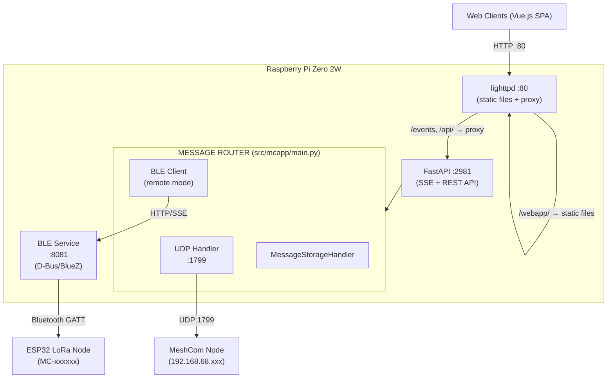
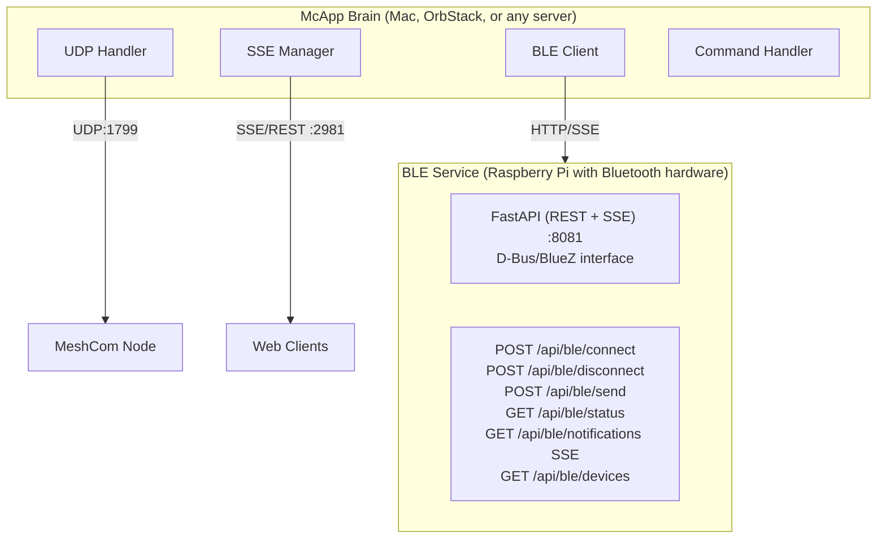
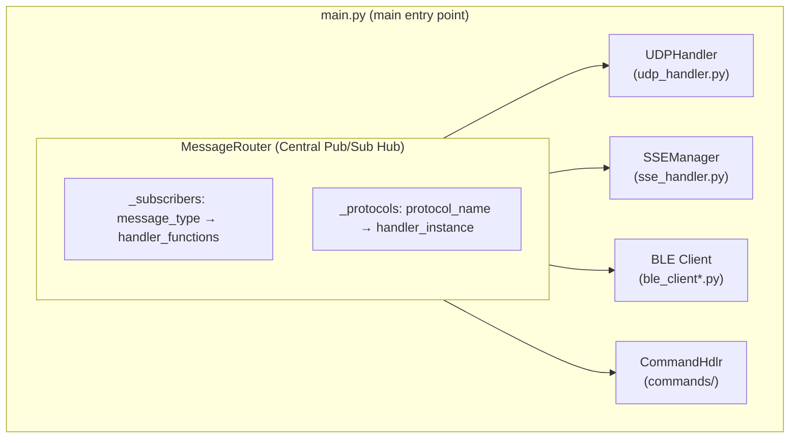

# CLAUDE.md

This file provides guidance to Claude Code (claude.ai/code) when working with code in this repository.

## Project Overview

McApp is a message proxy service for MeshCom (LoRa mesh network for ham radio operators). It bridges MeshCom nodes with web clients via SSE/REST (FastAPI), supporting both UDP and Bluetooth Low Energy (BLE) connections. The system runs on Raspberry Pi and serves a Vue.js web application through lighttpd.

## Architecture

### Standard Deployment (Pi with Bluetooth)


### Distributed Deployment (Remote BLE Service)


### Core Components

All source lives in `src/mcapp/`. Entry point: `mcapp.main:run` (invoked via `uv run mcapp`).

- **main.py**: Main entry point. Defines `MessageRouter` (central pub/sub hub) and initializes all protocol handlers
- **message_storage.py**: In-memory message store with JSON persistence, pruning, and parallel mheard statistics processing
- **sqlite_storage.py**: SQLite storage backend (WAL mode) with cursor-based pagination, type-based retention, composite indexes, and nightly pruning
- **udp_handler.py**: UDP listener/sender for MeshCom node communication (port 1799)
- **sse_handler.py**: SSE/REST API transport (FastAPI-based, port 2981). Proxied through lighttpd on port 80. Import-guarded — only loads if FastAPI is available
- **commands/**: Modular command system using mixin architecture (see Command System section below)
- **config_loader.py**: Dataclass-based configuration with `MCAPP_*` environment variable overrides
- **logging_setup.py**: Centralized logging with `EmojiFormatter`, `get_logger()`, `has_console()` detection
- **meteo.py**: `WeatherService` class — hybrid DWD BrightSky + OpenMeteo weather provider
- **migrate_storage.py**: Migration utility for deque → SQLite storage backend transition

### BLE Abstraction Layer

The BLE subsystem supports two modes via a unified client interface:

| Mode | File | Description |
|------|------|-------------|
| `remote` | `ble_client_remote.py` | HTTP/SSE client to remote BLE service |
| `disabled` | `ble_client_disabled.py` | No-op stub for testing |

For local BLE hardware access, deploy the standalone BLE service (ble_service/) on the Pi.

- **ble_client.py**: Abstract interface + `create_ble_client()` factory function
- **ble_protocol.py**: Shared protocol decoders/transformers (used by remote client and BLE service)

### BLE Service (Standalone)

Located in `ble_service/` - a FastAPI service that exposes BLE hardware via HTTP:

- **ble_service/src/main.py**: FastAPI REST API + SSE endpoints
- **ble_service/src/ble_adapter.py**: Clean D-Bus/BlueZ wrapper class
- **ble_service/mcapp-ble.service**: Systemd service file for Pi

### Message Flow

1. Messages arrive via UDP (from MeshCom node) or BLE (from ESP32)
2. MessageRouter publishes to subscribers based on message type
3. Messages are stored, broadcast to SSE clients, and processed for commands
4. Outbound messages from clients go through suppression logic before mesh transmission

### Key Classes

- `MessageRouter`: Central pub/sub hub connecting all protocols
- `MessageValidator`: Handles message normalization and outbound suppression logic
- `MessageStorageHandler`: Deque-based storage with size limits and parallel processing
- `BLEClient`: D-Bus based BLE connection with keep-alive and auto-reconnect
- `CommandHandler`: Extensible command system with throttling and abuse protection

### Command System (Mixin Architecture)

The `src/mcapp/commands/` package uses a mixin-based design where `CommandHandler` is assembled from specialized mixins:

- **handler.py** — `CommandHandler` class + `COMMANDS` registry + `create_command_handler()` factory
- **routing.py** — `RoutingMixin`: message reception, intent-based routing to the correct command
- **response.py** — `ResponseMixin`: response delivery back to mesh
- **dedup.py** — `DedupMixin`: duplicate message detection
- **simple_commands.py** — `SimpleCommandsMixin`: `!dice`, `!time`, `!userinfo`
- **data_commands.py** — `DataCommandsMixin`: `!search`, `!stats`, `!mheard`, `!pos`
- **weather_command.py** — `WeatherCommandMixin`: `!wx` / `!weather`
- **admin_commands.py** — `AdminCommandsMixin`: `!kb` (kick-ban), `!topic`
- **topic_beacon.py** — `TopicBeaconMixin`: group beacon management
- **ctcping.py** — `CTCPingMixin`: CTCSS/ping feature
- **constants.py** — Shared constants
- **tests.py** — Built-in test suite (`run_all_tests()`)

### Module Integration

The `MessageRouter` (defined in `src/mcapp/main.py`) is the central pub/sub hub that connects all protocol handlers:



**Initialization Flow** (in `src/mcapp/main.py`, `main()` function):
```python
# 1. Storage — SQLite (with migration) or in-memory deque fallback
if cfg.storage.backend == "sqlite" and SQLITE_AVAILABLE:
    storage_handler = await create_sqlite_storage(...)
else:
    storage_handler = MessageStorageHandler(deque(), cfg.storage.max_size_mb)

# 2. Central router
message_router = MessageRouter(storage_handler)
message_router.set_callsign(cfg.call_sign)

# 3. GPS caching from BLE → updates weather service location
message_router.subscribe("ble_notification", _cache_gps)

# 4. Protocol handlers
command_handler = create_command_handler(message_router, storage_handler, ...)
message_router.register_protocol('commands', command_handler)

udp_handler = UDPHandler(..., message_router=message_router)
message_router.register_protocol('udp', udp_handler)

# 5. SSE manager (REST API + Server-Sent Events), BLE client (local/remote/disabled)
```

**Message Types & Subscriptions:**

| Message Type | Subscribers | Purpose |
|--------------|-------------|---------|
| `mesh_message` | SSEManager, StorageHandler | Messages from LoRa mesh |
| `ble_notification` | SSEManager, StorageHandler, CommandHandler | BLE device notifications |
| `ble_status` | SSEManager | BLE connection status updates |
| `websocket_message` | SSEManager | Messages to broadcast to clients |
| `ble_message` | BLE handler | Outbound messages via BLE |
| `udp_message` | UDP handler | Outbound messages via UDP |

**Incoming Message Flow (BLE → SSE clients):**
1. BLE device sends GATT notification
2. `BLEClient._on_props_changed()` receives raw bytes
3. `notification_handler()` parses JSON or binary format
4. `message_router.publish('ble', 'ble_notification', data)`
5. `SSEManager._broadcast_handler()` receives via subscription
6. Broadcasts via SSE to all connected clients

**Outgoing Message Flow (Client → Mesh):**
1. Client sends message via `POST /api/send`
2. `SSEManager` routes by type (command, BLE, or UDP message)
3. `message_router.publish('sse', 'udp_message', data)`
4. `MessageRouter._udp_message_handler()` applies suppression logic
5. `UDPHandler.send_message()` sends JSON to MeshCom node

## Repository Structure

This project consists of **two separate Git repositories**:

| Repo | Path (local) | Content |
|------|-------------|---------|
| **McApp** | `/Users/martinwerner/WebDev/MCProxy` | Python backend (this repo) |
| **webapp** | `/Users/martinwerner/WebDev/webapp` | Vue 3 frontend (separate repo) |

Each repo has its own Git history, branches, and CLAUDE.md.

## Dev Backend Server

The development backend runs on a Raspberry Pi accessible via:

```bash
ssh mcapp.local    # No username needed
```

The McApp code is deployed to `~/mcapp/` on that machine.

## Package Management

- **Python**: `uv` only — NEVER use `pip` or `venv`
  - `uv sync` to install dependencies
  - `uv run mcapp` to run
- **Frontend (webapp repo)**: `npm`

## Code Quality

- **Python**: `uvx ruff check` is mandatory — zero tolerance for errors and warnings
- **Frontend** (webapp repo): `npx eslint` is mandatory — zero tolerance for errors and warnings
- All issues must be resolved before committing
- **Ruff config** (in `pyproject.toml`): `line-length = 100`, `target-version = "py311"`, rules: `["E", "F", "I", "W"]`
- **Git branches**: `development` (default), `main` (production)
- **Commit format**: `[type] description` — types: feat, fix, perf, refactor, chore, docs, test

## Development Commands

```bash
# Run in development mode (enables verbose logging)
export MCAPP_ENV=dev
uv run mcapp

# Lint (must pass before committing)
uvx ruff check
uvx ruff check --fix   # Auto-fix

# Deploy code to Pi (copies src/, syncs deps, restarts services)
./deploy-to-pi.sh

# Create a release (auto-detects branch: main → production, development → pre-release)
./release.sh

# On Pi: view service logs / restart
sudo journalctl -u mcapp.service -f
sudo systemctl restart mcapp.service
```

## BLE Testing Modes

| Scenario | BLE Mode | Setup |
|----------|----------|-------|
| Non-BLE features | `disabled` | `export MCAPP_BLE_MODE=disabled` |
| Production / Testing with BLE | `remote` | Deploy BLE service on Pi, point URL to it |

Remote BLE testing:
```bash
# On Pi: Start BLE service
cd ble_service
uvicorn src.main:app --host 0.0.0.0 --port 8081

# On Mac/OrbStack/other: Connect to remote BLE
export MCAPP_BLE_MODE=remote
export MCAPP_BLE_URL=http://pi.local:8081
export MCAPP_BLE_API_KEY=your-secret-key
uv run mcapp
```

## Configuration

Configuration lives in `/etc/mcapp/config.json`:
- `UDP_PORT_list/send`: Port 1799 for MeshCom node
- `SSE_ENABLED/SSE_HOST/SSE_PORT`: SSE/REST API (0.0.0.0:2981, proxied via lighttpd)
- `CALL_SIGN`: Node callsign for command handling
- `LAT/LONG/STAT_NAME`: Location for weather service
- `PRUNE_HOURS`: Chat message retention (default 720h = 30 days)
- `PRUNE_HOURS_POS`: Position data retention (default 192h = 8 days)
- `PRUNE_HOURS_ACK`: ACK retention (default 192h = 8 days)
- `MAX_STORAGE_SIZE_MB`: In-memory store limit

Dev config: `/etc/mcapp/config.dev.json` (auto-selected when `MCAPP_ENV=dev`)

### BLE Configuration

```json
{
  "BLE_MODE": "remote",          // "remote" | "disabled" (local mode removed, use BLE service)
  "BLE_REMOTE_URL": "",          // URL for remote BLE service (e.g., http://pi.local:8081)
  "BLE_API_KEY": "auto-generated",  // API key for remote service authentication
  "BLE_DEVICE_NAME": "",         // Auto-connect device name (e.g., "MC-XXXXXX")
  "BLE_DEVICE_ADDRESS": ""       // Auto-connect device MAC address
}
```

**Migration note:** Local mode (`BLE_MODE="local"`) was removed in v1.01.1. For local BLE hardware access, deploy the standalone BLE service (`ble_service/`) and use `BLE_MODE="remote"` pointing to the service URL.

**BLE API Key:** The bootstrap generates a random 16-char key (using `secrets` module) at install time. Both sides use it: McApp sends it as `X-API-Key` header, the BLE service validates it via `BLE_SERVICE_API_KEY` env var. The BLE service has no hardcoded fallback — if no key is set, it runs unauthenticated (with a startup warning).

**Environment variable overrides** (useful for testing):
- `MCAPP_BLE_MODE` - Override BLE mode without editing config
- `MCAPP_BLE_URL` - Override remote BLE service URL
- `MCAPP_BLE_API_KEY` - Override API key

### SQLite Storage Backend

The SQLite backend (`sqlite_storage.py`) is the default for production deployments. Schema version 6 introduced dedicated tables for positions and signal data (see `doc/2026-02-11_1400-position-signal-architecture-ADR.md` for full architecture).

**Journal mode:** WAL (Write-Ahead Logging) for concurrent reads during writes.

**Tables (Schema V6):**

| Table | Purpose |
|-------|---------|
| `messages` | Chat messages and ACKs. Legacy dual-write still receives `type='pos'` for backwards compatibility |
| `station_positions` | One row per station (UPSERT). Location from position beacons, signal from MHeard beacons — updated independently |
| `signal_log` | Raw RSSI/SNR measurements from every MHeard beacon (~130/hour) |
| `signal_buckets` | Pre-aggregated time buckets (5-min for 8d, 1-hour for 365d) for mHeard charts |

**Key design principle:** MHeard beacons (RSSI/SNR, no coordinates) and position beacons (lat/lon, no signal) are completely disjoint packet types. `station_positions` merges them per callsign with independent field-group updates — signal fields never overwrite location fields and vice versa.

**Indexes:**

| Index | Columns | Purpose |
|-------|---------|---------|
| `idx_messages_timestamp` | `timestamp` | Time-range filters |
| `idx_messages_src` | `src` | Source callsign lookups |
| `idx_messages_dst` | `dst` | Destination lookups |
| `idx_messages_type` | `type` | Type filters |
| `idx_messages_type_timestamp` | `type, timestamp DESC` | Smart initial payload, recent messages |
| `idx_messages_type_dst_timestamp` | `type, dst, timestamp DESC` | Paginated channel queries |
| `idx_signal_log_cs_ts` | `callsign, timestamp DESC` | Signal log time-range queries |

**Retention (nightly pruning at 04:00):**

| Table / Type | Retention | Notes |
|--------------|-----------|-------|
| `messages` type `msg` | 30 days | Chat messages |
| `messages` type `pos`/`ack` | 8 days | Legacy dual-write |
| `signal_log` | 8 days | Raw MHeard measurements |
| `signal_buckets` (5-min) | 8 days | Fine-grained chart data |
| `signal_buckets` (1-hour) | 365 days | Long-term trend data |
| `station_positions` | 30 days since `last_seen` | Stale stations removed |

**Nightly job (04:00):** Prunes expired data, aggregates old 5-min buckets into 1-hour buckets, runs `ANALYZE` for query planner freshness. Also runs pruning once at startup.

**In-memory bucket accumulation:** 5-minute signal buckets are accumulated in memory as MHeard beacons arrive, then flushed to `signal_buckets` on bucket rollover. On startup, partial buckets are recovered from `signal_log`.

## Dependencies

Python packages (managed via `uv`, see `pyproject.toml`):
- `dbus-next>=0.2.3`: BlueZ D-Bus interface for BLE (only in ble_service, removed from main package)
- `timezonefinder>=6.5.0`: Timezone detection for node time sync
- `requests>=2.31.0`: HTTP client for weather API (DWD BrightSky + OpenMeteo)
- `aiohttp>=3.9.0`: Async HTTP client for remote BLE
- `aiohttp-sse-client>=0.2.1`: SSE client for remote BLE notifications
- `fastapi>=0.115.0`: REST API framework (SSE transport, BLE service)
- `uvicorn[standard]>=0.34.0`: ASGI server for FastAPI
- `sse-starlette>=2.0.0`: SSE support for FastAPI
- `pydantic>=2.0`: Data validation

System packages (installed via apt):
- `lighttpd`: Static file server for Vue.js SPA
- `bluez`: Bluetooth stack for BLE (only on Pi running BLE service)
- `jq`: JSON processing in shell scripts

## Protocol Details

### UDP Message Format
JSON messages with fields: `src`, `dst`, `msg`, `type` (msg/pos/ack), `timestamp`, `rssi`, `snr`

### BLE Binary Messages
- Prefix `D{`: JSON config messages (TYP: MH, SA, G, W, SN, etc.)
- Prefix `@:` or `@!`: Binary mesh messages with header (payload_type, msg_id, hop_count)
- Prefix `@A`: ACK messages

### Chat Commands
All commands start with `!` and are processed by CommandHandler:
- `!wx` / `!weather`: Current weather
- `!mheard` / `!mh`: Recently heard stations
- `!stats`: Message statistics
- `!search`: Search messages by callsign
- `!pos`: Position data lookup
- `!dice`: Roll dice (Mäxchen rules)
- `!time`: Node time
- `!topic`: Group beacon management (admin)
- `!kb`: Kick-ban management (admin)

## Testing

There is no pytest — tests are built into the application and run at startup (when `has_console()` returns true, i.e., running in a terminal):
- Suppression logic tests via `message_router.test_suppression_logic()`
- Command handler tests via `command_handler.run_all_tests()` (in `src/mcapp/commands/tests.py`)

## Debugging

- **USR1 signal**: Send `kill -USR1 <pid>` to print a stack trace at the current hang point (handler in `main.py`)
- **`has_console()`** detection (in `logging_setup.py`) controls startup test execution and verbose output
- **`EmojiFormatter`** in `logging_setup.py` uses emoji prefixes for visual log scanning

## Querying the Production Database

The production SQLite database is at `/var/lib/mcapp/messages.db` on the Pi (`ssh mcapp.local`).

**CRITICAL: All timestamps are in milliseconds** (not seconds). Divide by 1000 before passing to `datetime.fromtimestamp()`. Forgetting this causes `ValueError: year 58089 is out of range`.

**Access pattern** (always use Python, never `sqlite3` CLI):
```bash
ssh mcapp.local "python3 -c \"
import sqlite3
from datetime import datetime

conn = sqlite3.connect('/var/lib/mcapp/messages.db')
conn.row_factory = sqlite3.Row

for r in conn.execute('SELECT src, dst, msg, timestamp FROM messages WHERE type=\\\"msg\\\" ORDER BY timestamp DESC LIMIT 5'):
    dt = datetime.fromtimestamp(r[\\\"timestamp\\\"] / 1000)
    print(f'{dt:%Y-%m-%d %H:%M} {r[\\\"src\\\"]} → {r[\\\"dst\\\"]}: {r[\\\"msg\\\"]}')

conn.close()
\""
```

**Schema version:** 6 (WAL mode enabled)

### Tables

| Table | Rows (approx) | Purpose |
|-------|---------------|---------|
| `messages` | ~48k | Chat messages (`type='msg'`) and position beacons (`type='pos'`) |
| `station_positions` | ~78 | One row per station, UPSERT from position + MHeard beacons |
| `signal_log` | ~37k | Raw RSSI/SNR from every MHeard beacon |
| `signal_buckets` | ~7k | Pre-aggregated 5-min and 1-hour signal buckets |
| `telemetry` | ~20 | Temperature, humidity, pressure readings |
| `mheard_cache` | 0 | Unused cache table |
| `schema_version` | 1 | Current schema version (6) |

### Key columns in `messages`

| Column | Type | Notes |
|--------|------|-------|
| `id` | INTEGER | Auto-increment PK |
| `msg_id` | TEXT | MeshCom message ID (NULL for MHeard beacons) |
| `src` | TEXT | Source callsign (may include relay path: `DL4GLE-10,DB0HOB-12`) |
| `dst` | TEXT | Destination (group number, `*` for broadcast, callsign for DM) |
| `msg` | TEXT | Message text (empty for position/MHeard) |
| `type` | TEXT | `msg` or `pos` (ACKs deleted in v4 migration) |
| `timestamp` | INTEGER | **Milliseconds** since epoch |
| `rssi` | INTEGER | Signal strength (dBm, -140 to -30) |
| `snr` | REAL | Signal-to-noise ratio (-30 to 12) |
| `src_type` | TEXT | `ble`, `lora`, etc. |
| `raw_json` | TEXT | Full original JSON payload |
| `transformer` | TEXT | Which parser produced this message |
| `conversation_key` | TEXT | For DM grouping (e.g., `DK5EN<>DL4GLE`) |
| `echo_id` | TEXT | Echo tracking ID from `{NNN` suffix |
| `acked` / `send_success` | INTEGER | ACK tracking flags (0 or 1) |

### Common queries

```bash
# Recent chat messages
ssh mcapp.local "python3 -c \"
import sqlite3
from datetime import datetime
conn = sqlite3.connect('/var/lib/mcapp/messages.db')
conn.row_factory = sqlite3.Row
for r in conn.execute(\\\"SELECT src, dst, msg, timestamp FROM messages WHERE type='msg' AND msg NOT LIKE '%:ack%' ORDER BY timestamp DESC LIMIT 10\\\"):
    dt = datetime.fromtimestamp(r['timestamp'] / 1000)
    print(f'{dt:%H:%M} {r[\\\"src\\\"]} → {r[\\\"dst\\\"]}: {r[\\\"msg\\\"]}')
conn.close()
\""

# Station positions with coordinates
ssh mcapp.local "python3 -c \"
import sqlite3
from datetime import datetime
conn = sqlite3.connect('/var/lib/mcapp/messages.db')
conn.row_factory = sqlite3.Row
for r in conn.execute('SELECT callsign, lat, lon, rssi, snr, last_seen FROM station_positions WHERE lat IS NOT NULL ORDER BY last_seen DESC LIMIT 10'):
    dt = datetime.fromtimestamp(r['last_seen'] / 1000) if r['last_seen'] else None
    print(f'{r[\\\"callsign\\\"]}: ({r[\\\"lat\\\"]}, {r[\\\"lon\\\"]}) rssi={r[\\\"rssi\\\"]} snr={r[\\\"snr\\\"]} last={dt}')
conn.close()
\""

# Signal quality for a specific station
ssh mcapp.local "python3 -c \"
import sqlite3
from datetime import datetime
conn = sqlite3.connect('/var/lib/mcapp/messages.db')
conn.row_factory = sqlite3.Row
for r in conn.execute(\\\"SELECT timestamp, rssi, snr FROM signal_log WHERE callsign='DB0ED-99' ORDER BY timestamp DESC LIMIT 10\\\"):
    dt = datetime.fromtimestamp(r['timestamp'] / 1000)
    print(f'{dt:%H:%M:%S} rssi={r[\\\"rssi\\\"]} snr={r[\\\"snr\\\"]}')
conn.close()
\""

# Message type distribution
ssh mcapp.local "python3 -c \"
import sqlite3
conn = sqlite3.connect('/var/lib/mcapp/messages.db')
for r in conn.execute('SELECT type, COUNT(*) as cnt FROM messages GROUP BY type ORDER BY cnt DESC'):
    print(f'{r[0]}: {r[1]}')
conn.close()
\""

# Database size
ssh mcapp.local "python3 -c \"
import os
size = os.path.getsize('/var/lib/mcapp/messages.db')
print(f'DB size: {size / 1024 / 1024:.2f} MB')
\""
```

### Escaping rules for SSH + python3 -c

When running Python via `ssh mcapp.local "python3 -c \"...\""`:
- Outer quotes: `"` for SSH command
- Escape inner double quotes: `\"`
- For SQL strings inside Python: use `\\\"` (triple-escaped) or use single quotes
- For f-string expressions: use `\\\"` around dict keys
- Alternative: write a temp script with `cat > /tmp/q.py << 'PYEOF'` to avoid escaping hell

## GitHub Repository

The GitHub repository is at **`github.com/DK5EN/McApp`**.

## Deployment

Target: Raspberry Pi Zero 2W running as systemd service (`mcapp.service`)

### New Bootstrap System (Recommended)

```bash
# Single command for install, update, or repair
curl -fsSL https://raw.githubusercontent.com/DK5EN/McApp/main/bootstrap/mcapp.sh | sudo bash
```

The bootstrap script:
1. Auto-detects state (fresh/migrate/upgrade)
2. Prompts for configuration on first install
3. Creates Python venv in `~/mcapp-venv` using uv
4. Configures SD card protection (tmpfs, volatile journal)
5. Sets up firewall (nftables on Trixie, iptables on Bookworm)
6. Disables IPv6 (fixes mDNS timeouts caused by Happy Eyeballs algorithm)
7. Enables and starts systemd service

See `bootstrap/README.md` for full documentation.

## Project Directory Structure

```
MCProxy/
├── pyproject.toml           # Project config (hatchling build, uv workspace)
├── uv.lock                  # Locked dependencies
├── config.sample.json       # Configuration template
├── deploy-to-pi.sh          # Deploy code to Pi via SSH/SCP
├── release.sh               # Unified release builder (gh CLI)
├── ssl-tunnel-setup.sh      # TLS remote access setup (standalone, not part of bootstrap)
│
├── src/mcapp/               # Main Python package
│   ├── __init__.py          # Version export (__version__)
│   ├── main.py              # Entry point + MessageRouter
│   ├── config_loader.py     # Dataclass-based configuration
│   ├── logging_setup.py     # Centralized logging + EmojiFormatter
│   ├── message_storage.py   # In-memory deque + JSON persistence
│   ├── sqlite_storage.py    # SQLite storage backend (optional)
│   ├── migrate_storage.py   # Deque → SQLite migration utility
│   ├── udp_handler.py       # UDP protocol handler
│   ├── sse_handler.py       # SSE/REST API transport (FastAPI, port 2981)
│   ├── meteo.py             # WeatherService (DWD + OpenMeteo)
│   ├── ble_client.py        # BLE abstraction interface + factory
│   ├── ble_client_remote.py # Remote BLE (HTTP/SSE)
│   ├── ble_client_disabled.py # No-op stub
│   ├── ble_protocol.py      # Shared BLE protocol decoders/transformers
│   └── commands/            # Modular command system (mixin-based)
│       ├── __init__.py
│       ├── handler.py       # CommandHandler + COMMANDS registry
│       ├── routing.py       # RoutingMixin
│       ├── response.py      # ResponseMixin
│       ├── dedup.py         # DedupMixin
│       ├── simple_commands.py
│       ├── data_commands.py
│       ├── weather_command.py
│       ├── admin_commands.py
│       ├── topic_beacon.py
│       ├── ctcping.py
│       ├── constants.py
│       └── tests.py         # Built-in test suite
│
├── ble_service/             # Standalone BLE service (uv workspace member)
│   ├── src/
│   │   ├── __init__.py
│   │   ├── main.py          # FastAPI REST + SSE
│   │   └── ble_adapter.py   # Clean D-Bus wrapper
│   ├── pyproject.toml
│   ├── mcapp-ble.service    # Systemd service
│   └── README.md            # API documentation
│
├── bootstrap/               # Installation scripts
│   ├── mcapp.sh             # Main entry point
│   ├── lib/                 # Script modules
│   └── templates/           # Config templates (incl. caddy/, cloudflared/)
│
└── doc/                     # Documentation
    ├── 2026-02-11_1400-position-signal-architecture-ADR.md  # Position/signal table architecture ADR
    ├── tls-architecture.md  # TLS setup diagrams
    └── sops/
        └── tls-maintenance.md  # Standard operating procedures
```

## Bootstrap Directory Structure

```
bootstrap/
├── mcapp.sh             # Main entry point (run with sudo)
├── lib/
│   ├── detect.sh        # State detection (fresh/migrate/upgrade)
│   ├── config.sh        # Interactive configuration prompts
│   ├── system.sh        # tmpfs, firewall, journald, hardening
│   ├── packages.sh      # apt + uv package management
│   ├── deploy.sh        # Webapp + Python script deployment
│   └── health.sh        # Health checks and diagnostics
├── templates/
│   ├── config.json.tmpl   # Configuration template
│   ├── mcapp.service      # systemd unit file
│   ├── mcapp-ble.service  # BLE service systemd unit
│   ├── nftables.conf      # Firewall rules (ports 22, 80, 1799)
│   ├── journald.conf      # Volatile journal config
│   ├── caddy/             # TLS reverse proxy templates
│   │   ├── Caddyfile.duckdns.tmpl
│   │   ├── Caddyfile.cloudflare.tmpl
│   │   ├── Caddyfile.desec.tmpl
│   │   └── caddy.service
│   └── cloudflared/       # Cloudflare Tunnel templates
│       ├── config.yml.tmpl
│       └── cloudflared.service
├── requirements.txt     # Python dependencies (minimum versions)
└── README.md            # Installation documentation
```

### Bootstrap CLI Options

```bash
sudo ./mcapp.sh --check       # Dry-run, show what would change
sudo ./mcapp.sh --force       # Force reinstall everything
sudo ./mcapp.sh --fix         # Repair broken installation
sudo ./mcapp.sh --reconfigure # Re-prompt for config values
sudo ./mcapp.sh --quiet       # Minimal output (for cron)
```

### BLE Service Deployment (Optional)

For distributed setups where McApp runs on a different machine than the Bluetooth hardware:

```bash
# On Pi with Bluetooth hardware
cd ~/mcapp/ble_service
uv sync

# Configure API key
export BLE_SERVICE_API_KEY=your-secret-key

# Run directly
uvicorn src.main:app --host 0.0.0.0 --port 8081

# Or install as systemd service
sudo cp mcapp-ble.service /etc/systemd/system/
sudo systemctl edit mcapp-ble  # Add: Environment=BLE_SERVICE_API_KEY=...
sudo systemctl enable --now mcapp-ble
```

The BLE service exposes:
- `GET /api/ble/status` - Connection status
- `GET /api/ble/devices` - Scan for devices
- `POST /api/ble/connect` - Connect to device
- `POST /api/ble/disconnect` - Disconnect
- `POST /api/ble/send` - Send message/command
- `GET /api/ble/notifications` - SSE notification stream
- `GET /health` - Health check

See `ble_service/README.md` for full API documentation.

## TLS Remote Access (Optional)

For internet access with TLS encryption, run the standalone setup script:

```bash
sudo ./ssl-tunnel-setup.sh
```

This adds Caddy as a TLS reverse proxy with automated Let's Encrypt DNS-01 certificates and DDNS updates. Supports DuckDNS, Cloudflare, deSEC.io, and Cloudflare Tunnel.

**Architecture with TLS:**
```
Browser (HTTPS) → Caddy:443 (TLS) → lighttpd:80 → {
    /webapp/  → static files
    /events   → proxy to FastAPI:2981
    /api/     → proxy to FastAPI:2981
}
```

See `doc/tls-architecture.md` for diagrams and `doc/sops/tls-maintenance.md` for maintenance procedures.

## Remote Health Check Commands

Commands for checking system health on the Pi via SSH. The Pi locale is German, so output labels may be in German.

**IMPORTANT quoting rule:** When running `python3 -c` over SSH, use single quotes for the Python code and `\"` for strings inside Python. Never use f-strings with dict key access — use `%` formatting instead. Nested double quotes in f-strings break the SSH quoting.

### System overview
```bash
ssh mcapp.local "uptime && echo '---' && free -h && echo '---' && df -h / /tmp /var/log && echo '---' && vcgencmd measure_temp && echo '---' && cat /proc/loadavg"
```

### Service statuses
```bash
ssh mcapp.local "sudo systemctl status mcapp.service --no-pager -l 2>&1 | head -20"
ssh mcapp.local "sudo systemctl status lighttpd.service --no-pager 2>&1 | head -10"
ssh mcapp.local "sudo systemctl status bluetooth.service --no-pager 2>&1 | head -10"
```

### Process memory usage
```bash
ssh mcapp.local "ps aux | grep -E 'mcapp|uv.*run' | grep -v grep"
```

### Database stats (use % formatting, NOT f-strings)
```bash
ssh mcapp.local "python3 -c '
import sqlite3, os
conn = sqlite3.connect(\"/var/lib/mcapp/messages.db\")
print(\"Schema version:\", conn.execute(\"SELECT version FROM schema_version\").fetchone()[0])
for r in conn.execute(\"SELECT type, COUNT(*) as cnt FROM messages GROUP BY type ORDER BY cnt DESC\"):
    print(\"  messages/%s: %d\" % (r[0], r[1]))
print(\"  station_positions: %d\" % conn.execute(\"SELECT COUNT(*) FROM station_positions\").fetchone()[0])
print(\"  signal_log: %d\" % conn.execute(\"SELECT COUNT(*) FROM signal_log\").fetchone()[0])
print(\"  signal_buckets: %d\" % conn.execute(\"SELECT COUNT(*) FROM signal_buckets\").fetchone()[0])
sz = os.path.getsize(\"/var/lib/mcapp/messages.db\")
print(\"DB size: %.2f MB\" % (sz/1024/1024))
conn.close()
'"
```

### Log checks
```bash
# Overnight logs (pruning runs at 04:00)
ssh mcapp.local "sudo journalctl -u mcapp.service --since '2026-02-13 22:00' --until '2026-02-14 06:00' --no-pager | tail -100"

# Today's logs
ssh mcapp.local "sudo journalctl -u mcapp.service --since today --no-pager | tail -150"

# Errors only (journald priority filter — may miss app-level [ERROR] lines)
ssh mcapp.local "sudo journalctl -u mcapp.service --since today -p err --no-pager"

# Grep for app-level errors/warnings
ssh mcapp.local "sudo journalctl -u mcapp.service --since today --no-pager | grep -i 'error\|exception\|traceback\|warning\|WARN'"

# Log volume count
ssh mcapp.local "sudo journalctl -u mcapp.service --since today --no-pager | wc -l"
```

## Firewall Configuration

McApp uses host-based firewall to protect the Raspberry Pi. The bootstrap script automatically configures:
- **nftables** on Debian Trixie (and newer)
- **iptables** on Debian Bookworm (legacy fallback)

### Allowed Ports

| Port | Protocol | Service | Access |
|------|----------|---------|--------|
| 22 | TCP | SSH | Rate limited (6/min external, LAN exempt) |
| 80 | TCP | lighttpd | All traffic (serves webapp + proxies API) |
| 1799 | UDP | MeshCom | All traffic (LoRa mesh communication) |
| 5353 | UDP | mDNS | Multicast only (224.0.0.251) |

**LAN exemption for SSH:** Connections from RFC 1918 private IP ranges (192.168.0.0/16, 10.0.0.0/8, 172.16.0.0/12) are NOT rate limited.

### Internal-Only Ports (Not Exposed)

| Port | Protocol | Service | Why Not Exposed |
|------|----------|---------|-----------------|
| 2981 | TCP | FastAPI SSE/REST | Proxied via lighttpd on port 80 |

**Note:** Older firewall configurations (before Feb 2026) exposed ports 2980 and 2981 directly. These are now internal-only. The bootstrap script automatically removes them during upgrade.

### Silent Drops (Not Logged)

To prevent log spam, both nftables and iptables silently drop common broadcast/multicast traffic:

- Layer 2 broadcast packets
- Multicast packets (224.0.0.0/4, 239.0.0.0/8)
- Global broadcast (255.255.255.255)
- SSDP/UPnP (port 1900)
- NetBIOS (ports 137, 138)
- LLMNR (port 5355)
- High UDP ports (> 30000)
- IGMP protocol

### Firewall Logs

**Log format:**
- nftables: `[nftables DROP] ` prefix
- iptables: `[iptables DROP] ` prefix

**Rate limiting:** 10 drops per minute are logged (prevents log spam while maintaining visibility)

**View dropped traffic:**
```bash
# Watch firewall drops in real-time
sudo journalctl -kf | grep DROP

# Count drops by source IP (last hour)
sudo journalctl -k --since "1 hour ago" | grep DROP | awk '{print $NF}' | sort | uniq -c | sort -rn | head -20

# Count drops by destination port (last hour)
sudo journalctl -k --since "1 hour ago" | grep DROP | grep -oP 'DPT=\K\d+' | sort | uniq -c | sort -rn | head -20

# Show all firewall logs from today
sudo journalctl -k --since today | grep DROP
```

### Customizing the Firewall

**To allow additional ports (example: custom service on port 8080):**

For **nftables** (edit `/etc/nftables.conf`):
```nft
# Add before the log rule
tcp dport 8080 accept
```

For **iptables** (edit `/etc/iptables/rules.v4`):
```bash
# Add before the log rule
iptables -A INPUT -p tcp --dport 8080 -j ACCEPT
```

**Apply changes:**
```bash
# nftables
sudo systemctl restart nftables

# iptables
sudo iptables-restore < /etc/iptables/rules.v4
```

**To customize LAN exemption ranges** (e.g., for non-standard subnets), edit the IP ranges in both configurations and apply changes.

## Troubleshooting

### Bluetooth Blocked by rfkill

**Symptom:** `bluetoothctl power on` fails with "Failed to set power on: org.bluez.Error.Failed"

**Diagnosis:**
```bash
rfkill list bluetooth
# Shows: Soft blocked: yes
```

**Root cause:** Some Raspberry Pi images ship with `/etc/modprobe.d/rfkill_default.conf` containing `options rfkill default_state=0`, which blocks all radios (Bluetooth, WiFi) at boot.

**Solution:** The bootstrap script automatically installs `unblock-bluetooth.service` which runs `rfkill unblock bluetooth` after the Bluetooth service starts.

**Manual fix (if not using bootstrap):**
```bash
# Create systemd service
cat <<'EOF' | sudo tee /etc/systemd/system/unblock-bluetooth.service
[Unit]
Description=Unblock Bluetooth for McApp BLE
After=bluetooth.service
Before=mcapp.service

[Service]
Type=oneshot
ExecStart=/usr/sbin/rfkill unblock bluetooth
RemainAfterExit=yes

[Install]
WantedBy=multi-user.target
EOF

# Enable and start
sudo systemctl daemon-reload
sudo systemctl enable --now unblock-bluetooth

# Verify
rfkill list bluetooth  # Should show: Soft blocked: no
```
