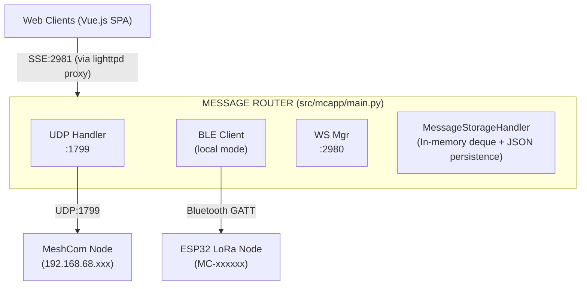
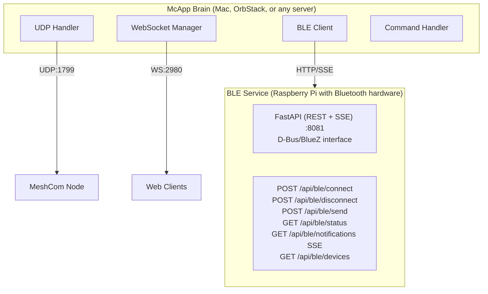
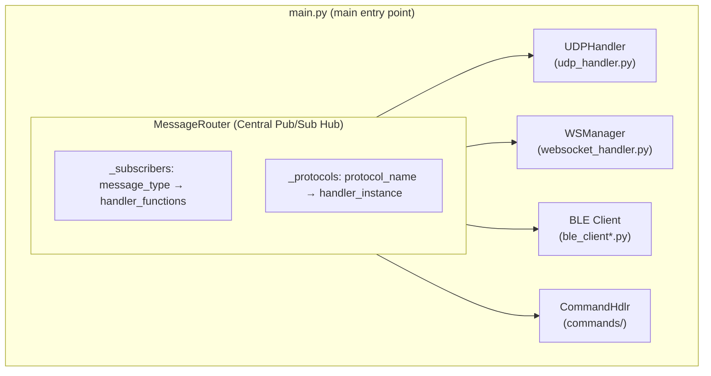

# CLAUDE.md

This file provides guidance to Claude Code (claude.ai/code) when working with code in this repository.

## Project Overview

McApp is a message proxy service for MeshCom (LoRa mesh network for ham radio operators). It bridges MeshCom nodes with web clients via WebSocket, supporting both UDP and Bluetooth Low Energy (BLE) connections. The system runs on Raspberry Pi and serves a Vue.js web application.

## Architecture

### Standard Deployment (Pi with Bluetooth)


### Distributed Deployment (Remote BLE Service)


### Core Components

All source lives in `src/mcapp/`. Entry point: `mcapp.main:run` (invoked via `uv run mcapp`).

- **main.py**: Main entry point. Defines `MessageRouter` (central pub/sub hub) and initializes all protocol handlers
- **message_storage.py**: In-memory message store with JSON persistence, pruning, and parallel mheard statistics processing
- **sqlite_storage.py**: Optional SQLite storage backend with cursor-based pagination and schema versioning
- **udp_handler.py**: UDP listener/sender for MeshCom node communication (port 1799)
- **websocket_handler.py**: WebSocket server for web clients (port 2980)
- **sse_handler.py**: Optional SSE transport alternative (FastAPI-based, port 2981). Import-guarded — only loads if FastAPI is available
- **commands/**: Modular command system using mixin architecture (see Command System section below)
- **config_loader.py**: Dataclass-based configuration with `MCAPP_*` environment variable overrides
- **logging_setup.py**: Centralized logging with `EmojiFormatter`, `get_logger()`, `has_console()` detection
- **meteo.py**: `WeatherService` class — hybrid DWD BrightSky + OpenMeteo weather provider
- **migrate_storage.py**: Migration utility for deque → SQLite storage backend transition

### BLE Abstraction Layer

The BLE subsystem supports three modes via a unified client interface:

| Mode | File | Description |
|------|------|-------------|
| `local` | `ble_client_local.py` | Direct D-Bus/BlueZ (wraps `ble_handler.py`) |
| `remote` | `ble_client_remote.py` | HTTP/SSE client to remote BLE service |
| `disabled` | `ble_client_disabled.py` | No-op stub for testing |

- **ble_client.py**: Abstract interface + `create_ble_client()` factory function
- **ble_handler.py**: Legacy BlueZ D-Bus implementation (used by local mode)

### BLE Service (Standalone)

Located in `ble_service/` - a FastAPI service that exposes BLE hardware via HTTP:

- **ble_service/src/main.py**: FastAPI REST API + SSE endpoints
- **ble_service/src/ble_adapter.py**: Clean D-Bus/BlueZ wrapper class
- **ble_service/mcapp-ble.service**: Systemd service file for Pi

### Message Flow

1. Messages arrive via UDP (from MeshCom node) or BLE (from ESP32)
2. MessageRouter publishes to subscribers based on message type
3. Messages are stored, broadcast to WebSocket clients, and processed for commands
4. Outbound messages from clients go through suppression logic before mesh transmission

### Key Classes

- `MessageRouter`: Central pub/sub hub connecting all protocols
- `MessageValidator`: Handles message normalization and outbound suppression logic
- `MessageStorageHandler`: Deque-based storage with size limits and parallel processing
- `BLEClient`: D-Bus based BLE connection with keep-alive and auto-reconnect
- `CommandHandler`: Extensible command system with throttling and abuse protection

### Command System (Mixin Architecture)

The `src/mcapp/commands/` package uses a mixin-based design where `CommandHandler` is assembled from specialized mixins:

- **handler.py** — `CommandHandler` class + `COMMANDS` registry + `create_command_handler()` factory
- **routing.py** — `RoutingMixin`: message reception, intent-based routing to the correct command
- **response.py** — `ResponseMixin`: response delivery back to mesh
- **dedup.py** — `DedupMixin`: duplicate message detection
- **simple_commands.py** — `SimpleCommandsMixin`: `!dice`, `!time`, `!userinfo`
- **data_commands.py** — `DataCommandsMixin`: `!search`, `!stats`, `!mheard`, `!pos`
- **weather_command.py** — `WeatherCommandMixin`: `!wx` / `!weather`
- **admin_commands.py** — `AdminCommandsMixin`: `!kb` (kick-ban), `!topic`
- **topic_beacon.py** — `TopicBeaconMixin`: group beacon management
- **ctcping.py** — `CTCPingMixin`: CTCSS/ping feature
- **constants.py** — Shared constants
- **tests.py** — Built-in test suite (`run_all_tests()`)

### Module Integration

The `MessageRouter` (defined in `src/mcapp/main.py`) is the central pub/sub hub that connects all protocol handlers:



**Initialization Flow** (in `src/mcapp/main.py`, `main()` function):
```python
# 1. Storage — SQLite (with migration) or in-memory deque fallback
if cfg.storage.backend == "sqlite" and SQLITE_AVAILABLE:
    storage_handler = await create_sqlite_storage(...)
else:
    storage_handler = MessageStorageHandler(deque(), cfg.storage.max_size_mb)

# 2. Central router
message_router = MessageRouter(storage_handler)
message_router.set_callsign(cfg.call_sign)

# 3. GPS caching from BLE → updates weather service location
message_router.subscribe("ble_notification", _cache_gps)

# 4. Protocol handlers
command_handler = create_command_handler(message_router, storage_handler, ...)
message_router.register_protocol('commands', command_handler)

udp_handler = UDPHandler(..., message_router=message_router)
message_router.register_protocol('udp', udp_handler)

websocket_manager = WebSocketManager(cfg.websocket.host, cfg.websocket.port, message_router)
message_router.register_protocol('websocket', websocket_manager)

# 5. Optional: SSE manager, BLE client (local/remote/disabled)
```

**Message Types & Subscriptions:**

| Message Type | Subscribers | Purpose |
|--------------|-------------|---------|
| `mesh_message` | WSManager, StorageHandler | Messages from LoRa mesh |
| `ble_notification` | WSManager, StorageHandler, CommandHandler | BLE device notifications |
| `ble_status` | WSManager | BLE connection status updates |
| `websocket_message` | WSManager | Messages to broadcast to clients |
| `ble_message` | BLE handler | Outbound messages via BLE |
| `udp_message` | UDP handler | Outbound messages via UDP |

**Incoming Message Flow (BLE → WebSocket clients):**
1. BLE device sends GATT notification
2. `BLEClient._on_props_changed()` receives raw bytes
3. `notification_handler()` parses JSON or binary format
4. `message_router.publish('ble', 'ble_notification', data)`
5. `WebSocketManager._broadcast_handler()` receives via subscription
6. Broadcasts JSON to all connected WebSocket clients

**Outgoing Message Flow (WebSocket client → Mesh):**
1. Client sends message via WebSocket
2. `WebSocketManager._process_client_message()` routes by type
3. `message_router.publish('websocket', 'udp_message', data)`
4. `MessageRouter._udp_message_handler()` applies suppression logic
5. `UDPHandler.send_message()` sends JSON to MeshCom node

## Repository Structure

This project consists of **two separate Git repositories**:

| Repo | Path (local) | Content |
|------|-------------|---------|
| **McApp** | `/Users/martinwerner/WebDev/MCProxy` | Python backend (this repo) |
| **webapp** | `/Users/martinwerner/WebDev/webapp` | Vue 3 frontend (separate repo) |

Each repo has its own Git history, branches, and CLAUDE.md.

## Dev Backend Server

The development backend runs on a Raspberry Pi accessible via:

```bash
ssh mcapp.local    # No username needed
```

The McApp code is deployed to `~/mcapp/` on that machine.

## Package Management

- **Python**: `uv` only — NEVER use `pip` or `venv`
  - `uv sync` to install dependencies
  - `uv run mcapp` to run
- **Frontend (webapp repo)**: `npm`

## Code Quality

- **Python**: `uvx ruff check` is mandatory — zero tolerance for errors and warnings
- **Frontend** (webapp repo): `npx eslint` is mandatory — zero tolerance for errors and warnings
- All issues must be resolved before committing
- **Ruff config** (in `pyproject.toml`): `line-length = 100`, `target-version = "py311"`, rules: `["E", "F", "I", "W"]`
- **Git branches**: `development` (default), `main` (production)
- **Commit format**: `[type] description` — types: feat, fix, perf, refactor, chore, docs, test

## Development Commands

```bash
# Run in development mode (enables verbose logging)
export MCAPP_ENV=dev
uv run mcapp

# Lint (must pass before committing)
uvx ruff check
uvx ruff check --fix   # Auto-fix

# Deploy code to Pi (copies src/, syncs deps, restarts services)
./deploy-to-pi.sh

# Create a release (auto-detects branch: main → production, development → pre-release)
./release.sh

# On Pi: view service logs / restart
sudo journalctl -u mcapp.service -f
sudo systemctl restart mcapp.service
```

## BLE Testing Modes

| Scenario | BLE Mode | Setup |
|----------|----------|-------|
| Non-BLE features | `disabled` | `export MCAPP_BLE_MODE=disabled` |
| Real BLE via Pi | `remote` | Run BLE service on Pi, point URL to it |
| Production on Pi | `local` | Default, uses D-Bus/BlueZ directly |

Remote BLE testing:
```bash
# On Pi: Start BLE service
cd ble_service
uvicorn src.main:app --host 0.0.0.0 --port 8081

# On Mac/OrbStack/other: Connect to remote BLE
export MCAPP_BLE_MODE=remote
export MCAPP_BLE_URL=http://pi.local:8081
export MCAPP_BLE_API_KEY=your-secret-key
uv run mcapp
```

## Configuration

Configuration lives in `/etc/mcapp/config.json`:
- `UDP_PORT_list/send`: Port 1799 for MeshCom node
- `WS_HOST/PORT`: WebSocket server (127.0.0.1:2980)
- `CALL_SIGN`: Node callsign for command handling
- `LAT/LONG/STAT_NAME`: Location for weather service
- `PRUNE_HOURS`: Message retention period (default 168h = 7 days)
- `MAX_STORAGE_SIZE_MB`: In-memory store limit

Dev config: `/etc/mcapp/config.dev.json` (auto-selected when `MCAPP_ENV=dev`)

### BLE Configuration

```json
{
  "BLE_MODE": "local",           // "local" | "remote" | "disabled"
  "BLE_REMOTE_URL": "",          // URL for remote BLE service (remote mode only)
  "BLE_API_KEY": "",             // API key for remote service authentication
  "BLE_DEVICE_NAME": "",         // Auto-connect device name (e.g., "MC-XXXXXX")
  "BLE_DEVICE_ADDRESS": ""       // Auto-connect device MAC address
}
```

**Environment variable overrides** (useful for testing):
- `MCAPP_BLE_MODE` - Override BLE mode without editing config
- `MCAPP_BLE_URL` - Override remote BLE service URL
- `MCAPP_BLE_API_KEY` - Override API key

## Dependencies

Python packages (managed via `uv`, see `pyproject.toml`):
- `websockets>=14.0`: WebSocket server
- `dbus-next>=0.2.3`: BlueZ D-Bus interface for BLE (local mode)
- `timezonefinder>=6.5.0`: Timezone detection for node time sync
- `requests>=2.31.0`: HTTP client for weather API (DWD BrightSky + OpenMeteo)
- `aiohttp>=3.9.0`: Async HTTP client for remote BLE
- `aiohttp-sse-client>=0.2.1`: SSE client for remote BLE notifications
- `fastapi>=0.115.0`: REST API framework (SSE transport, BLE service)
- `uvicorn[standard]>=0.34.0`: ASGI server for FastAPI
- `sse-starlette>=2.0.0`: SSE support for FastAPI
- `pydantic>=2.0`: Data validation

System packages (installed via apt):
- `lighttpd`: Static file server for Vue.js SPA
- `bluez`: Bluetooth stack for BLE (local mode only)
- `jq`: JSON processing in shell scripts

## Protocol Details

### UDP Message Format
JSON messages with fields: `src`, `dst`, `msg`, `type` (msg/pos/ack), `timestamp`, `rssi`, `snr`

### BLE Binary Messages
- Prefix `D{`: JSON config messages (TYP: MH, SA, G, W, SN, etc.)
- Prefix `@:` or `@!`: Binary mesh messages with header (payload_type, msg_id, hop_count)
- Prefix `@A`: ACK messages

### Chat Commands
All commands start with `!` and are processed by CommandHandler:
- `!wx` / `!weather`: Current weather
- `!mheard` / `!mh`: Recently heard stations
- `!stats`: Message statistics
- `!search`: Search messages by callsign
- `!pos`: Position data lookup
- `!dice`: Roll dice (Mäxchen rules)
- `!time`: Node time
- `!topic`: Group beacon management (admin)
- `!kb`: Kick-ban management (admin)

## Testing

There is no pytest — tests are built into the application and run at startup (when `has_console()` returns true, i.e., running in a terminal):
- Suppression logic tests via `message_router.test_suppression_logic()`
- Command handler tests via `command_handler.run_all_tests()` (in `src/mcapp/commands/tests.py`)

## Debugging

- **USR1 signal**: Send `kill -USR1 <pid>` to print a stack trace at the current hang point (handler in `main.py`)
- **`has_console()`** detection (in `logging_setup.py`) controls startup test execution and verbose output
- **`EmojiFormatter`** in `logging_setup.py` uses emoji prefixes for visual log scanning

## GitHub Repository

The GitHub repository remains at **`github.com/DK5EN/McAdvChat`** for compatibility reasons
(existing links, bookmarks, bootstrap URLs on deployed devices). The project itself is called
**McApp** — only the repo URL keeps the legacy name.

## Deployment

Target: Raspberry Pi Zero 2W running as systemd service (`mcapp.service`)

### New Bootstrap System (Recommended)

```bash
# Single command for install, update, or repair
curl -fsSL https://raw.githubusercontent.com/DK5EN/McAdvChat/main/bootstrap/mcapp.sh | sudo bash
```

The bootstrap script:
1. Auto-detects state (fresh/migrate/upgrade)
2. Prompts for configuration on first install
3. Creates Python venv in `~/mcapp-venv` using uv
4. Configures SD card protection (tmpfs, volatile journal)
5. Sets up firewall (nftables on Trixie, iptables on Bookworm)
6. Enables and starts systemd service

See `bootstrap/README.md` for full documentation.

## Project Directory Structure

```
MCProxy/
├── pyproject.toml           # Project config (hatchling build, uv workspace)
├── uv.lock                  # Locked dependencies
├── config.sample.json       # Configuration template
├── deploy-to-pi.sh          # Deploy code to Pi via SSH/SCP
├── release.sh               # Unified release builder (gh CLI)
│
├── src/mcapp/               # Main Python package
│   ├── __init__.py          # Version export (__version__)
│   ├── main.py              # Entry point + MessageRouter
│   ├── config_loader.py     # Dataclass-based configuration
│   ├── logging_setup.py     # Centralized logging + EmojiFormatter
│   ├── message_storage.py   # In-memory deque + JSON persistence
│   ├── sqlite_storage.py    # SQLite storage backend (optional)
│   ├── migrate_storage.py   # Deque → SQLite migration utility
│   ├── udp_handler.py       # UDP protocol handler
│   ├── websocket_handler.py # WebSocket server
│   ├── sse_handler.py       # SSE transport (optional, FastAPI)
│   ├── meteo.py             # WeatherService (DWD + OpenMeteo)
│   ├── ble_client.py        # BLE abstraction interface + factory
│   ├── ble_client_local.py  # Local BLE (wraps ble_handler)
│   ├── ble_client_remote.py # Remote BLE (HTTP/SSE)
│   ├── ble_client_disabled.py # No-op stub
│   ├── ble_handler.py       # Legacy D-Bus/BlueZ implementation
│   └── commands/            # Modular command system (mixin-based)
│       ├── __init__.py
│       ├── handler.py       # CommandHandler + COMMANDS registry
│       ├── routing.py       # RoutingMixin
│       ├── response.py      # ResponseMixin
│       ├── dedup.py         # DedupMixin
│       ├── simple_commands.py
│       ├── data_commands.py
│       ├── weather_command.py
│       ├── admin_commands.py
│       ├── topic_beacon.py
│       ├── ctcping.py
│       ├── constants.py
│       └── tests.py         # Built-in test suite
│
├── ble_service/             # Standalone BLE service (uv workspace member)
│   ├── src/
│   │   ├── __init__.py
│   │   ├── main.py          # FastAPI REST + SSE
│   │   └── ble_adapter.py   # Clean D-Bus wrapper
│   ├── pyproject.toml
│   ├── mcapp-ble.service    # Systemd service
│   └── README.md            # API documentation
│
└── bootstrap/               # Installation scripts
    ├── mcapp.sh             # Main entry point
    ├── lib/                 # Script modules
    └── templates/           # Config templates
```

## Bootstrap Directory Structure

```
bootstrap/
├── mcapp.sh             # Main entry point (run with sudo)
├── lib/
│   ├── detect.sh        # State detection (fresh/migrate/upgrade)
│   ├── config.sh        # Interactive configuration prompts
│   ├── system.sh        # tmpfs, firewall, journald, hardening
│   ├── packages.sh      # apt + uv package management
│   ├── deploy.sh        # Webapp + Python script deployment
│   └── health.sh        # Health checks and diagnostics
├── templates/
│   ├── config.json.tmpl   # Configuration template
│   ├── mcapp.service      # systemd unit file
│   ├── mcapp-ble.service  # BLE service systemd unit
│   ├── nftables.conf      # Firewall rules
│   └── journald.conf      # Volatile journal config
├── requirements.txt     # Python dependencies (minimum versions)
└── README.md            # Installation documentation
```

### Bootstrap CLI Options

```bash
sudo ./mcapp.sh --check       # Dry-run, show what would change
sudo ./mcapp.sh --force       # Force reinstall everything
sudo ./mcapp.sh --fix         # Repair broken installation
sudo ./mcapp.sh --reconfigure # Re-prompt for config values
sudo ./mcapp.sh --quiet       # Minimal output (for cron)
```

### BLE Service Deployment (Optional)

For distributed setups where McApp runs on a different machine than the Bluetooth hardware:

```bash
# On Pi with Bluetooth hardware
cd ~/mcapp/ble_service
uv sync

# Configure API key
export BLE_SERVICE_API_KEY=your-secret-key

# Run directly
uvicorn src.main:app --host 0.0.0.0 --port 8081

# Or install as systemd service
sudo cp mcapp-ble.service /etc/systemd/system/
sudo systemctl edit mcapp-ble  # Add: Environment=BLE_SERVICE_API_KEY=...
sudo systemctl enable --now mcapp-ble
```

The BLE service exposes:
- `GET /api/ble/status` - Connection status
- `GET /api/ble/devices` - Scan for devices
- `POST /api/ble/connect` - Connect to device
- `POST /api/ble/disconnect` - Disconnect
- `POST /api/ble/send` - Send message/command
- `GET /api/ble/notifications` - SSE notification stream
- `GET /health` - Health check

See `ble_service/README.md` for full API documentation.

## Troubleshooting

### Bluetooth Blocked by rfkill

**Symptom:** `bluetoothctl power on` fails with "Failed to set power on: org.bluez.Error.Failed"

**Diagnosis:**
```bash
rfkill list bluetooth
# Shows: Soft blocked: yes
```

**Root cause:** Some Raspberry Pi images ship with `/etc/modprobe.d/rfkill_default.conf` containing `options rfkill default_state=0`, which blocks all radios (Bluetooth, WiFi) at boot.

**Solution:** The bootstrap script automatically installs `unblock-bluetooth.service` which runs `rfkill unblock bluetooth` after the Bluetooth service starts.

**Manual fix (if not using bootstrap):**
```bash
# Create systemd service
cat <<'EOF' | sudo tee /etc/systemd/system/unblock-bluetooth.service
[Unit]
Description=Unblock Bluetooth for McApp BLE
After=bluetooth.service
Before=mcapp.service

[Service]
Type=oneshot
ExecStart=/usr/sbin/rfkill unblock bluetooth
RemainAfterExit=yes

[Install]
WantedBy=multi-user.target
EOF

# Enable and start
sudo systemctl daemon-reload
sudo systemctl enable --now unblock-bluetooth

# Verify
rfkill list bluetooth  # Should show: Soft blocked: no
```
