# McApp

McApp is a single page, client rendered, web application. It should run on every modern browser out there, but you never know. Settings get stored in your browser. If you delete your browser cache, everything is reset.

Rendering on the client, the Raspberry Pi is only a lightweight proxy between a MeshCom device that is connected via BLE and the web browser. It uses SSE and RestAPI for communication.

- Either in-memory database or LightSQL — the SD card does not handle constant writes well
- No PHP, as this requires page reloads, which are slow and not elegant — just a static web page is retrieved once
- On initial page load, a dump from the McProxy gets sent to your browser. So every time you refresh your browser, you get a fresh reload.
- Infinite scrolling is enabled, so go back to 1972 if you're so inclined
- Try to install the app on your mobile phone by storing it as an icon on your home screen
- Installs with an icon on your mobile phone

### Installation

Run this single command on a Raspberry Pi for fresh install, update, or repair:

```bash
# Install latest stable release
curl -fsSL https://raw.githubusercontent.com/DK5EN/McAdvChat/main/bootstrap/mcproxy.sh | sudo bash

# Install latest development pre-release
curl -fsSL https://raw.githubusercontent.com/DK5EN/McAdvChat/main/bootstrap/mcproxy.sh | sudo bash -s -- --dev
```

The script auto-detects its context and does the right thing:
- **Fresh install**: Prompts for configuration, installs everything
- **Update**: Checks versions, updates if newer available
- **Incomplete**: Resumes configuration prompts
- **Migration**: Upgrades from old install scripts
- **Dev mode** (`--dev`): Installs the latest pre-release instead of the latest stable release

#### Requirements

- Raspberry Pi Zero 2W (or any Pi with ARM Cortex-A53)
- Debian Bookworm (12) or Trixie (13)
- 512MB RAM minimum
- SD card (8GB+ recommended)
- Network connectivity
- MeshCom Node in Bluetooth range

#### Configuration

During first install, you'll be prompted for:

| Setting | Example | Description |
|---------|---------|-------------|
| Callsign | `DX9XX-99` | Your ham radio callsign with SSID |
| Node address | `mcapp.local` | MeshCom node hostname or IP |
| Latitude | `48.2082` | Your station latitude |
| Longitude | `16.3738` | Your station longitude |
| Station name | `Vienna` | Name for weather reports |

Configuration is stored in `/etc/mcadvchat/config.json`.

#### Command-Line Options

```bash
sudo ./mcproxy.sh --check       # Dry-run, show what would change
sudo ./mcproxy.sh --force       # Force reinstall everything
sudo ./mcproxy.sh --fix         # Repair broken installation
sudo ./mcproxy.sh --reconfigure # Re-prompt for configuration
sudo ./mcproxy.sh --dev         # Install latest development pre-release
sudo ./mcproxy.sh --quiet       # Minimal output (for cron)
```

#### Service Management

```bash
# MCProxy
sudo systemctl status mcproxy       # Check status
sudo journalctl -u mcproxy -f       # View logs
sudo systemctl restart mcproxy      # Restart service
sudo systemctl stop mcproxy         # Stop service

# BLE Remote Service (on Pi with Bluetooth hardware)
sudo systemctl status mcproxy-ble   # Check status
sudo journalctl -u mcproxy-ble -f   # View logs
sudo systemctl restart mcproxy-ble  # Restart service
sudo systemctl stop mcproxy-ble     # Stop service
```

#### Access Points

After installation:

| Service | URL |
|---------|-----|
| Web UI | `http://<hostname>.local/webapp` |
| SSE Stream | `http://<hostname>.local:2980` |
| BLE Service API | `http://<pi-hostname>.local:8081` |

#### Automatic Updates

Set up a cron job for automatic updates:

```bash
# /etc/cron.d/mcproxy-update
0 4 * * * root curl -fsSL https://raw.githubusercontent.com/DK5EN/McAdvChat/main/bootstrap/mcproxy.sh | bash --quiet 2>&1 | logger -t mcproxy-update
```


# Architecture

```mermaid
graph TD
    Browser["🌐 Browser<br/>(Vue.js SPA)"]

    Browser -- "WSS" --> MeshComServer["☁️ MeshCom<br/>Internet Server"]

    Browser -- "SSE / REST<br/>:2980" --> McProxy["⚙️ McProxy<br/>Service"]

    McProxy -- "HTTP / SSE<br/>:8081" --> BLEProxy["📡 BLE Proxy<br/>(FastAPI)"]

    BLEProxy -- "Bluetooth<br/>GATT" --> MeshComNode["📻 MeshCom<br/>Node"]

    McProxy -- "UDP :1799<br/>⇄ bidirectional" --> MeshComNode
```



| Chat | Map | MHeard |
|------|-----|--------|
|  |  |  |

# McApp Specification

The MeshCom McApp project consists of three components:

- **Frontend** - attractive, responsive, and multi-device capable
    - Must be super fast and responsive
    - Must have dark mode auto switching
    - Should behave like a native app
    - Should follow current web application programming standards
    - Should be installable as a Progressive Web App (PWA) in the browser
    - Should be addable to the phone's home screen as a PWA
    - Should run on laptops, iPads, and phones alike
    - Must dynamically adapt to the screen size (responsive design)
    - Must be regularly updated with security fixes, as libraries may contain vulnerabilities

  - **Connectivity**
     - Must be able to connect to the MeshCom node via BLE and UDP
     - Must filter out characters that do not conform to the APRS + UTF-8 protocol
     - Should be fault-tolerant with characters that can be filtered without issues
     - Messages that cannot be easily filtered and contain illegal binary data are hard-rejected, as they originate from malfunctioning E22 nodes. There is no point displaying them since they contain garbage data.
     - Must reload messages from the MeshCom node on every browser refresh

  - **Chat View**
     - Must be able to filter groups and users
     - Spam and illegal messages are assigned to group 9999, as they disrupt the normal message view
     - Must receive the time signal and issue a watchdog message when no time signal packet is received from Vienna (MeshCom node must be connected to the internet for this to work)
     - Must have a search field so that any callsign or group chat can be filtered
     - The target should dynamically adapt to the selected group or callsign
     - The send button is triggered by pressing Enter (newlines are not allowed in APRS)
     - Messages first enter a send queue so the MeshCom node is not overwhelmed. Current send delay is 12 seconds, which is sometimes still too fast for reliable RF transmission.
     - Optional: dynamic message delay, which can only be implemented with Bluetooth access since we don't get feedback from the MeshCom node

  - **Map View**
     - Requires APRS graphics
     - Must have a searchable map of nodes
     - Map must support satellite view and dark mode
     - Clicking on a node shows more information
     - Not planned: fetching dynamic data for temperature, humidity, and air pressure, as well as other sensor data as this data does not propagate over the Internet backbone. Go to aprs.fi to see sensor data

  - **FT - File Transfer** 
     - Was implemented, but then removed as the bandwidth is too small

  - **Setup Page**
     - Must be able to filter groups and PN users
     - Must automatically detect WebSocket connection parameters
     - Must be able to delete users and groups (in the browser, not on the server)
     - No "SAVE Settings" button - must save input when leaving the page

- **Server Backend**
    - Runs on a Raspberry Pi Zero 2W, which is particularly power-efficient and more than sufficient for our purposes
    - Receives all messages from the MeshCom node via UDP (`--extudpip 192...` and `--extudp on` must be set)
    - Preferably connects via Bluetooth protocol for more stable transmission with more data and more capabilities like RSSI and SNR info
    - Implements a keep-alive over Bluetooth and automatically reconnects if the connection is lost
    - Automatically sets the timezone on the MeshCom node, accounting for daylight saving time
    - Must perform UTF-8 and APRS protocol checks, as there are regularly illegal characters that cause crashes
    - Can automatically update scripts and website via the bootstrap script
    - Generates mheard RSSI and SNR statistics when BLE is connected

- **Use Cases:**
    - Chat
        - With delivery confirmation "double checkmark" (for personal chats and group chats)
        - Look and feel following current chat apps for intuitive usage
        - "Single checkmark" for messages that successfully arrived on the MeshCom server, when web connection is active
    - Map
        - Display all received POS reports on a map with various display options
    - Configuration page: the config page must follow current design guidelines

    - Optional: connect multiple nodes via UDP
        - Multiple nodes can point to the Raspberry Pi as their target. This ensures that if one node misses something, we get the message from the other node. Two is good, three is better. Best to implement "antenna diversity" by distributing nodes across the space.

**Still missing:**
- Reading environmental sensors, including a dashboard for displaying statistics
    - Currently no real use case, as the environmental sensors are needed for implementation
    - Would first need LoRa packets that contain this information

# Background Information

- Messages must conform to the APRS protocol
     - APRS messages are designed to be ASCII-compatible, typically 7-bit printable ASCII (decimal 33-126)
     - Control characters (like null \x00, bell \x07, or newline \x0A) and extended 8-bit values (128-255) are not safe
     - Characters outside this range may cause message corruption
     - Allowed: A-Z, a-z, 0-9, common punctuation
     - Not allowed: _binary_data_, _emoji_, _extended_Unicode_

- MeshCom uses UTF-8, with the peculiarity that during UDP transmission the JSON is double-stringified

- MeshCom can transmit unsafe characters, especially when an E22 node is operated with an unclean power supply
     - The raw byte stream can be toxic and should urgently go through multiple sanitizing steps

- Compression on just a few bytes unfortunately only adds overhead without any real savings
     - One would have to build a custom dictionary for the ham radio jargon in the DACH region to increase entropy
     - Cutting off one bit to effectively implement Base91 would in turn require all 8 bits to be usable on the LoRa link

- Encoding binary data with Base64 works and transmission works as well

- Reed-Solomon (RS) is operational and would offer significant advantages over the very simple Hamming coding in LoRa for transmitting binary data and receiving error-prone packets. However, access to raw packets that have an invalid CRC is missing.

- RS operates on fixed-size blocks, so we can pack long messages into short chunks that are transmitted as bursts
     - This would bring enormous advantages since messages >70 characters can hardly be transmitted successfully because of too many collisions in the 433MHz Band

- RS assumes that individual bits flip during transmission. However, the MeshCom node already handles this with Hamming, though far less robustly and fault-tolerantly
     - MeshCom discards LoRa packets with bit errors. Therefore RS cannot help us recover the packet here

- With interleaving, the loss of one or two chunks during multi-chunk transmission can be compensated
     - The overhead is immense, making retransmission requests significantly more effective

- RS can be Base64 encoded and can then handle the loss of entire chunks. But many of the major advantages are throttled by the LoRa protocol

### Technical Details on the Preliminary Considerations, Which Unfortunately Did Not Pan Out
- Channel model: publicly shared medium, definitely with hidden-node problem since everything is repeated up to 4 hops, high packet error probability with increasing payload size
- Payload packet size: maximum 149 bytes; restriction to UTF-8-safe, APRS-compatible, JSON-compatible characters
- Chunking: messages are segmented into ~10-byte payload chunks
- Compression: real-time compatible lossless compression (e.g., deflate)
- Error correction: FEC with redundancy factor r = 1.2 - i.e., 20% additional data (Reed-Solomon)
- Packet structure: [Message Header ID|Payload incl. FEC]
- Retransmissions: optional request for individual packets upon detecting gaps in reception

## 2) Statistical/Technical Foundation, a Brief Look at the Scientific Side

Channel Modeling (Packet Loss Rate as a Function of Payload)

Assuming the error probability Pe(l) increases exponentially with the payload length l:
Pe(l) = 1 - e^(-lambda * l)

With typical lambda approximately 0.01, for example:
- 10 bytes: ~10% error probability
- 50 bytes: ~39%
- 100 bytes: ~63%
- 149 bytes: ~77%

This empirical model allows us to determine the optimal chunk size: a compromise between efficiency (overhead down) and success rate (packet loss down).

FEC Method:

Established methods such as Reed-Solomon (for block-based transmission) are used.
- Reed-Solomon is more robust than Hamming code in LoRa
- Can correct multiple errors per block
- Can process both distributed and burst errors
- Better secures lossy channels like LoRa or UDP
- Even more robust with interleaving (equivalent to a 90-degree rotation of the transmission matrix)

The goal is to generate n packets from k original packets, so that the message is reconstructable as long as at least k packets are received:

	r=n/k, e.g. r=1.2 (for 20% overhead)

Expected Success Rate:

With p as the success probability per packet and k as the minimum number:

	P_success = sum {i=k}^{n} (n/i) * p^i (1-p)^(n-i)

This allows targeted optimization of n, k, and r.

## 3) State of the Art (Similar Systems: DVB, DAB, LoRa)

Comparable Systems

- DVB-S2: Uses LDPC + BCH for FEC, with very high redundancy levels in poor channels
- DAB+ (Digital Audio Broadcast): Reed-Solomon at the application level, time diversity
- LoRa: Adaptive Data Rate, small packets, strong FEC with Hamming/FEC(4,5)

Lessons Learned
- FEC + interleaving + fragmentation are central pillars
- Adaptive coding based on channel conditions improves efficiency (not tested)
- Selective Acknowledgements (SACK) are essential for high reliability in real-time reassembly

## 4) MeshCom

It is important to emphasize that we build on the existing MeshCom protocol, which in turn uses LoRa with the APRS protocol as its foundation. Communication with the current channel parameters is possible down to approximately SNR -17dB. Nevertheless, transmissions are regularly lost since delivery is not guaranteed, and as shown above, longer messages have a higher susceptibility to complete loss. One can also observe that some LoRa frames are retransmitted; the author has no further details on this.

## 5) Verdict, Discussion, and Open Points

Strengths
- Clean concept with exact boundaries for MeshCom spec payload (149 bytes, APRS/JSON-safe)
- Real-time capable, robust, and adaptive - for high user satisfaction
- Practical, realistic assumptions (error rates, broadcast model)
- Scientifically grounded, based on known models and approaches, no pseudo-science

Weaknesses
- The calculation was made without access to raw MeshCom LoRa frames

What's Still Missing / What Needs to Be Defined to Deepen the Idea
- Chunk size tuning algorithm - optimal based on channel quality - for optimal channel throughput
- Loss model / packet scheduling - retry strategy and timeouts?
  - How can channel quality be measured in MeshCom?
- Buffer strategy on reception - how long to wait for missing packets? When does patience run out?
- Collision avoidance with simultaneous senders?
  - Hidden node is a real problem with max hop count 4 and leads to massive collisions
  - How could a token or time-slot model be implemented?
  - Does a time-slot model even make sense when we have many LoRa devices that are completely unaware?
  - Would likely need to be implemented as a change to the MeshCom firmware ("won't happen, says Kurt OE1KBC")
- Security - already handled at the LoRa MeshCom node (Hamming). If RS is used, everything is secured there

Optional Extensions
- Adaptive redundancy: increase FEC share with high packet loss
- Streaming preview: display "User is typing" + live fragment display. This would definitely be the coolest feature.
- UI feedback: green = received, yellow = expected, red = lost. Definitely needs to be included.

References:
- Private exchange with developers in the Telegram chat (cannot be made public)
- https://icssw.org/grundlegende-spezifikationen/
- https://en.wikipedia.org/wiki/Raptor_code
- https://en.wikipedia.org/wiki/Reed-Solomon_error_correction
- https://en.wikipedia.org/wiki/JSON
- https://en.wikipedia.org/wiki/Chunking_(computing)
- https://en.wikipedia.org/wiki/Streaming_protocol
- https://en.wikipedia.org/wiki/Forward_error_correction
- https://en.wikipedia.org/wiki/Channel_(communications)
- https://en.wikipedia.org/wiki/Data_transmission
- https://files.tapr.org/software_library/aprs/aprsspec/spec/aprs100/APRSProt.pdf
    > for allowed APRS character definition
