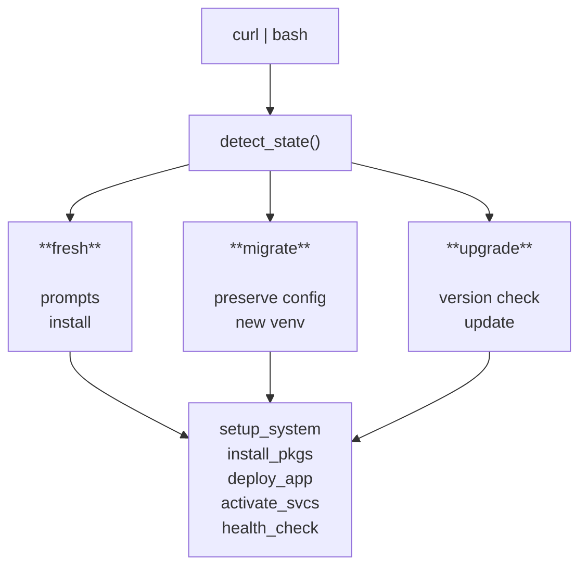

# ADR: McApp Bootstrap Architecture Rewrite

**Date:** 2026-01-25
**Status:** Implemented
**Deciders:** Martin Werner

## Context

The existing McApp installation process consisted of 3 separate shell scripts (`install_caddy.sh`, `mc-install.sh`, `install_mcapp.sh`) that required:
- 4 separate curl commands
- Manual editing of config.json between runs
- Two-phase execution of install_mcapp.sh

This created poor operator experience and several technical issues:
- Not idempotent (broke on re-run)
- Hardcoded German locale and Austrian coordinates
- Hardcoded "bookworm" in Caddy repo (broke on Trixie)
- No SD card wear protection
- No system hardening
- pip-based dependencies prone to drift

## Decision

Implement a unified bootstrap system with:

1. **Single entry point** (`mcapp.sh`) handling all scenarios
2. **State detection** to determine fresh/incomplete/migrate/upgrade
3. **uv package manager** instead of pip
4. **Idempotent operations** using marker-based config management
5. **SD card protection** via tmpfs and volatile journald
6. **Migration support** for existing installations

### Architecture

```
bootstrap/
├── mcapp.sh             # Main entry point, CLI parsing
├── lib/
│   ├── detect.sh        # State & version detection
│   ├── config.sh        # Interactive prompts & validation
│   ├── system.sh        # tmpfs, firewall, services
│   ├── packages.sh      # apt + uv package management
│   ├── deploy.sh        # Webapp + Python deployment
│   └── health.sh        # Health checks & diagnostics
├── templates/           # Configuration templates
├── requirements.txt     # Python dependencies (minimum versions)
└── README.md           # User documentation
```

### State Machine



## Alternatives Considered

### Ansible/Terraform

**Rejected because:**
- Python overhead (~50MB) on 512MB Pi
- Requires control node or pre-installed Python
- Operators are ham radio enthusiasts, not DevOps engineers
- Overkill for single-purpose appliance

### Docker/Containers

**Rejected because:**
- Docker daemon: ~100MB RAM overhead
- Only 512MB total on Pi Zero 2W
- Container overlay FS increases SD card wear
- Added complexity not justified for single-service appliance

### Keep Separate Scripts

**Rejected because:**
- Poor operator experience (4 commands + manual edit)
- Not idempotent
- Duplicate code across scripts
- Difficult to maintain

## Consequences

### Positive

- **Single command** for all scenarios: `curl ... | sudo bash`
- **Idempotent** - safe to re-run
- **Self-healing** - `--fix` mode repairs broken installs
- **Migration support** - seamless upgrade from old scripts
- **SD card longevity** - tmpfs reduces write cycles
- **Security hardening** - firewall, SSH limits, service reduction
- **Faster installs** - uv is 10-100x faster than pip
- **Multi-version Debian** - Bookworm and Trixie support

### Negative

- Larger codebase (~2,700 lines vs ~500 lines total before)
- More complex state machine logic
- Two venv locations during migration period (`~/venv` + `~/mcapp-venv`)

### Neutral

- Old scripts remain in repo (deprecated, for reference)
- Operators must trust new script (same as before)

## Implementation Notes

### Migration Path

The script detects old installations by checking for `~/venv` without `~/mcapp-venv`. Migration:
1. Stops mcapp service
2. Preserves old venv (not deleted)
3. Creates new venv at `~/mcapp-venv`
4. Updates systemd service paths
5. Adds missing config fields

### Debian Version Handling

| Aspect | Bookworm (12) | Trixie (13) |
|--------|---------------|-------------|
| Python | 3.11 | 3.14 |
| Firewall | iptables (legacy) | nftables |

### Testing Requirements

Before release:
1. Fresh install on Bookworm
2. Fresh install on Trixie
3. Migration from old installation
4. Upgrade with version bump
5. Repair mode (`--fix`)
6. Dry-run mode (`--check`)

## References

- Plan document: Detailed architecture plan in conversation
- Old scripts: `install_caddy.sh`, `mc-install.sh`, `install_mcapp.sh`
- uv documentation: https://docs.astral.sh/uv/
