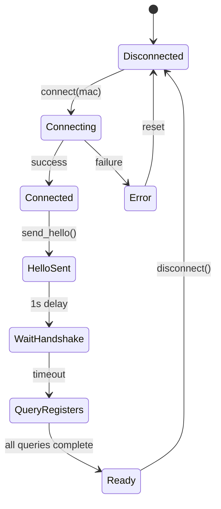

# Phase 4 Verification Report

**Date:** 2026-02-14
**Status:** ⏳ **NOT IMPLEMENTED** (Optional features, not started)

## Summary

Phase 4 consists of **optional advanced features** that are **NOT implemented** in either the main code or the BLE remote service. These are low-priority enhancements for future development.

## Phase 4 Items

### Item 14: Unit Tests for Protocol Encoding/Decoding

**Status:** ❌ **NOT IMPLEMENTED**

**What exists:**
- `src/mcapp/commands/tests.py` - Built-in tests for CommandHandler (application logic)
- These test command reception, intent parsing, kick-ban logic, etc.
- **NOT** protocol-level unit tests

**What's missing:**
- Unit tests for BLE message encoding (0x10-0xF0 message types)
- Unit tests for BLE message decoding (JSON, binary, ACK parsing)
- Test coverage for edge cases (MTU overflow, invalid checksums, malformed messages)
- Pytest test suite for protocol layer

**Impact:** Low - Application works without unit tests, but testing requires real hardware

**Example of what's needed:**
```python
# tests/test_ble_protocol.py (DOES NOT EXIST)
def test_encode_callsign_message():
    """Test 0x50 callsign message encoding"""
    result = encode_callsign("DL4GLE-10")
    assert result == bytes([0x0C, 0x50, ...])  # Expected format

def test_decode_json_message():
    """Test JSON message decoding"""
    data = b'D{"TYP":"I","FRM":"4.35k"}'
    result = decode_json_message(data)
    assert result["TYP"] == "I"

def test_fcs_validation():
    """Test FCS checksum validation"""
    # Valid message
    assert validate_fcs(valid_binary_message) == True
    # Corrupted message
    assert validate_fcs(corrupted_message) == False
```

---

### Item 15: Spectrum Analysis Commands

**Status:** ❌ **NOT IMPLEMENTED**

**Documentation reference:** MeshCom firmware supports spectrum scanning (page 451-468)

**Missing commands:**
- `--spectrum` - Trigger spectrum scan
- `--specstart` - Set start frequency
- `--specend` - Set end frequency
- `--specstep` - Set frequency step size
- `--specsamples` - Set number of samples

**Checked:**
- ✅ Main code (`src/mcapp/`) - No spectrum analysis code
- ✅ BLE remote (`ble_service/`) - No spectrum analysis code

**Impact:** Low - Niche feature for RF analysis

**Implementation effort:** Medium (~200-300 lines)
- Add spectrum commands to command handler
- Add result parsing for spectrum data
- Add frontend visualization (likely requires chart library)

---

### Item 16: BLE State Machine Diagram

**Status:** ❌ **NOT CREATED**

**What's missing:**
- Visual diagram of BLE connection flow
- State transitions: DISCONNECTED → CONNECTING → CONNECTED → ERROR
- Sequence diagram for: connect → hello → wait → query registers → ready

**Current documentation:**
- CLAUDE.md has text descriptions of message flow
- No visual diagrams

**Impact:** Low - Code works, but harder to understand for new developers

**Example of what's needed:**


**Recommended location:** `doc/ble-state-machine.md`

---

### Item 17: Telemetry Configuration Support

**Status:** ❌ **NOT IMPLEMENTED**

**Documentation reference:** Full APRS telemetry system (page 604-629)

**Missing commands:**
- `--parm` - Set telemetry parameter names
- `--unit` - Set telemetry units
- `--format` - Set telemetry format
- `--eqns` - Set telemetry equations
- `--values` - Query current telemetry values
- `--ptime` - Set telemetry interval

**Checked:**
- ✅ Main code (`src/mcapp/`) - No telemetry config code
- ✅ BLE remote (`ble_service/`) - No telemetry config code

**Impact:** Low - Advanced APRS feature, rarely used

**Implementation effort:** Medium-High (~300-400 lines)
- Add telemetry commands to handler
- Add parsing for complex telemetry format
- Add validation for equations and units
- Add frontend UI for telemetry configuration

---

## Overall Phase 4 Status

| Item | Feature | Main Code | Remote BLE | Priority | Effort |
|------|---------|-----------|------------|----------|--------|
| 14 | Unit Tests | ❌ | ❌ | Medium | Medium |
| 15 | Spectrum Analysis | ❌ | ❌ | Low | Medium |
| 16 | State Diagram | ❌ | ❌ | Low | Low |
| 17 | Telemetry Config | ❌ | ❌ | Low | High |

**Summary:** 0 of 4 items implemented (0%)

## Production Readiness

**Question:** Is Phase 4 required for production?

**Answer:** ✅ **NO** - Phase 4 is optional

- Phases 1-3 provide full protocol compliance and production readiness
- Phase 4 items are **nice-to-have** enhancements:
  - Unit tests improve confidence but app works without them
  - Spectrum analysis is a niche RF debugging feature
  - State diagram helps documentation but isn't required for operation
  - Telemetry config is an advanced APRS feature

**Current production status:**
- ✅ Local BLE: Production ready (Phases 1-3 complete)
- ✅ Remote BLE: Production ready (Phases 1-3 complete)
- ⏳ Phase 4: Optional enhancements for future

## Recommendations

### If you want to implement Phase 4:

**Priority order:**
1. **Item 16 (State Diagram)** - Lowest effort, helps documentation
   - Create Mermaid diagrams in `doc/ble-state-machine.md`
   - Estimated: 1-2 hours

2. **Item 14 (Unit Tests)** - Highest value for code quality
   - Set up pytest infrastructure
   - Write protocol encoding/decoding tests
   - Estimated: 8-12 hours

3. **Item 15 (Spectrum Analysis)** - Useful for debugging RF issues
   - Implement spectrum commands
   - Add frontend visualization
   - Estimated: 6-8 hours

4. **Item 17 (Telemetry)** - Lowest priority (advanced users only)
   - Implement telemetry commands
   - Add complex UI for configuration
   - Estimated: 10-15 hours

**Total effort if implementing all:** ~25-37 hours

### If you skip Phase 4:

✅ **This is perfectly acceptable!**

- Your BLE implementation is already production-ready
- Phases 1-3 provide complete protocol compliance
- Phase 4 features can be added later if needed
- Most users won't need spectrum analysis or telemetry config

## Conclusion

**Phase 4 is NOT implemented** and **NOT required for production**.

All critical and high-priority features (Phases 1-3) are complete for both local and remote BLE modes. The application is **production ready** without Phase 4.

Phase 4 items are optional enhancements that can be implemented in the future if specific use cases arise (e.g., RF debugging, advanced APRS telemetry).

**Recommendation:** Mark Phase 4 as "Optional/Future" and proceed with production deployment.
