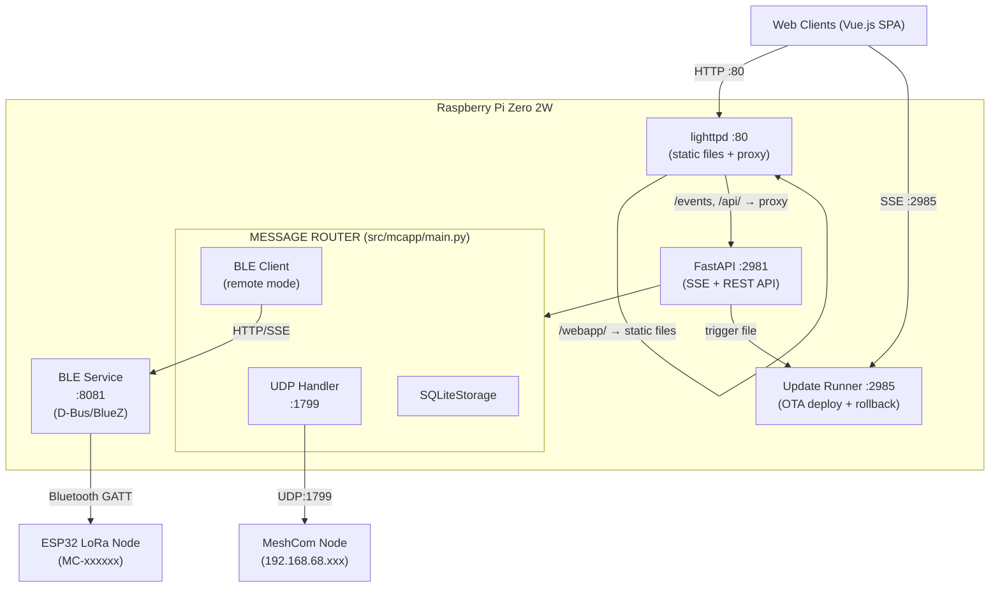
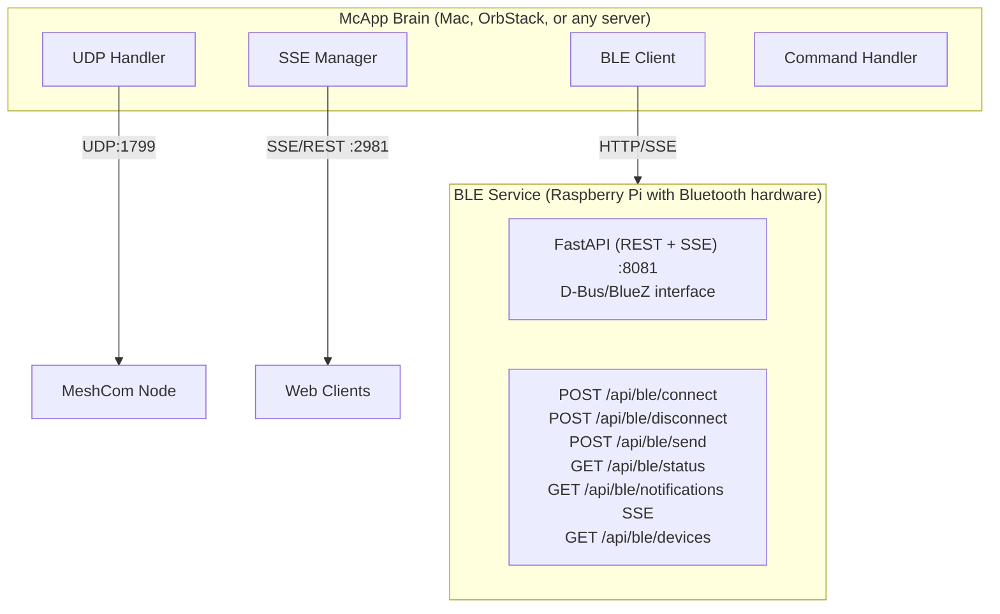
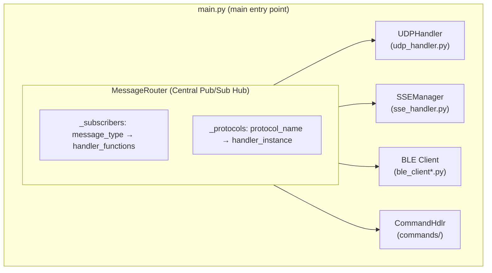

# Architecture Reference

Content preserved from CLAUDE.md — detailed architecture documentation.

## Standard Deployment (Pi with Bluetooth)



## Distributed Deployment (Remote BLE Service)



## Core Components

All source lives in `src/mcapp/`. Entry point: `mcapp.main:run` (invoked via `uv run mcapp`).

- **main.py**: Main entry point. Defines `MessageRouter` (central pub/sub hub) and initializes all protocol handlers
- **sqlite_storage.py**: SQLite storage backend (WAL mode) with cursor-based pagination, type-based retention, composite indexes, and nightly pruning
- **udp_handler.py**: UDP listener/sender for MeshCom node communication (port 1799)
- **sse_handler.py**: SSE/REST API transport (FastAPI-based, port 2981). Proxied through lighttpd on port 80. Import-guarded — only loads if FastAPI is available
- **commands/**: Modular command system using mixin architecture (see Command System section below)
- **config_loader.py**: Dataclass-based configuration with `MCAPP_*` environment variable overrides
- **logging_setup.py**: Centralized logging with `EmojiFormatter`, `get_logger()`, `has_console()` detection
- **meteo.py**: `WeatherService` class — hybrid DWD BrightSky + OpenMeteo weather provider

## BLE Abstraction Layer

The BLE subsystem supports two modes via a unified client interface:

| Mode | File | Description |
|------|------|-------------|
| `remote` | `ble_client_remote.py` | HTTP/SSE client to remote BLE service |
| `disabled` | `ble_client_disabled.py` | No-op stub for testing |

For local BLE hardware access, deploy the standalone BLE service (ble_service/) on the Pi.

- **ble_client.py**: Abstract interface + `create_ble_client()` factory function
- **ble_protocol.py**: Shared protocol decoders/transformers (used by remote client and BLE service)

## BLE Service (Standalone)

Located in `ble_service/` - a FastAPI service that exposes BLE hardware via HTTP:

- **ble_service/src/main.py**: FastAPI REST API + SSE endpoints
- **ble_service/src/ble_adapter.py**: Clean D-Bus/BlueZ wrapper class
- **ble_service/mcapp-ble.service**: Systemd service file for Pi

## Message Flow

1. Messages arrive via UDP (from MeshCom node) or BLE (from ESP32)
2. MessageRouter publishes to subscribers based on message type
3. Messages are stored, broadcast to SSE clients, and processed for commands
4. Outbound messages from clients go through suppression logic before mesh transmission

## Key Classes

- `MessageRouter`: Central pub/sub hub connecting all protocols
- `MessageValidator`: Handles message normalization and outbound suppression logic
- `SQLiteStorage`: Persistent storage with WAL mode, pruning, and parallel signal processing
- `BLEClient`: D-Bus based BLE connection with keep-alive and auto-reconnect
- `CommandHandler`: Extensible command system with throttling and abuse protection

## Command System (Mixin Architecture)

The `src/mcapp/commands/` package uses a mixin-based design where `CommandHandler` is assembled from specialized mixins:

- **handler.py** — `CommandHandler` class + `COMMANDS` registry + `create_command_handler()` factory
- **routing.py** — `RoutingMixin`: message reception, intent-based routing to the correct command
- **response.py** — `ResponseMixin`: response delivery back to mesh
- **dedup.py** — `DedupMixin`: duplicate message detection
- **simple_commands.py** — `SimpleCommandsMixin`: `!dice`, `!time`, `!userinfo`
- **data_commands.py** — `DataCommandsMixin`: `!search`, `!stats`, `!mheard`, `!pos`
- **weather_command.py** — `WeatherCommandMixin`: `!wx` / `!weather`
- **admin_commands.py** — `AdminCommandsMixin`: `!kb` (kick-ban), `!topic`
- **topic_beacon.py** — `TopicBeaconMixin`: group beacon management
- **ctcping.py** — `CTCPingMixin`: CTCSS/ping feature
- **constants.py** — Shared constants
- **tests.py** — Built-in test suite (`run_all_tests()`)

## Module Integration

The `MessageRouter` (defined in `src/mcapp/main.py`) is the central pub/sub hub that connects all protocol handlers:



**Initialization Flow** (in `src/mcapp/main.py`, `main()` function):
```python
# 1. Storage — SQLite (with migration) or in-memory deque fallback
if cfg.storage.backend == "sqlite" and SQLITE_AVAILABLE:
    storage_handler = await create_sqlite_storage(...)
else:
    storage_handler = MessageStorageHandler(deque(), cfg.storage.max_size_mb)

# 2. Central router
message_router = MessageRouter(storage_handler)
message_router.set_callsign(cfg.call_sign)

# 3. GPS caching from BLE → updates weather service location
message_router.subscribe("ble_notification", _cache_gps)

# 4. Protocol handlers
command_handler = create_command_handler(message_router, storage_handler, ...)
message_router.register_protocol('commands', command_handler)

udp_handler = UDPHandler(..., message_router=message_router)
message_router.register_protocol('udp', udp_handler)

# 5. SSE manager (REST API + Server-Sent Events), BLE client (local/remote/disabled)
```

**Message Types & Subscriptions:**

| Message Type | Subscribers | Purpose |
|--------------|-------------|---------|
| `mesh_message` | SSEManager, StorageHandler | Messages from LoRa mesh |
| `ble_notification` | SSEManager, StorageHandler, CommandHandler | BLE device notifications |
| `ble_status` | SSEManager | BLE connection status updates |
| `websocket_message` | SSEManager | Messages to broadcast to clients |
| `ble_message` | BLE handler | Outbound messages via BLE |
| `udp_message` | UDP handler | Outbound messages via UDP |

**Incoming Message Flow (BLE → SSE clients):**
1. BLE device sends GATT notification
2. `BLEClient._on_props_changed()` receives raw bytes
3. `notification_handler()` parses JSON or binary format
4. `message_router.publish('ble', 'ble_notification', data)`
5. `SSEManager._broadcast_handler()` receives via subscription
6. Broadcasts via SSE to all connected clients

**Outgoing Message Flow (Client → Mesh):**
1. Client sends message via `POST /api/send`
2. `SSEManager` routes by type (command, BLE, or UDP message)
3. `message_router.publish('sse', 'udp_message', data)`
4. `MessageRouter._udp_message_handler()` applies suppression logic
5. `UDPHandler.send_message()` sends JSON to MeshCom node

## Protocol Details

### UDP Message Format
JSON messages with fields: `src`, `dst`, `msg`, `type` (msg/pos/ack), `timestamp`, `rssi`, `snr`

### BLE Binary Messages
- Prefix `D{`: JSON config messages (TYP: MH, SA, G, W, SN, etc.)
- Prefix `@:` or `@!`: Binary mesh messages with header (payload_type, msg_id, hop_count)
- Prefix `@A`: ACK messages

### Chat Commands
All commands start with `!` and are processed by CommandHandler:
- `!wx` / `!weather`: Current weather
- `!mheard` / `!mh`: Recently heard stations
- `!stats`: Message statistics
- `!search`: Search messages by callsign
- `!pos`: Position data lookup
- `!dice`: Roll dice (Mäxchen rules)
- `!time`: Node time
- `!topic`: Group beacon management (admin)
- `!kb`: Kick-ban management (admin)

## Project Directory Structure

```
MCProxy/
├── pyproject.toml           # Project config (hatchling build, uv workspace)
├── uv.lock                  # Locked dependencies
├── config.sample.json       # Configuration template
├── scripts/                 # Release and setup scripts
│   ├── release.sh           # Interactive release builder (gh CLI)
│   ├── update-runner.py     # Standalone OTA update server (port 2985)
│   └── ssl-tunnel-setup.sh  # TLS remote access setup (standalone)
│
├── src/mcapp/               # Main Python package
│   ├── __init__.py          # Version export (__version__)
│   ├── main.py              # Entry point + MessageRouter
│   ├── config_loader.py     # Dataclass-based configuration
│   ├── logging_setup.py     # Centralized logging + EmojiFormatter
│   ├── sqlite_storage.py    # SQLite storage backend (WAL mode)
│   ├── udp_handler.py       # UDP protocol handler
│   ├── sse_handler.py       # SSE/REST API transport (FastAPI, port 2981)
│   ├── meteo.py             # WeatherService (DWD + OpenMeteo)
│   ├── ble_client.py        # BLE abstraction interface + factory
│   ├── ble_client_remote.py # Remote BLE (HTTP/SSE)
│   ├── ble_client_disabled.py # No-op stub
│   ├── ble_protocol.py      # Shared BLE protocol decoders/transformers
│   └── commands/            # Modular command system (mixin-based)
│       ├── __init__.py
│       ├── handler.py       # CommandHandler + COMMANDS registry
│       ├── routing.py       # RoutingMixin
│       ├── response.py      # ResponseMixin
│       ├── dedup.py         # DedupMixin
│       ├── simple_commands.py
│       ├── data_commands.py
│       ├── weather_command.py
│       ├── admin_commands.py
│       ├── topic_beacon.py
│       ├── ctcping.py
│       ├── constants.py
│       └── tests.py         # Built-in test suite
│
├── ble_service/             # Standalone BLE service (uv workspace member)
│   ├── src/
│   │   ├── __init__.py
│   │   ├── main.py          # FastAPI REST + SSE
│   │   └── ble_adapter.py   # Clean D-Bus wrapper
│   ├── pyproject.toml
│   ├── mcapp-ble.service    # Systemd service
│   └── README.md            # API documentation
│
├── bootstrap/               # Installation scripts
│   ├── mcapp.sh             # Main entry point
│   ├── DEPLOYMENT_LOGGING.md # Deployment logging guide
│   ├── README.md            # Installation documentation
│   ├── lib/                 # Script modules
│   └── templates/           # Config templates (incl. caddy/, cloudflared/)
│
└── doc/                     # Documentation
    ├── 2026-01-25_1400-bootstrap-rewrite-ADR.md          # Bootstrap redesign ADR
    ├── 2026-02-10_1200-tls-remote-access-ADR.md          # TLS setup ADR
    ├── 2026-02-11_1400-position-signal-architecture-ADR.md # Position/signal table architecture ADR
    ├── 2026-02-14_1500-altitude-normalization-ADR.md     # Altitude normalization ADR
    ├── tls-architecture.md       # TLS setup diagrams
    ├── tls-maintenance-SOP.md    # TLS maintenance procedures
    ├── a0-commands.md            # Command system documentation
    ├── ble-state-machine.md      # BLE state machine
    ├── dataflow.md               # Data flow diagrams
    ├── telemetry.md              # Telemetry documentation
    ├── MeshCom-ACK.md            # ACK protocol
    ├── remote-flash.md           # Remote firmware update
    └── release-history.md        # Version history
```

## Dependencies

Python packages (managed via `uv`, see `pyproject.toml`):
- `dbus-next>=0.2.3`: BlueZ D-Bus interface for BLE (only in ble_service, removed from main package)
- `timezonefinder>=6.5.0`: Timezone detection for node time sync
- `requests>=2.31.0`: HTTP client for weather API (DWD BrightSky + OpenMeteo)
- `aiohttp>=3.9.0`: Async HTTP client for remote BLE
- `aiohttp-sse-client>=0.2.1`: SSE client for remote BLE notifications
- `fastapi>=0.115.0`: REST API framework (SSE transport, BLE service)
- `uvicorn[standard]>=0.34.0`: ASGI server for FastAPI
- `sse-starlette>=2.0.0`: SSE support for FastAPI
- `pydantic>=2.0`: Data validation

System packages (installed via apt):
- `lighttpd`: Static file server for Vue.js SPA
- `bluez`: Bluetooth stack for BLE (only on Pi running BLE service)
- `jq`: JSON processing in shell scripts
