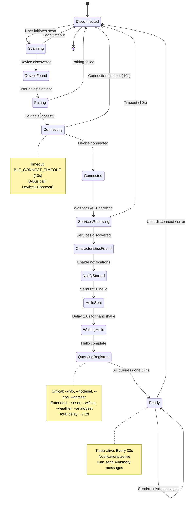
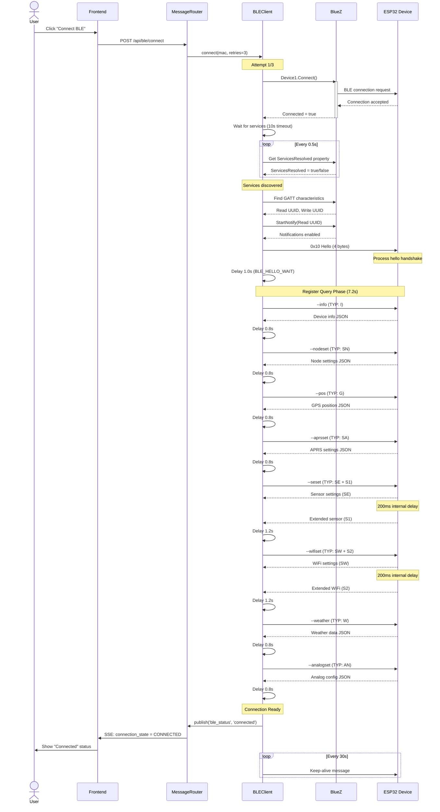
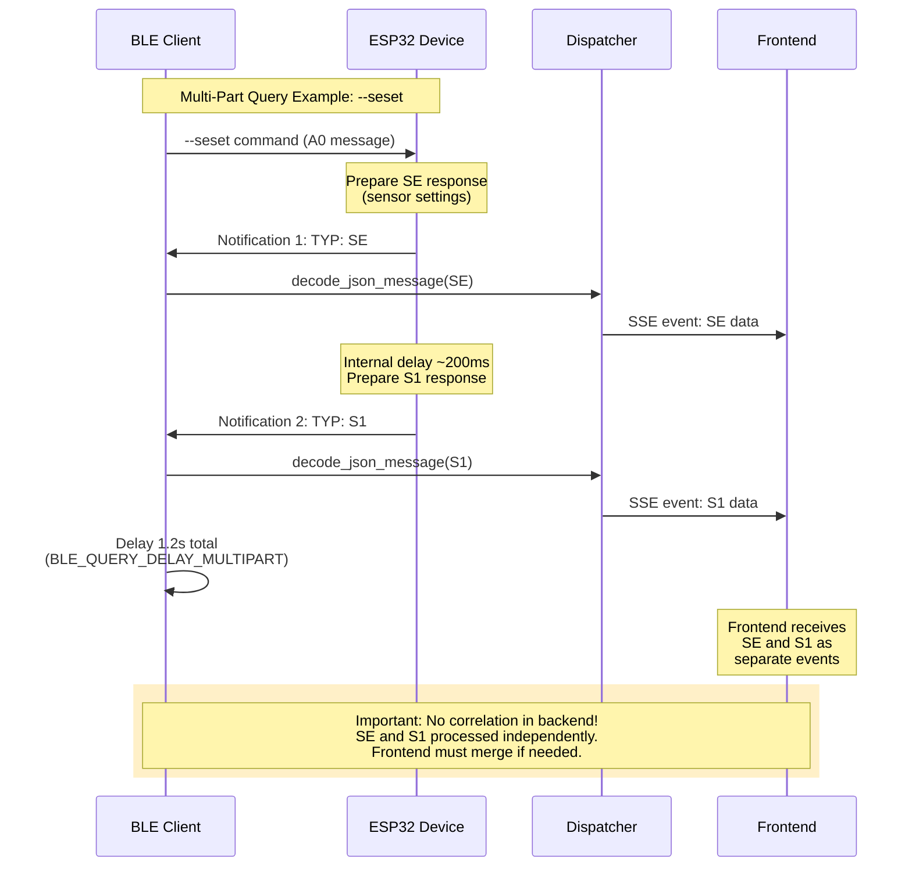
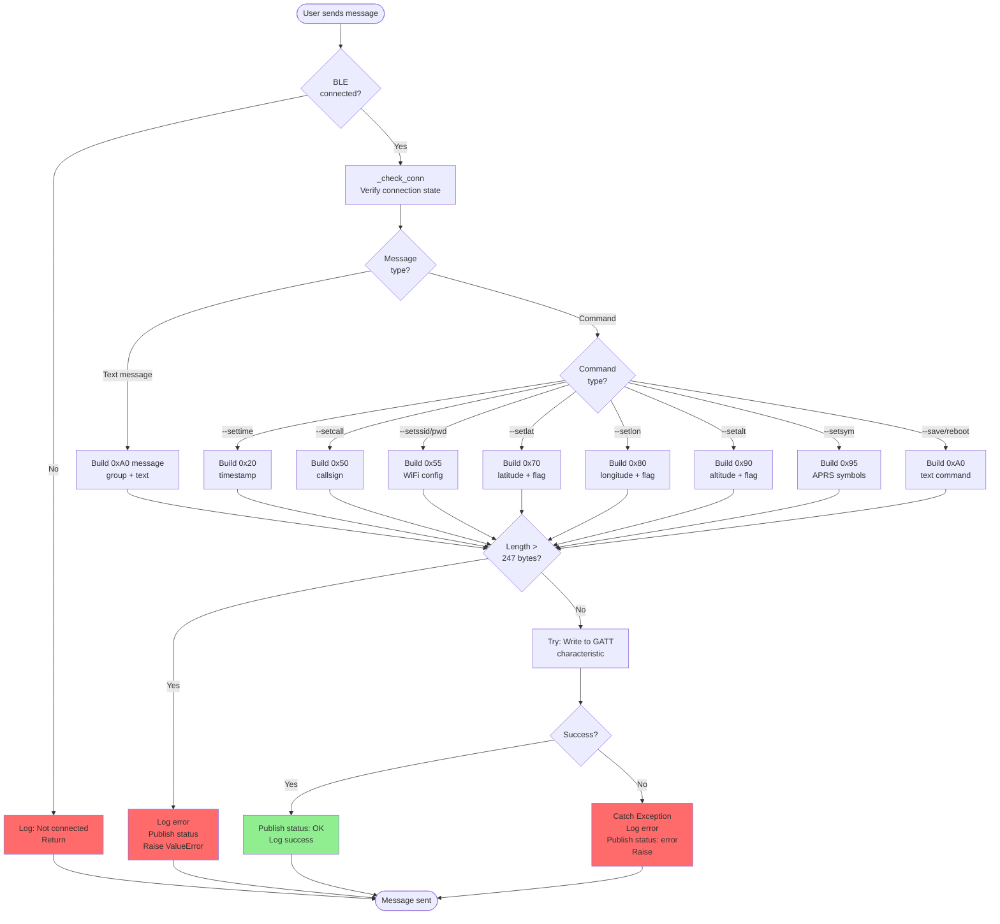
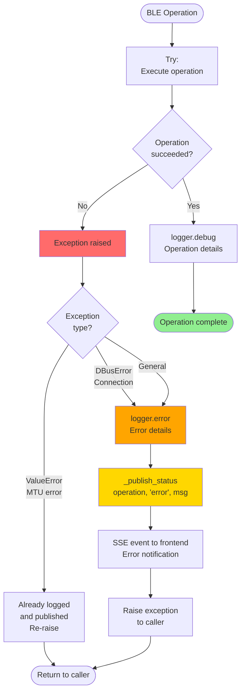
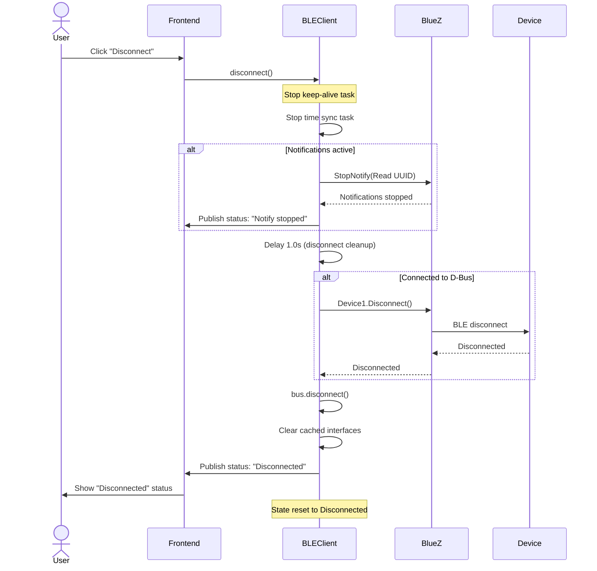

# BLE State Machine and Message Flow Documentation

**Date:** 2026-02-14
**Version:** 1.0
**Related Files:** `src/mcapp/ble_handler.py`, `src/mcapp/main.py`

This document provides visual documentation of the BLE connection lifecycle, message flows, and state transitions in McApp.

---

## Table of Contents

1. [Connection State Machine](#connection-state-machine)
2. [Connection Sequence Diagram](#connection-sequence-diagram)
3. [Register Query Flow](#register-query-flow)
4. [Multi-Part Response Flow](#multi-part-response-flow)
5. [Message Send Flow](#message-send-flow)
6. [Error Handling Flow](#error-handling-flow)
7. [Disconnect Flow](#disconnect-flow)

---

## Connection State Machine

The BLE connection goes through several states from initial discovery to ready for communication.



### State Descriptions

| State | Description | Timeout | Implementation |
|-------|-------------|---------|----------------|
| **Disconnected** | No active connection | - | Initial state |
| **Scanning** | Discovering nearby BLE devices | User-defined | BlueZ adapter scan |
| **DeviceFound** | Device discovered, awaiting user action | - | Device MAC known |
| **Pairing** | Bluetooth pairing in progress | User-defined | BlueZ pairing agent |
| **Connecting** | Establishing BLE connection | 10.0s | `BLEClient.connect()` |
| **Connected** | Physical connection established | - | `Device1.Connected = true` |
| **ServicesResolving** | GATT service discovery | 10.0s | Polling `ServicesResolved` every 0.5s |
| **CharacteristicsFound** | Read/write UUIDs found | - | GATT characteristics cached |
| **NotifyStarted** | Notifications enabled | - | `GattCharacteristic1.StartNotify()` |
| **HelloSent** | 0x10 hello message sent | - | 4-byte handshake: `\x04\x10\x20\x30` |
| **WaitingHello** | Delay for firmware processing | 1.0s | `BLE_HELLO_WAIT` constant |
| **QueryingRegisters** | Fetching device config | ~7.2s | 8 register queries with delays |
| **Ready** | Fully operational | - | Can send/receive all message types |

---

## Connection Sequence Diagram

Detailed sequence of operations during BLE connection from user action to ready state.



### Timing Summary

| Phase | Duration | Details |
|-------|----------|---------|
| Connection | ~2-5s | BLE connection + service discovery |
| Hello Handshake | 1.0s | Mandatory delay before queries |
| Critical Queries | 3.2s | 4 queries × 0.8s each |
| Extended Queries | 4.0s | 2 multi-part (1.2s) + 2 standard (0.8s) |
| **Total** | **~7-11s** | From "Connect" click to ready |

---

## Register Query Flow

Detailed flow of the register query process showing critical vs extended queries.

```mermaid
flowchart TD
    Start([BLE Connected]) --> HelloWait{Wait for<br/>hello?}

    HelloWait -->|Yes| WaitDelay[Delay 1.0s<br/>BLE_HELLO_WAIT]
    HelloWait -->|No| TimeSync
    WaitDelay --> TimeSync

    TimeSync{Sync time?} -->|Yes| SendTime[Send --settime<br/>0x20 message]
    TimeSync -->|No| CriticalStart
    SendTime --> CriticalStart

    CriticalStart[Start Critical Queries] --> Q1

    Q1[--info<br/>TYP: I] --> D1[Delay 0.8s]
    D1 --> Q2[--nodeset<br/>TYP: SN]
    Q2 --> D2[Delay 0.8s]
    D2 --> Q3[--pos<br/>TYP: G]
    Q3 --> D3[Delay 0.8s]
    D3 --> Q4[--aprsset<br/>TYP: SA]
    Q4 --> D4[Delay 0.8s]

    D4 --> ExtendedStart[Start Extended Queries]

    ExtendedStart --> Q5[--seset<br/>TYP: SE + S1<br/>Multi-part]
    Q5 --> D5[Delay 1.2s<br/>BLE_QUERY_DELAY_MULTIPART]
    D5 --> Q6[--wifiset<br/>TYP: SW + S2<br/>Multi-part]
    Q6 --> D6[Delay 1.2s]
    D6 --> Q7[--weather<br/>TYP: W]
    Q7 --> D7[Delay 0.8s<br/>BLE_QUERY_DELAY_STANDARD]
    D7 --> Q8[--analogset<br/>TYP: AN]
    Q8 --> D8[Delay 0.8s]

    D8 --> Complete([Ready for Use])

    style Q1 fill:#90EE90
    style Q2 fill:#90EE90
    style Q3 fill:#90EE90
    style Q4 fill:#90EE90
    style Q5 fill:#FFD700
    style Q6 fill:#FFD700
    style Q7 fill:#87CEEB
    style Q8 fill:#87CEEB

    style Complete fill:#00FF00
```



**Legend:**
- 🟢 Green: Critical queries (always run)
- 🟡 Gold: Multi-part queries (SE+S1, SW+S2)
- 🔵 Blue: Extended queries (optional, can fail)

---

## Multi-Part Response Flow

Some queries trigger two separate notifications sent sequentially by the device.



### Multi-Part Pairs

| Command | Part 1 | Part 2 | Delay | Description |
|---------|--------|--------|-------|-------------|
| `--seset` | SE | S1 | 1.2s | Sensor settings + extended sensor data |
| `--wifiset` | SW | S2 | 1.2s | WiFi settings + extended WiFi data |

**Key Points:**
1. Device sends TWO separate BLE notifications
2. ~200ms internal delay between parts
3. Backend processes each independently
4. Both published as separate SSE events
5. Frontend responsible for merging if needed
6. Client uses 1.2s delay (longer than single queries) to ensure both parts arrive

---

## Message Send Flow

Flow for sending messages from user to the mesh network.



### Message Format Reference

| Type | Msg ID | Format | Example |
|------|--------|--------|---------|
| Text Message | 0xA0 | `[LEN][0xA0][{GRP}MSG]` | Group chat |
| Set Time | 0x20 | `[LEN][0x20][TIMESTAMP]` | UNIX timestamp (4B LE) |
| Set Callsign | 0x50 | `[LEN][0x50][LEN][CALL]` | Length-prefixed string |
| WiFi Config | 0x55 | `[LEN][0x55][SSID_LEN][SSID][PWD_LEN][PWD]` | Two length-prefixed strings |
| Set Latitude | 0x70 | `[LEN][0x70][FLOAT][FLAG]` | 4B float (LE) + save flag |
| Set Longitude | 0x80 | `[LEN][0x80][FLOAT][FLAG]` | 4B float (LE) + save flag |
| Set Altitude | 0x90 | `[LEN][0x90][INT][FLAG]` | 4B signed int (LE) + flag |
| APRS Symbols | 0x95 | `[LEN][0x95][PRI][SEC]` | 2 bytes (table + symbol) |
| Save & Reboot | 0xF0 | `[LEN][0xF0]` | No payload |

---

## Error Handling Flow

Comprehensive error handling ensures frontend always receives status updates.



### Error Handling Pattern

All BLE operations follow this pattern:

```python
try:
    # BLE operation (write, read, etc.)
    await self.write_char_iface.call_write_value(byte_array, {})
    logger.debug("Operation succeeded: %s", context)

except ValueError:
    # MTU validation error - already logged
    raise

except Exception as e:
    logger.error("Operation failed: %s", e)
    await self._publish_status('operation', 'error', f"❌ Failed: {e}")
    raise
```

### Status Publishing

All errors are published to the frontend via SSE:

| Operation | Status Types | Messages |
|-----------|--------------|----------|
| Connect | `info`, `error` | Connection progress, failures |
| Send Hello | `info`, `error` | Handshake status |
| Send Message | `ok`, `error` | Message sent or failed |
| Send Command | `ok`, `error` | Command execution status |

---

## Disconnect Flow

Graceful disconnection with cleanup.



### Cleanup Steps

1. Stop keep-alive task (if running)
2. Stop time sync task (if running)
3. Stop GATT notifications
4. Delay 1.0s for cleanup
5. Disconnect from device
6. Disconnect from D-Bus
7. Clear cached interfaces
8. Publish disconnection status
9. Reset state

---

## Implementation Reference

### Key Files

| File | Purpose | Key Functions |
|------|---------|---------------|
| `ble_handler.py` | BLE connection management | `connect()`, `send_hello()`, `send_message()` |
| `main.py` | Register query orchestration | `_query_ble_registers()`, `_send_ble_command_with_retry()` |
| `ble_client.py` | Abstraction interface | `create_ble_client()` factory |
| `ble_client_local.py` | Local D-Bus implementation | Wrapper around `ble_handler.py` |
| `ble_client_remote.py` | Remote HTTP/SSE client | For distributed deployments |

### Timing Constants

All timing constants are centralized:

**`ble_handler.py`:**
```python
BLE_CONNECT_TIMEOUT = 10.0           # Connection timeout
BLE_SERVICES_CHECK_INTERVAL = 0.5    # Service polling interval
BLE_KEEPALIVE_INTERVAL = 30.0        # Keep-alive frequency
BLE_HELLO_DELAY = 1.0                # Post-hello delay
BLE_DISCONNECT_DELAY = 2.0           # Pre-disconnect delay
```

**`main.py`:**
```python
BLE_HELLO_WAIT = 1.0                 # Wait after hello
BLE_QUERY_DELAY_STANDARD = 0.8       # Standard query delay
BLE_QUERY_DELAY_MULTIPART = 1.2      # Multi-part query delay
BLE_RETRY_BASE_DELAY = 0.5           # Retry backoff base
```

---

## Troubleshooting

### Common Issues

| Issue | State | Cause | Solution |
|-------|-------|-------|----------|
| Connection timeout | Connecting | Device too far, interference | Retry, move closer |
| Services not resolved | ServicesResolving | Slow device, BLE stack issue | Increase timeout, restart BlueZ |
| Hello timeout | WaitingHello | Device not ready | Increase `BLE_HELLO_WAIT` |
| Query failures | QueryingRegisters | Command not supported | Check firmware version |
| MTU exceeded | Ready | Message too long | Split message or shorten |
| Connection drops | Ready | Signal weak, device reboot | Auto-reconnect on next send |

### Debug Tips

1. **Enable verbose logging**: Set `MCAPP_ENV=dev`
2. **Monitor D-Bus**: `dbus-monitor --system`
3. **Check BlueZ logs**: `journalctl -u bluetooth -f`
4. **Check service logs**: `journalctl -u mcapp.service -f`
5. **Frontend SSE stream**: Browser DevTools → Network → EventStream

---

## Future Enhancements

Potential improvements to the state machine:

1. **Automatic Reconnection**: Retry on connection loss
2. **State Persistence**: Resume state after app restart
3. **Queue Management**: Queue messages during disconnection
4. **Connection Pooling**: Multiple simultaneous devices
5. **Smart Retry**: Exponential backoff on connection failures
6. **Health Monitoring**: Periodic connection quality checks

---

**Document Maintenance:**
- Update diagrams when adding new states or transitions
- Keep timing constants synchronized with code
- Document any protocol changes from firmware updates
- Add new message types as implemented

**Related Documents:**
- `doc/ble-challenges.md` - Gap analysis and implementation status
- `doc/a0-commands.md` - Firmware protocol specification
- `doc/phase3-summary.md` - Phase 3 implementation details
