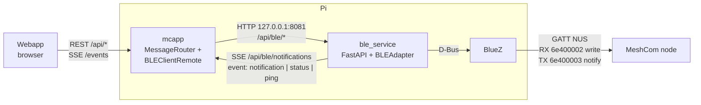
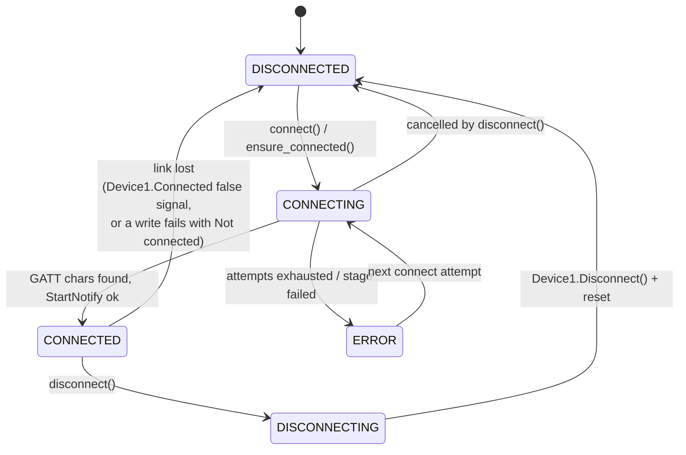
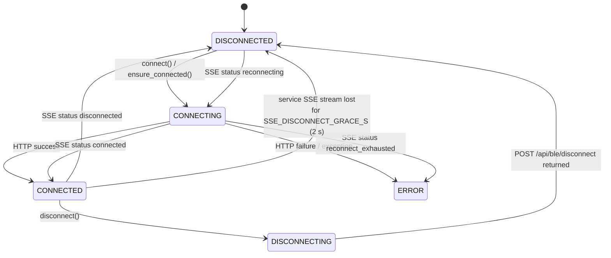
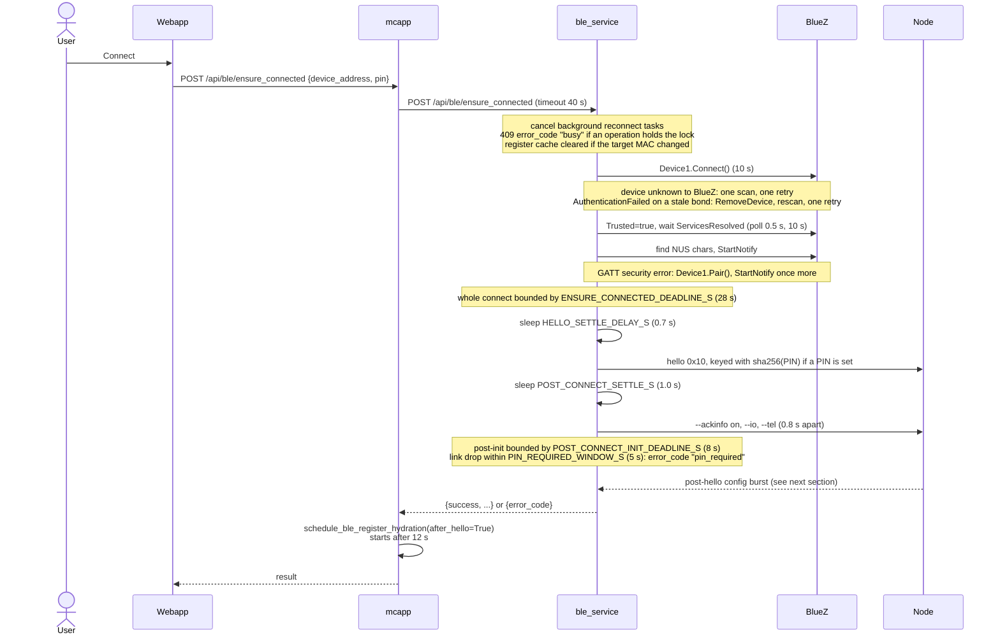
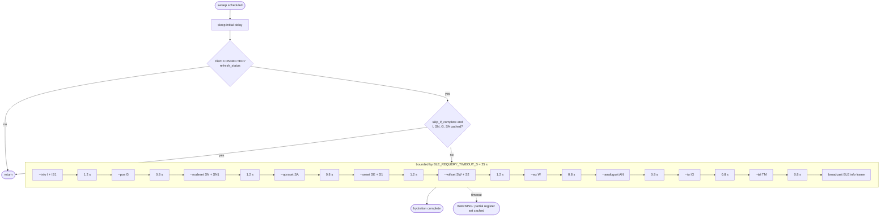
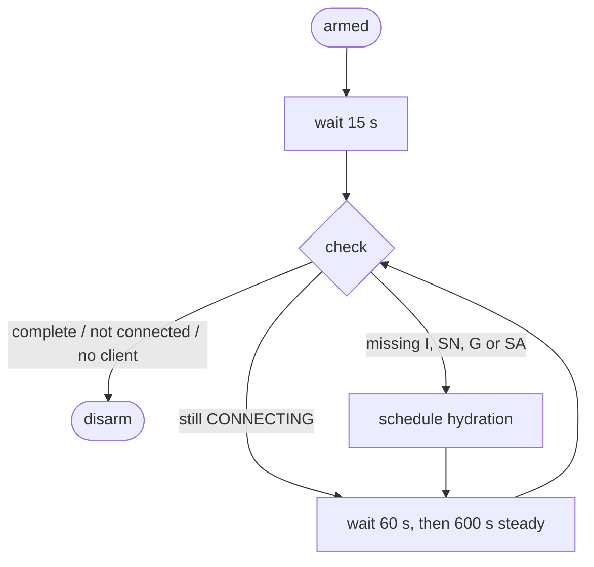
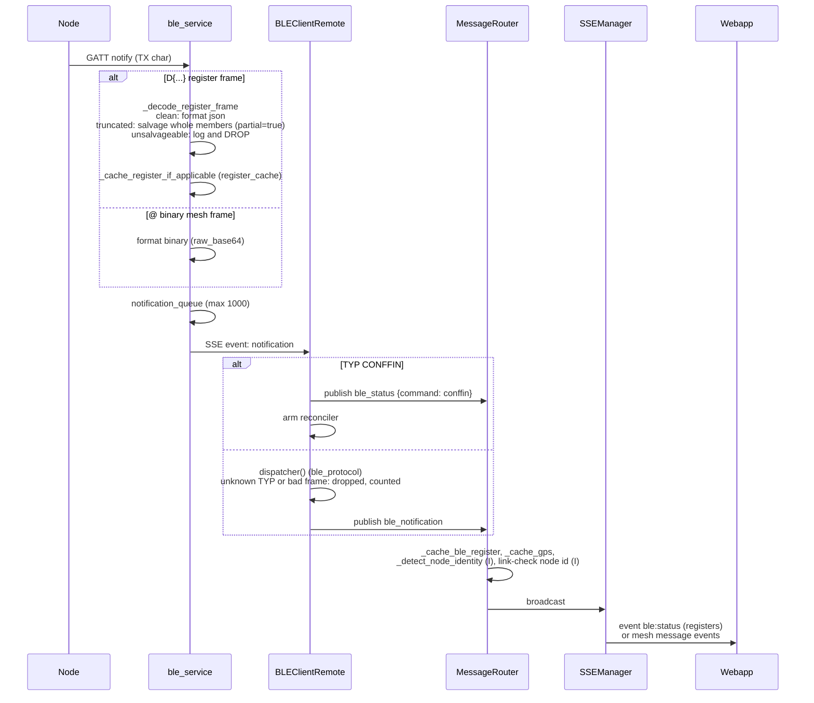
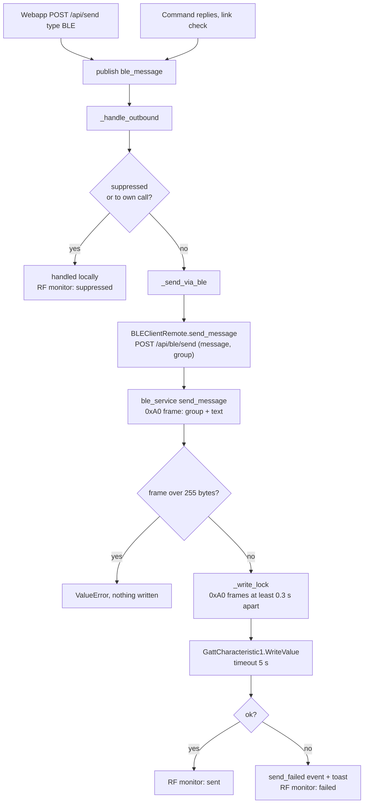
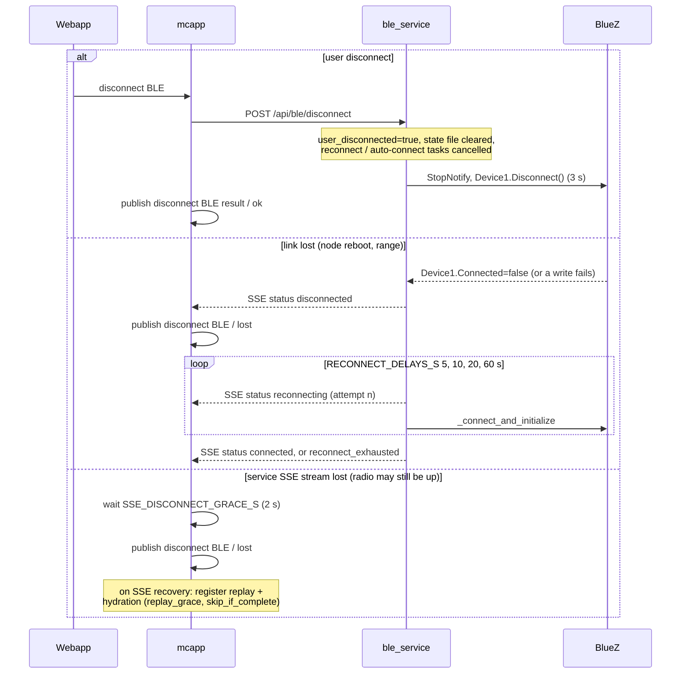

# BLE State Machine and Message Flow

**Updated:** 2026-09-25 (rewrite; replaces the 2026-02-14 version, which described the removed
in-process `ble_handler.py` / local D-Bus mode)

**Related files:** `ble_service/src/ble_adapter.py`, `ble_service/src/main.py`,
`src/mcapp/ble_client_remote.py`, `src/mcapp/ble_client.py`, `src/mcapp/main.py`,
`src/mcapp/sse_routes/deploy.py`, `src/mcapp/sse_handler.py`

Line numbers drift; constant and function names are the stable anchors. When code and this document
disagree, the code wins — fix the document.

---

## Table of Contents

1. [Architecture](#architecture)
2. [State Machines](#state-machines)
3. [Connect Flows](#connect-flows)
4. [Post-Hello Burst and Register Hydration](#post-hello-burst-and-register-hydration)
5. [Register Reconciler](#register-reconciler)
6. [Multi-Part Registers](#multi-part-registers)
7. [Notification Path](#notification-path)
8. [Send Path](#send-path)
9. [Disconnect, Link Loss and Reconnect](#disconnect-link-loss-and-reconnect)
10. [Timing Constants](#timing-constants)
11. [Troubleshooting](#troubleshooting)

---

## Architecture

Two processes on the Pi. Only `ble_service` touches Bluetooth; mcapp is an HTTP/SSE client of it.

```mermaid
flowchart LR
    Webapp[Webapp<br/>browser] -- "REST /api/*<br/>SSE /events" --> Mcapp
    subgraph Pi
        Mcapp[mcapp<br/>MessageRouter +<br/>BLEClientRemote] -- "HTTP 127.0.0.1:8081<br/>/api/ble/*" --> BleSvc[ble_service<br/>FastAPI + BLEAdapter]
        BleSvc -- "SSE /api/ble/notifications<br/>event: notification | status | ping" --> Mcapp
        BleSvc -- "D-Bus" --> BlueZ[BlueZ]
    end
    BlueZ -- "GATT NUS<br/>RX 6e400002 write<br/>TX 6e400003 notify" --> Node[MeshCom node]
```

- **BLE modes** (`BLEMode`, `ble_client.py`): `remote` (default) and `disabled`, selected by
  `MCAPP_BLE_MODE` > config `BLE_MODE` > `"remote"`. There is no local mode anymore. If building or
  starting the remote client fails, mcapp falls back to the `disabled` stub for the process lifetime.
- **Service URL:** `BLE_SERVICE_URL = "http://127.0.0.1:8081"`, overridable with `MCAPP_BLE_URL`;
  auth via `X-API-Key` (`MCAPP_BLE_API_KEY` / `BLE_API_KEY`).
- **Register caches exist twice:** `ble_service`'s `register_cache` (survives mcapp restarts and plain
  disconnects) and mcapp's `MessageRouter.cached_ble_registers` (serves webapp SSE reconnects). See
  [Notification Path](#notification-path).

---

## State Machines

### ble_service: `BLEAdapter` (`ConnectionState`, `ble_adapter.py`)

```mermaid
stateDiagram-v2
    [*] --> DISCONNECTED

    DISCONNECTED --> CONNECTING: connect() / ensure_connected()
    CONNECTING --> CONNECTED: GATT chars found, StartNotify ok
    CONNECTING --> ERROR: attempts exhausted / stage failed
    CONNECTING --> DISCONNECTED: cancelled by disconnect()

    CONNECTED --> DISCONNECTING: disconnect()
    DISCONNECTING --> DISCONNECTED: Device1.Disconnect() + reset

    CONNECTED --> DISCONNECTED: link lost<br/>(Device1.Connected false signal,<br/>or a write fails with Not connected)

    ERROR --> CONNECTING: next connect attempt
```

The service's wire vocabulary adds two strings that are not enum members (`ble_service/src/main.py`):
`reconnecting` (`STATUS_RECONNECTING`; `/api/ble/status.state` reports it instead of the enum value
while a reconnect ladder runs) and `reconnect_exhausted` (`STATUS_RECONNECT_EXHAUSTED`).

### mcapp: `BLEClientRemote` (`ConnectionState`, `ble_client.py`)

A mirror of the service's state, driven by mcapp's own HTTP calls and by `status` events on the
service SSE stream. Unknown wire strings map to `DISCONNECTED` (`ConnectionState.from_wire`).

```mermaid
stateDiagram-v2
    [*] --> DISCONNECTED

    DISCONNECTED --> CONNECTING: connect() / ensure_connected()
    CONNECTING --> CONNECTED: HTTP success
    CONNECTING --> ERROR: HTTP failure / exception

    DISCONNECTED --> CONNECTING: SSE status reconnecting
    CONNECTING --> CONNECTED: SSE status connected
    CONNECTING --> ERROR: SSE status reconnect_exhausted
    CONNECTED --> DISCONNECTED: SSE status disconnected

    CONNECTED --> DISCONNECTING: disconnect()
    DISCONNECTING --> DISCONNECTED: POST /api/ble/disconnect returned

    CONNECTED --> DISCONNECTED: service SSE stream lost<br/>for SSE_DISCONNECT_GRACE_S (2 s)
```

Every transition into `CONNECTED` arms the [register reconciler](#register-reconciler). Only
`DISCONNECTED -> CONNECTED` publishes `connect BLE result / ok / "BLE auto-reconnected"`; the common
path is `CONNECTING -> CONNECTED`, because the service always sends `reconnecting` first.

`connect()` has a guard (returns False while already `CONNECTING`) and a cooldown
(`CONNECT_COOLDOWN_S = 15.0`); `ensure_connected()` has neither, on purpose — it is the explicit user
action.

---

## Connect Flows

### Main flow: `POST /api/ble/ensure_connected` (webapp connect button)

mcapp's route (`sse_routes/deploy.py`) forwards to the service and, on success, schedules register
hydration with `after_hello=True`.

```mermaid
sequenceDiagram
    actor User
    participant Webapp
    participant Mcapp as mcapp
    participant Svc as ble_service
    participant BlueZ
    participant Node

    User->>Webapp: Connect
    Webapp->>Mcapp: POST /api/ble/ensure_connected {device_address, pin}
    Mcapp->>Svc: POST /api/ble/ensure_connected (timeout 40 s)
    Note over Svc: cancel background reconnect tasks<br/>409 error_code "busy" if an operation holds the lock<br/>register cache cleared if the target MAC changed
    Svc->>BlueZ: Device1.Connect() (10 s)
    Note over Svc,BlueZ: device unknown to BlueZ: one scan, one retry<br/>AuthenticationFailed on a stale bond: RemoveDevice, rescan, one retry
    Svc->>BlueZ: Trusted=true, wait ServicesResolved (poll 0.5 s, 10 s)
    Svc->>BlueZ: find NUS chars, StartNotify
    Note over Svc,BlueZ: GATT security error: Device1.Pair(), StartNotify once more
    Note over Svc: whole connect bounded by ENSURE_CONNECTED_DEADLINE_S (28 s)
    Svc->>Svc: sleep HELLO_SETTLE_DELAY_S (0.7 s)
    Svc->>Node: hello 0x10, keyed with sha256(PIN) if a PIN is set
    Svc->>Svc: sleep POST_CONNECT_SETTLE_S (1.0 s)
    Svc->>Node: --ackinfo on, --io, --tel (0.8 s apart)
    Note over Svc: post-init bounded by POST_CONNECT_INIT_DEADLINE_S (8 s)<br/>link drop within PIN_REQUIRED_WINDOW_S (5 s): error_code "pin_required"
    Node-->>Svc: post-hello config burst (see next section)
    Svc-->>Mcapp: {success, ...} or {error_code}
    Mcapp->>Mcapp: schedule_ble_register_hydration(after_hello=True)<br/>starts after 12 s
    Mcapp-->>Webapp: result
```

`error_code` values: `device_not_found`, `connect_failed`, `pair_failed`, `gatt_failed`,
`pin_required`, `timeout`, `busy`. A wrong PIN is inferred from the node dropping the link shortly
after the hello; the firmware sends no explicit rejection frame. On success a changed PIN is persisted
in the service's state file.

**Hello bytes** (`build_hello_bytes`): PIN 0 sends `OPEN_HELLO = 04 10 20 30`; a PIN in
100000-999999 sends 36 bytes, `24 10 20 30` + `sha256("%06d" % pin)`.

### Other connect paths

| Path                                                                | Service call                                                         | Register hydration                                                                                 |
| ------------------------------------------------------------------- | -------------------------------------------------------------------- | -------------------------------------------------------------------------------------------------- |
| Legacy `connect BLE` router command (webapp `retryConnect()`)       | `POST /api/ble/connect` (up to 3 attempts, 1 s apart); no busy guard | `--settime` inline on a fresh connect, info frame to the caller, then scheduled sweep              |
| Service startup auto-connect (`_startup_auto_connect`)              | internal `_connect_and_initialize`, after `AUTO_CONNECT_DELAY` (8 s) | none scheduled directly; mcapp sees `reconnecting` then `connected` on SSE and arms the reconciler |
| Service auto-reconnect after link loss (`_auto_reconnect`)          | internal `_connect_and_initialize`, ladder `RECONNECT_DELAYS_S`      | same as above                                                                                      |
| mcapp restart while the service holds a link (`requery_reused_...`) | none                                                                 | `after_hello=False, replay_grace=True, skip_if_complete=True`                                      |

`_connect_and_initialize` runs the same post-connect steps as the main flow (StartNotify, 0.7 s,
hello, 1.0 s, `--ackinfo on` / `--io` / `--tel`) without the PIN-probe window or the deadlines.

---

## Post-Hello Burst and Register Hydration

### What the node sends on its own

After a hello the firmware runs its `config_cmds` list (`esp32_main.cpp` / `nrf52_main.cpp`:
`--info --seset --wifiset --nodeset --wx --pos --aprsset --io --tel --analogset`), then `CONFFIN`. It
holds all output for 3000 ms and then drains about one frame per 300 ms, so the burst occupies roughly
hello + 3 s to hello + 9 s. On firmware from 2026-09-25 on, `--info` and `--nodeset` each add a second
frame (`IS1`, `SN1`).

The burst is observed to go missing in practice (hello sent too early after StartNotify is the
suspected cause; `HELLO_SETTLE_DELAY_S` is a mitigation, not a proven fix). That is why mcapp
re-requests every register explicitly instead of trusting the burst.

### Hydration sweep (`schedule_ble_register_hydration`, mcapp)

Single-flight: a second request while a sweep is pending or running is skipped, not queued. The
initial delay depends on the trigger:

| Trigger                                                              | Arguments                              | Initial delay                              |
| -------------------------------------------------------------------- | -------------------------------------- | ------------------------------------------ |
| `POST /api/ble/ensure_connected` success, legacy connect (fresh)     | `after_hello=True`                     | `BLE_HYDRATE_BURST_CLEAR_DELAY_S` = 12.0 s |
| mcapp startup with a reused link, service SSE recovered after a loss | `after_hello=False, replay_grace=True` | `BLE_HYDRATE_REPLAY_GRACE_DELAY_S` = 3.0 s |
| Reconciler, legacy connect when already connected, info command      | `after_hello=False`                    | `BLE_HYDRATE_QUIET_DELAY_S` = 1.0 s        |

```mermaid
flowchart TD
    Start([sweep scheduled]) --> Sleep[sleep initial delay]
    Sleep --> Conn{client CONNECTED?<br/>refresh_status}
    Conn -->|no| Stop([return])
    Conn -->|yes| Skip{skip_if_complete and<br/>I, SN, G, SA cached?}
    Skip -->|yes| Stop
    Skip -->|no| Sweep

    subgraph Sweep [bounded by BLE_REQUERY_TIMEOUT_S = 25 s]
        Q1[--info  I + IS1] --> D1[1.2 s]
        D1 --> Q2[--pos  G] --> D2[0.8 s]
        D2 --> Q3[--nodeset  SN + SN1] --> D3[1.2 s]
        D3 --> Q4[--aprsset  SA] --> D4[0.8 s]
        D4 --> Q5[--seset  SE + S1] --> D5[1.2 s]
        D5 --> Q6[--wifiset  SW + S2] --> D6[1.2 s]
        D6 --> Q7[--wx  W] --> D7[0.8 s]
        D7 --> Q8[--analogset  AN] --> D8[0.8 s]
        D8 --> Q9[--io  IO] --> D9[0.8 s]
        D9 --> Q10[--tel  TM] --> D10[0.8 s]
        D10 --> Info[broadcast BLE info frame]
    end

    Sweep --> Done([hydration complete])
    Sweep -. timeout .-> Partial([WARNING: partial register set cached])
```

- Order is deliberate: `I` (identity) and `G` (GPS, seeds the weather location) go first so a sweep
  cut short by the timeout still delivers the load-bearing part.
- Spacing is load-bearing: two text commands in one firmware main-loop pass means only the last one
  runs. Nominal cost is 9.6 s of sleeps plus 10 loopback HTTP calls.
- Each command goes through `_send_ble_command_with_retry`: `BLE_CMD_MAX_RETRIES = 3`, backoff
  `BLE_RETRY_BASE_DELAY * 2**attempt` (0.5 s, 1.0 s). A failed command is logged and the sweep goes on.
- `--settime` (0x20 time sync) is not part of the scheduled sweep; the legacy connect command sends
  it inline after a fresh connect (`_settle_hello_and_sync_time`: 1.0 s, then `--settime`). The
  service sends `--utcoff` + 0x20 only on `POST /api/ble/settime` and on a detected DST change.

---

## Register Reconciler

Hydration is edge-triggered and one-shot; the reconciler (`arm_ble_register_reconciler`) is the
level-triggered watchdog that keeps asking until the required set is present.

- **Armed by:** any transition to `CONNECTED` in `BLEClientRemote`, `CONFFIN`, mcapp startup finding a
  connection still coming up, and a cache wipe that happens while the link is still connected.
- **Required set:** `REQUIRED_BLE_REGISTER_TYPES = {I, SN, G, SA}`. `AN` (absent on nRF52), `IS1` and
  `SN1` (absent on firmware before 2026-09-25) are deliberately excluded — requiring them would retry
  forever on hardware or firmware that never sends them.
- **Cadence:** first check after 15 s, then 60 s, then every 600 s. An incomplete check schedules a
  hydration sweep (`skip_if_complete=True`). Complete, not connected, or no client disarms it;
  `CONNECTING` keeps it looping.
- **Logging:** a new or changed missing set logs a WARNING at once; an unchanged set logs DEBUG until
  the 6th consecutive steady-cadence repeat (1 h), escalates once, then stays DEBUG.

```mermaid
flowchart TD
    Arm([armed]) --> W1[wait 15 s] --> C{check}
    C -->|complete / not connected / no client| Disarm([disarm])
    C -->|still CONNECTING| Next
    C -->|missing I, SN, G or SA| Hyd[schedule hydration] --> Next
    Next[wait 60 s, then 600 s steady] --> C
```

---

## Multi-Part Registers

Several commands answer with two frames. The parent register sits near the firmware's 244-char BLE
JSON limit, so newer fields go into a companion register sent right after it.

| Command     | Part 1 | Part 2 | Sweep delay | Content                                        |
| ----------- | ------ | ------ | ----------- | ---------------------------------------------- |
| `--info`    | `I`    | `IS1`  | 1.2 s       | Identity, firmware, battery + build date       |
| `--nodeset` | `SN`   | `SN1`  | 1.2 s       | Node settings + via routing (`VIA`, `VIACALL`) |
| `--seset`   | `SE`   | `S1`   | 1.2 s       | Sensor settings + extended sensor settings     |
| `--wifiset` | `SW`   | `S2`   | 1.2 s       | WiFi settings + extended WiFi / UDP settings   |

- Each part is an independent notification with its own `TYP`; neither backend nor service correlates
  them. The webapp stores each in its own ref (`bleStore`).
- `SN1` is also sent after every other `sendNodeSetting()` caller, including `--via on`, `--via off`
  and `--via <CALL>`; mcapp logs one INFO line when its `VIA`/`VIACALL` pair changes.
- `IS1.BDATE` is `YYYYMMDD-HHMMSS` in the build host's local time, without a zone.

All 14 cached register types: `I IS1 SN SN1 G SA SE S1 SW S2 W AN IO TM` (`BLE_REGISTER_TYPES` in
mcapp, `_CACHEABLE_REGISTER_TYPS` in the service, `ROUTINE_JSON_TYPS` in the dispatcher — keep the
three in sync). `CONFFIN` and `MH` are routed but never cached.

---

## Notification Path

```mermaid
sequenceDiagram
    participant Node
    participant Svc as ble_service
    participant Client as BLEClientRemote
    participant Router as MessageRouter
    participant SSE as SSEManager
    participant Webapp

    Node->>Svc: GATT notify (TX char)
    alt D{...} register frame
        Svc->>Svc: _decode_register_frame<br/>clean: format json<br/>truncated: salvage whole members (partial=true)<br/>unsalvageable: log and DROP
        Svc->>Svc: _cache_register_if_applicable (register_cache)
    else @ binary mesh frame
        Svc->>Svc: format binary (raw_base64)
    end
    Svc->>Svc: notification_queue (max 1000)
    Svc->>Client: SSE event: notification
    alt TYP CONFFIN
        Client->>Router: publish ble_status {command: conffin}
        Client->>Client: arm reconciler
    else
        Client->>Client: dispatcher() (ble_protocol)<br/>unknown TYP or bad frame: dropped, counted
        Client->>Router: publish ble_notification
    end
    Router->>Router: _cache_ble_register, _cache_gps,<br/>_detect_node_identity (I), link-check node id (I)
    Router->>SSE: broadcast
    SSE->>Webapp: event ble:status (registers)<br/>or mesh message events
```

- **Service SSE:** `GET /api/ble/notifications`, events `notification`, `status`, and `ping` every
  `SSE_PING_INTERVAL_S` (30 s). mcapp reads with `SSE_READ_TIMEOUT_S = 90.0` and reconnects with
  backoff 5 s, doubling, max 60 s.
- **Register replay on every service-SSE (re)connect:** `_replay_cached_registers` fetches
  `GET /api/ble/registers` and feeds each entry through the normal notification path, so mcapp's cache
  refills without RF traffic.
- **Webapp replay:** on each webapp SSE connect, `SSEManager.initial_events` sends a synthetic
  `blueZ` status frame and, if connected, every entry of `cached_ble_registers`, all as `ble:status`.
- **Identity:** an `I` frame with a valid non-placeholder `CALL` updates the proxy callsign
  (`apply_callsign`) and broadcasts `proxy:identity_changed`; its `ID` teaches the link check the
  node's msg_id prefix.
- **Timestamps:** a frame's own node RX trailer (`node_rx_ts_ms`) wins over arrival time; mesh frames
  get `src_type: "ble_remote"`, register frames keep `src_type: "BLE"`.

---

## Send Path

```mermaid
flowchart TD
    W[Webapp POST /api/send type BLE] --> Pub[publish ble_message]
    Cmd[Command replies, link check] --> Pub
    Pub --> Out[_handle_outbound]
    Out --> Supp{suppressed<br/>or to own call?}
    Supp -->|yes| Local[handled locally<br/>RF monitor: suppressed]
    Supp -->|no| Via[_send_via_ble]
    Via --> Rem["BLEClientRemote.send_message<br/>POST /api/ble/send (message, group)"]
    Rem --> SvcSend["ble_service send_message<br/>0xA0 frame: group + text"]
    SvcSend --> Len{frame over 255 bytes?}
    Len -->|yes| Err[ValueError, nothing written]
    Len -->|no| Lock[_write_lock<br/>0xA0 frames at least 0.3 s apart]
    Lock --> Write[GattCharacteristic1.WriteValue<br/>timeout 5 s]
    Write --> Res{ok?}
    Res -->|yes| Sent[RF monitor: sent]
    Res -->|no| Fail[send_failed event + toast<br/>RF monitor: failed]
```

- The transport is chosen upstream: the webapp's `/api/send` with `type: "BLE"` publishes
  `ble_message`, anything else `udp_message`. The link check picks BLE when connected, else UDP.
- `_send_via_ble` failure reasons: `BLE client not available`, `BLE not connected`,
  `BLE service rejected the frame`, or the exception text.
- `A0_MIN_GAP_S = 0.3`: the firmware has one phone text buffer per main-loop pass, so two 0xA0 writes
  in one pass drop all but the last. Binary config frames are not delayed.
- No chunking: frames are bounded by the 1-byte length prefix (`_FRAME_LENGTH_PREFIX_MAX = 255`);
  callsign and WiFi frames also by `_BLE_MTU_LIMIT = 247`. The negotiated ATT MTU is only logged.
- Keep-alive: the service sends `--pos` every `KEEPALIVE_INTERVAL_S` (300 s) while connected.

### Frame reference (service endpoints)

| Frame         | Type               | Endpoint                                      | Payload                                  |
| ------------- | ------------------ | --------------------------------------------- | ---------------------------------------- |
| Hello         | 0x10               | internal (post-connect init)                  | open 4 bytes, or 36 bytes with PIN hash  |
| Text/command  | 0xA0               | `/api/ble/send` (`message`+`group`/`command`) | `{group}text` or `--command`             |
| Time sync     | 0x20               | `/api/ble/settime`                            | 4-byte LE Unix time, after `--utcoff`    |
| Callsign      | 0x50               | `/api/ble/config/callsign`                    | length-prefixed string                   |
| WiFi          | 0x55               | `/api/ble/config/wifi`                        | SSID + password, length-prefixed         |
| Position      | 0x70 / 0x80 / 0x90 | `/api/ble/config/position`                    | lat, lon (float), alt (int), 0.2 s apart |
| APRS symbols  | 0x95               | `/api/ble/config/aprs`                        | table + symbol                           |
| Save + reboot | 0xF0               | `/api/ble/config/save`                        | none; the node reboots                   |

---

## Disconnect, Link Loss and Reconnect

```mermaid
sequenceDiagram
    participant Webapp
    participant Mcapp as mcapp
    participant Svc as ble_service
    participant BlueZ

    alt user disconnect
        Webapp->>Mcapp: disconnect BLE
        Mcapp->>Svc: POST /api/ble/disconnect
        Note over Svc: user_disconnected=true, state file cleared,<br/>reconnect / auto-connect tasks cancelled
        Svc->>BlueZ: StopNotify, Device1.Disconnect() (3 s)
        Mcapp->>Mcapp: publish disconnect BLE result / ok
    else link lost (node reboot, range)
        BlueZ-->>Svc: Device1.Connected=false (or a write fails)
        Svc-->>Mcapp: SSE status disconnected
        Mcapp->>Mcapp: publish disconnect BLE / lost
        loop RECONNECT_DELAYS_S 5, 10, 20, 60 s
            Svc-->>Mcapp: SSE status reconnecting (attempt n)
            Svc->>BlueZ: _connect_and_initialize
        end
        Svc-->>Mcapp: SSE status connected, or reconnect_exhausted
    else service SSE stream lost (radio may still be up)
        Mcapp->>Mcapp: wait SSE_DISCONNECT_GRACE_S (2 s)
        Mcapp->>Mcapp: publish disconnect BLE / lost
        Note over Mcapp: on SSE recovery: register replay +<br/>hydration (replay_grace, skip_if_complete)
    end
```

- **Cache wipes:** mcapp clears `cached_ble_registers` on any `ble_status` whose command contains
  `disconnect` with result `ok` or `lost`. The service clears its `register_cache` only when the
  connect target MAC changes, never on a plain disconnect.
- **No reconnect after a user disconnect** (`user_disconnected`), nor after a drop inside the PIN
  probe window. `POST /api/ble/cancel_reconnect` stops a running ladder without touching the link.
- The reconnect ladder is 4 attempts, then `reconnect_exhausted` and no further tries. Startup
  auto-connect uses the same ladder but tries immediately and bounds each attempt at 30 s.

---

## Timing Constants

| Constant                             | Value            | Where                  | Purpose                                            |
| ------------------------------------ | ---------------- | ---------------------- | -------------------------------------------------- |
| `CONNECT_TIMEOUT_S`                  | 10.0             | `ble_adapter.py`       | Connect, ServicesResolved and GATT discovery, each |
| `WRITE_TIMEOUT_S`                    | 5.0              | `ble_adapter.py`       | One GATT write                                     |
| `DISCONNECT_TIMEOUT_S`               | 3.0              | `ble_adapter.py`       | `Device1.Disconnect()`                             |
| `REGISTER_QUERY_DELAY_S`             | 0.8              | `ble_adapter.py`       | Between `--ackinfo on`, `--io`, `--tel`            |
| `A0_MIN_GAP_S`                       | 0.3              | `ble_adapter.py`       | Minimum gap between 0xA0 writes                    |
| `KEEPALIVE_INTERVAL_S`               | 300              | `ble_adapter.py`       | `--pos` keep-alive                                 |
| `DST_CHECK_INTERVAL_S`               | 3600             | `ble_adapter.py`       | DST change check (then time sync)                  |
| `HELLO_SETTLE_DELAY_S`               | 0.7              | `ble_service/main.py`  | StartNotify to hello                               |
| `POST_CONNECT_SETTLE_S`              | 1.0              | `ble_service/main.py`  | Hello to register queries                          |
| `ENSURE_CONNECTED_DEADLINE_S`        | 28.0             | `ble_service/main.py`  | Whole `ensure_connected` connect                   |
| `POST_CONNECT_INIT_DEADLINE_S`       | 8.0              | `ble_service/main.py`  | Hello + queries after `ensure_connected`           |
| `PIN_REQUIRED_WINDOW_S`              | 5.0              | `ble_service/main.py`  | Drop after hello within this = wrong PIN           |
| `RECONNECT_DELAYS_S`                 | (5, 10, 20, 60)  | `ble_service/main.py`  | Reconnect ladder                                   |
| `AUTO_CONNECT_DELAY`                 | 8 (env)          | `ble_service/main.py`  | Service startup auto-connect                       |
| `SSE_PING_INTERVAL_S`                | 30.0             | `ble_service/main.py`  | Service SSE keep-alive                             |
| `CONNECT_REQUEST_TIMEOUT_S`          | 40.0             | `ble_client_remote.py` | mcapp HTTP timeout for connect calls               |
| `CONNECT_COOLDOWN_S`                 | 15.0             | `ble_client_remote.py` | Minimum gap between `connect()` calls              |
| `SSE_READ_TIMEOUT_S`                 | 90.0             | `ble_client_remote.py` | Must exceed `SSE_PING_INTERVAL_S`                  |
| `SSE_DISCONNECT_GRACE_S`             | 2.0              | `ble_client_remote.py` | Service SSE loss before "lost" is published        |
| `SSE_BACKOFF_*`                      | 5 s x2, max 60 s | `ble_client_remote.py` | Service SSE reconnect                              |
| `REQUEST_RETRIES` / `_DELAY_S`       | 2 / 1.5          | `ble_client_remote.py` | HTTP retry on 409 and connection errors            |
| `BLE_HELLO_WAIT`                     | 1.0              | `mcapp/main.py`        | Before `--settime` on legacy fresh connect         |
| `BLE_QUERY_DELAY_STANDARD`           | 0.8              | `mcapp/main.py`        | Single-frame register command                      |
| `BLE_QUERY_DELAY_MULTIPART`          | 1.2              | `mcapp/main.py`        | Two-frame register command                         |
| `BLE_CMD_MAX_RETRIES`                | 3                | `mcapp/main.py`        | Per sweep command                                  |
| `BLE_RETRY_BASE_DELAY`               | 0.5              | `mcapp/main.py`        | Exponential backoff base                           |
| `BLE_HYDRATE_BURST_CLEAR_DELAY_S`    | 12.0             | `mcapp/main.py`        | Sweep start after a fresh hello                    |
| `BLE_HYDRATE_REPLAY_GRACE_DELAY_S`   | 3.0              | `mcapp/main.py`        | Sweep start when racing the register replay        |
| `BLE_HYDRATE_QUIET_DELAY_S`          | 1.0              | `mcapp/main.py`        | Sweep start otherwise                              |
| `BLE_REQUERY_TIMEOUT_S`              | 25.0             | `mcapp/main.py`        | One sweep                                          |
| `BLE_RECONCILE_*`                    | 15 / 60 / 600 s  | `mcapp/main.py`        | Reconciler checks                                  |
| `BLE_RECONCILE_ESCALATION_THRESHOLD` | 6                | `mcapp/main.py`        | Repeats before the one escalation WARNING          |

`CONNECT_REQUEST_TIMEOUT_S` must stay above the service's own connect deadlines; an mcapp timeout
surfaces as a `RuntimeError`, not a `BLEServiceError`.

---

## Troubleshooting

| Symptom                                          | Likely cause                                               | Look at                                                                            |
| ------------------------------------------------ | ---------------------------------------------------------- | ---------------------------------------------------------------------------------- |
| Webapp shows `XX0XXX` / `0.0.0` placeholders     | `I` never cached (burst lost, cache wiped, sweep failed)   | mcapp log: "hydration complete", reconciler "missing TYPs"                         |
| Reconciler WARNING "missing TYPs" repeats        | Frames dropped in the service (truncated `D{` frame)       | `journalctl -u mcapp-ble.service` for "Dropped BLE register update"                |
| Connect fails with `pin_required`                | Wrong BLE PIN; the node drops the link after the hello     | PIN in webapp settings vs. node                                                    |
| Connect fails with `busy`                        | Scan, pair or reconnect holds the service's operation lock | `GET /api/ble/status` (`reconnecting`)                                             |
| Registers vanish although the radio is connected | mcapp lost the service SSE stream (grace 2 s)              | mcapp log "BLE service connection lost"; recovery replays registers                |
| Two commands sent, only the second took effect   | Both landed in one firmware main-loop pass                 | `A0_MIN_GAP_S` / sweep spacing                                                     |
| `Type not found!` WARNING in the mcapp log       | Firmware sends a register TYP the dispatcher does not know | add it to all three allowlists (see [Multi-Part Registers](#multi-part-registers)) |
| Via card shows guessed state only                | Node firmware predates `SN1`                               | webapp register status: `SN1` row empty                                            |

**Logs:** `journalctl -u mcapp.service -f` (mcapp), `journalctl -u mcapp-ble.service -f`
(ble_service), `journalctl -u bluetooth -f` (BlueZ). `MCAPP_ENV=dev` enables verbose logging.
`GET /api/ble/activity` on the service returns its recent connection events.

**Related documents:** `doc/a0-commands.md` (firmware command and register reference),
`ble_service/README.md` (service API), `doc/2026-09-25_2041-is1-sn1-registers-plan.md`,
`doc/2026-09-10_1900-ble-protocol-parity-audit.md`.
