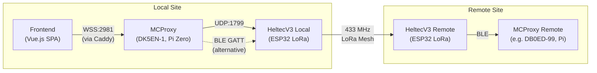
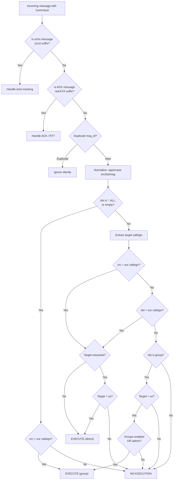
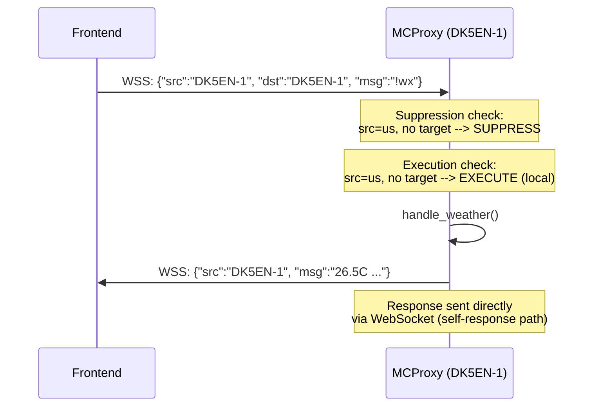
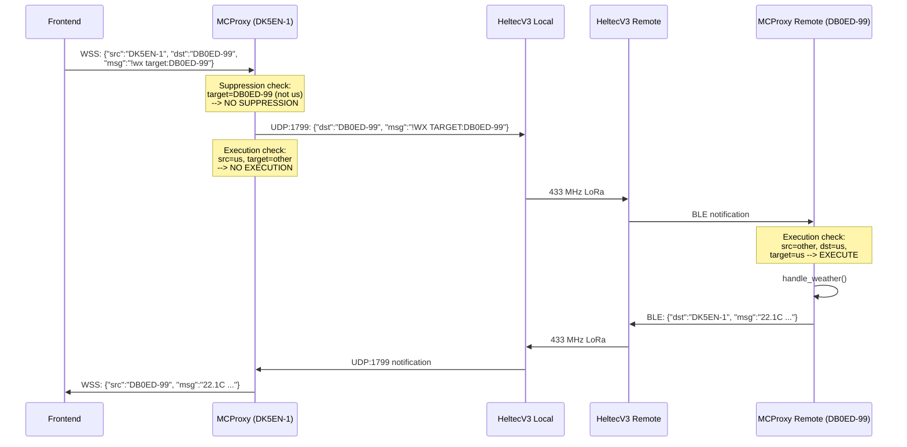
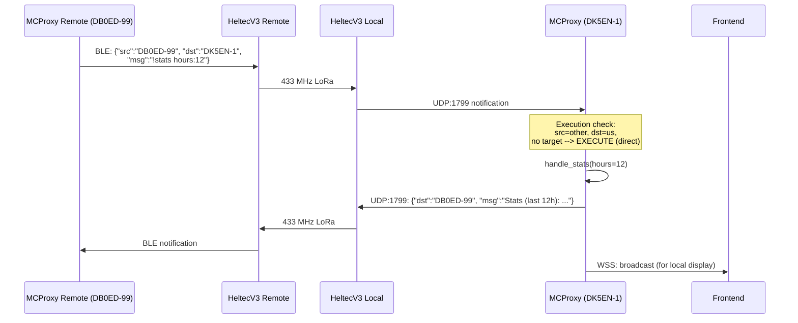
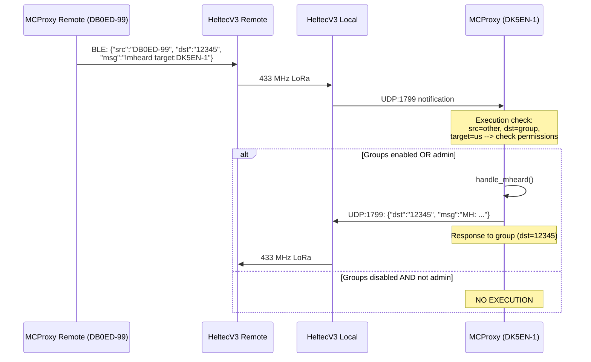
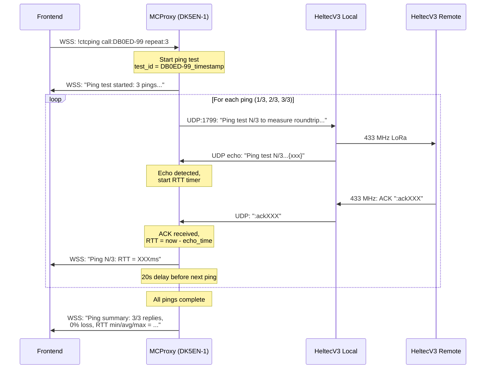

# MCProxy Command Interface

## 1. Overview

This document describes the command interface for MCProxy, a message proxy for MeshCom (LoRa mesh network for ham radio operators). MCProxy bridges MeshCom nodes with web clients via WebSocket, processing chat commands that arrive over UDP (from LoRa nodes) or BLE (from ESP32 devices).

Commands are prefixed with `!` and can be executed locally or routed to remote MCProxy nodes across the LoRa mesh. This document covers:

- The network topology and participants involved in command routing
- The unified target extraction algorithm that determines where a command executes
- Outbound suppression logic that prevents commands from leaking onto the mesh when they should execute locally
- The execution decision matrix that determines whether an incoming command should be processed
- The complete command reference with parameters, defaults, and throttling
- Sequence diagrams for all routing scenarios
- Protection mechanisms (dedup, throttle, abuse blocking, chunking)

All commands are uppercase-normalized on receipt. Callsigns follow the pattern `^(?=.*[A-Z])(?=.*[0-9])[A-Z0-9]{3,8}(-\d{1,2})?$`, requiring at least one letter and one digit with a minimum length of 3 characters. This rejects false positives such as "MSG", "24", "ON", or "POS".

---

## 2. Network Topology



**Participants:**

| Node | Role | Connection |
|------|------|------------|
| Frontend (Vue.js SPA) | Web client for chat and monitoring | WebSocket via Caddy reverse proxy |
| MCProxy Local (DK5EN-1) | Message router, command processor | Pi Zero, hub of all connections |
| HeltecV3 Local | ESP32 LoRa transceiver | UDP:1799 or BLE GATT to MCProxy |
| HeltecV3 Remote | ESP32 LoRa transceiver at remote site | 433 MHz mesh link to local HeltecV3 |
| MCProxy Remote (DB0ED-99) | Remote command processor | BLE to remote HeltecV3 |

---

## 3. Command Routing Model

### 3.1 Message Anatomy

Every message flowing through MCProxy carries three key fields:

| Field | Description | Example |
|-------|-------------|---------|
| `src` | Originating callsign (may contain comma-separated path) | `DK5EN-1` or `DB0ED-99,DK5EN-1` |
| `dst` | Destination: a callsign, group number, or broadcast marker | `DB0ED-99`, `12345`, `*`, `ALL` |
| `msg` | Message text, commands prefixed with `!` | `!wx target:DB0ED-99` |

The `src` field is normalized by extracting only the first callsign before any comma (path routing). Both `src` and `dst` are uppercased. If `msg` starts with `!`, the entire message text is uppercased.

### 3.2 Target Extraction Algorithm

The `extract_target_callsign()` function uses a unified algorithm for ALL commands. It determines which MCProxy node should execute a given command.

**Priority order:**

1. **Explicit `target:` parameter** -- Scanned anywhere in the message arguments.
   - `target:LOCAL` or `target:` (empty) returns `None`, meaning explicit local execution.
   - `target:DB0ED-99` returns `DB0ED-99` if it matches the callsign pattern.
   - An invalid target format returns `None`.

2. **Positional fallback** -- Scans arguments right-to-left, skipping any `key:value` pairs. The first standalone token matching the callsign pattern is treated as the target.

3. **Commands that NEVER have targets:** `GROUP`, `KB`, `TOPIC`. These always return `None` (local-only commands that manage node state).

**Examples:**

| Input | Extracted Target | Reason |
|-------|-----------------|--------|
| `!WX TARGET:DB0ED-99` | `DB0ED-99` | Explicit target parameter |
| `!WX TARGET:LOCAL` | `None` | Explicit local execution |
| `!SEARCH CALL:DK5EN DAYS:7 DB0ED-99` | `DB0ED-99` | Positional fallback (right-to-left) |
| `!STATS HOURS:24` | `None` | No standalone callsign found |
| `!CTCPING CALL:DB0ED-99 PAYLOAD:25 REPEAT:3 TARGET:DK5EN-7` | `DK5EN-7` | Explicit target overrides positional |
| `!GROUP ON` | `None` | GROUP never has targets |
| `!KB DL1ABC` | `None` | KB never has targets |
| `!SEARCH DK5EN` | `DK5EN` | Positional match (sole argument) |

### 3.3 Suppression Logic (Outbound Commands)

When our node (MCProxy Local) sends a command message outbound toward the mesh, the `should_suppress_outbound()` method decides whether to actually transmit it or keep it local. This prevents commands intended for local execution from being broadcast over the LoRa mesh.

**Decision flow:**

```
1. src != our callsign?         --> NO SUPPRESSION (not our message)
2. Not a command (!-prefixed)?  --> NO SUPPRESSION (regular chat)
3. Invalid destination?         --> SUPPRESS (*, ALL, empty)
4. No target extracted?         --> SUPPRESS (local execution)
5. Target = our callsign?       --> SUPPRESS (local execution)
6. Target = someone else?       --> NO SUPPRESSION (send to mesh)
```

**Suppression truth table:**

| Condition | Result | Reason |
|-----------|--------|--------|
| `src` is not us | Pass through | Not our responsibility |
| Message is not a command | Pass through | Regular chat messages always transmit |
| `dst` is `*`, `ALL`, or empty | Suppress | Invalid destination for commands |
| No target in command | Suppress | Local execution intent |
| Target is our own callsign | Suppress | Self-targeting means local |
| Target is a different callsign | Send to mesh | Remote execution intent |

### 3.4 Execution Decision Matrix

The `_should_execute_command()` method determines whether an incoming command should be processed by this MCProxy node. It returns a tuple of `(should_execute: bool, target_type: str | None)` where `target_type` is `"direct"` or `"group"`.

| # | src | dst | target | Execute? | Type | Rationale |
|---|-----|-----|--------|----------|------|-----------|
| 1 | Us | `*` / `ALL` / empty | -- | Yes | `group` | Own broadcast command |
| 2 | Other | `*` / `ALL` / empty | -- | No | -- | Remote broadcast, not our business |
| 3 | Us | any | None | Yes | `direct` or `group` | Our command, no target = local intent |
| 4 | Us | any | Us | Yes | `direct` or `group` | Our command, self-targeted = local |
| 5 | Us | any | Other | No | -- | Our command intended for remote node |
| 6 | Other | Us | None | Yes | `direct` | P2P message, no specific target |
| 7 | Other | Us | Us | Yes | `direct` | P2P message, explicitly targets us |
| 8 | Other | Us | Other | No | -- | P2P message but wrong target |
| 9 | Other | Group | Us | Conditional | `group` | Group + our target, requires permission |
| 10 | Other | Group | Not us | No | -- | Group message, not targeted at us |

**Row 9 permission check:** For group commands targeting us from non-admin users, execution requires `group_responses_enabled == True`. Admin users (callsign base matching the node's admin callsign) bypass this check.

**Response routing:**
- `target_type == "direct"` and `src == us`: response goes to `dst` (the chat partner)
- `target_type == "direct"` and `src != us`: response goes to `src` (the sender)
- `target_type == "group"`: response goes to `dst` (the group)

### 3.5 Routing Decision Flowchart



---

## 4. Command Reference

### 4.1 Summary Table

| Command | Aliases | Category | Admin | Throttle | Description |
|---------|---------|----------|-------|----------|-------------|
| `!wx` | `!weather` | Simple | No | 5 min | Current weather at node location |
| `!time` | -- | Simple | No | 5 sec | Current date and time |
| `!dice` | -- | Simple | No | 5 sec | Roll two dice (Maxchen rules) |
| `!help` | -- | Simple | No | 5 min | List available commands |
| `!userinfo` | -- | Simple | No | 5 min | Show node user information |
| `!stats` | -- | Data | No | 5 min | Message statistics |
| `!mheard` | `!mh` | Data | No | 5 min | Recently heard stations |
| `!search` | `!s` | Data | No | 5 min | Search messages by callsign |
| `!pos` | -- | Data | No | 5 min | Position data lookup |
| `!group` | -- | Admin | Yes | 5 sec | Toggle group response mode |
| `!kb` | -- | Admin | Yes | 5 sec | Kick-ban management |
| `!topic` | -- | Admin | Yes | 5 sec | Group beacon management |
| `!ctcping` | -- | Complex | No | 5 min | Ping test with RTT measurement |

### 4.2 Simple Commands

#### !wx / !weather

Get the current weather data at the node's configured location.

- **Format:** `!wx [target:CALLSIGN]`
- **Aliases:** `!weather`
- **Parameters:** None (location comes from node config)
- **Throttle:** 5 minutes
- **Admin:** No
- **Example:**
  ```
  !wx                     --> Local weather
  !wx target:DB0ED-99     --> Weather at DB0ED-99's location
  ```
- **Response:** `26.5C Windchill 24.8C 52% Humidity Wind 12km/h NW Gust 18km/h (Garching b.Munchen)`

Weather data is fetched from an external API with a 30-minute cache. If the service is unavailable, an error message is returned.

#### !time

Show the current date, time, and weekday (in German).

- **Format:** `!time [target:CALLSIGN]`
- **Parameters:** None
- **Throttle:** 5 seconds
- **Admin:** No
- **Example:**
  ```
  !time                   --> Local time
  !time target:DB0ED-99   --> Time at remote node
  ```
- **Response:** `14:35:22 Uhr, Donnerstag, 06.02.2026`

#### !dice

Roll two dice following Maxchen (Meiern) rules. The higher die is placed first, doubles are named (e.g., "Sechser-Pasch"), and the combination 2+1 is "Maxchen" -- the highest possible roll.

- **Format:** `!dice [target:CALLSIGN]`
- **Parameters:** None
- **Throttle:** 5 seconds
- **Admin:** No
- **Example:**
  ```
  !dice                   --> Roll locally
  ```
- **Response:** `DK5EN-1: [5][3] -> 53` or `DK5EN-1: [2][1] -> 21 (Maxchen!)`

#### !help

List available commands with brief usage hints.

- **Format:** `!help`
- **Parameters:** None
- **Throttle:** 5 minutes
- **Admin:** No
- **Response:** Categorized command list (Search, Stats, Weather, Fun)

#### !userinfo

Display the user information text configured for this node.

- **Format:** `!userinfo [target:CALLSIGN]`
- **Parameters:** None
- **Throttle:** 5 minutes
- **Admin:** No
- **Response:** The configured `user_info_text`, e.g. `DK5EN-1 Node | Garching, Bavaria`

### 4.3 Data Commands

#### !stats

Show message and position statistics for a time window.

- **Format:** `!stats [hours:N] [target:CALLSIGN]`
- **Aliases:** None
- **Parameters:**
  | Parameter | Type | Default | Description |
  |-----------|------|---------|-------------|
  | `hours` | int | `24` | Lookback window in hours |
- **Positional fallback:** First bare number is interpreted as `hours`
- **Throttle:** 5 minutes
- **Admin:** No
- **Examples:**
  ```
  !stats                  --> Stats for last 24 hours
  !stats hours:48         --> Stats for last 48 hours
  !stats 12               --> Stats for last 12 hours (positional)
  !stats target:DB0ED-99  --> Stats from remote node
  ```
- **Response:** `Stats (last 24h): Messages: 142, Positions: 87, Total: 229 (9.5/h), Active stations: 12`

#### !mheard / !mh

Show recently heard stations, sorted by last-seen time. Supports filtering by message type.

- **Format:** `!mheard [type:all|msg|pos] [limit:N] [target:CALLSIGN]`
- **Aliases:** `!mh`
- **Parameters:**
  | Parameter | Type | Default | Description |
  |-----------|------|---------|-------------|
  | `type` | string | `all` | Filter: `all`, `msg`, or `pos` |
  | `limit` | int | `5` | Maximum stations to show |
- **Positional fallback:** A bare number is `limit`; a bare string matching `msg`/`pos`/`all` is `type`
- **Throttle:** 5 minutes
- **Admin:** No
- **Examples:**
  ```
  !mheard                        --> Top 5 stations, all types
  !mh limit:10 type:msg          --> Top 10 message stations
  !mheard 3                      --> Top 3 stations (positional)
  !mheard type:pos target:DB0ED-99  --> Position stations from remote
  ```
- **Response:**
  ```
  MH: [msg] DK5EN-1 @14:22 (15) | DB0ED-99 @14:18 (8) | OE3XXX-7 @13:55 (3)
        [pos] DK5EN-1 @14:20 (42) | DB0ED-99 @14:15 (28)
  ```
  If the response exceeds 140 bytes, it is split into two chunks with padding to force a clean break.

#### !search / !s

Search message store by callsign with activity summary including message/position counts, last-seen times, SID breakdown, and group memberships.

- **Format:** `!search [call:CALLSIGN] [days:N] [target:CALLSIGN]`
- **Aliases:** `!s`
- **Parameters:**
  | Parameter | Type | Default | Description |
  |-----------|------|---------|-------------|
  | `call` | string | `*` (all) | Callsign to search. Without SSID suffix, matches as prefix (e.g. `DK5EN` matches `DK5EN-1`, `DK5EN-7`) |
  | `days` | int | `1` | Lookback window in days |
- **Positional fallback:** First bare token is `call`
- **Throttle:** 5 minutes
- **Admin:** No
- **Examples:**
  ```
  !search call:DK5EN days:7          --> DK5EN-* activity over 7 days
  !s DK5EN                           --> Same (positional, 1 day default)
  !search call:DK5EN-1 days:3        --> Exact match for DK5EN-1
  !search DK5EN target:DB0ED-99      --> Search on remote node
  ```
- **Response:** `DK5EN-* (7d): 42 msg (last 14:22) / 18 pos (last 14:20) / SIDs: -1 @14:22, -7 @12:05 / Groups: 12345,99`

#### !pos

Look up the most recent position data for a callsign.

- **Format:** `!pos [call:CALLSIGN] [days:N] [target:CALLSIGN]`
- **Parameters:**
  | Parameter | Type | Default | Description |
  |-----------|------|---------|-------------|
  | `call` | string | required | Callsign to look up |
  | `days` | int | `7` | Lookback window in days |
- **Positional fallback:** First bare token is `call`
- **Throttle:** 5 minutes
- **Admin:** No
- **Examples:**
  ```
  !pos call:DK5EN-1                  --> Latest position
  !pos DK5EN-1 days:14              --> Position over 14 days
  ```
- **Response:** `DK5EN-1 position: 48.2490,11.6530 (last seen 14:20)`

### 4.4 Admin Commands

Admin commands require the requester's callsign base (without SSID) to match the node's configured admin callsign. For example, if the node's callsign is `DK5EN-1`, then `DK5EN`, `DK5EN-1`, `DK5EN-7` are all valid admin identities.

All three admin commands (`GROUP`, `KB`, `TOPIC`) are excluded from target extraction -- they always execute locally regardless of any arguments that look like callsigns.

#### !group

Toggle whether the node responds to commands from group channels. When disabled, only admin users can trigger commands via groups.

- **Format:** `!group on|off`
- **Parameters:**
  | Parameter | Type | Default | Description |
  |-----------|------|---------|-------------|
  | `state` | string | -- | `on` to enable, `off` to disable |
- **Throttle:** 5 seconds
- **Admin:** Yes
- **Examples:**
  ```
  !group on       --> Enable group responses
  !group off      --> Disable group responses
  !group          --> Show current state
  ```
- **Response:** `Group responses ENABLED` or `Group responses DISABLED`

#### !kb

Manage the callsign blocklist. Blocked callsigns cannot execute any commands on this node.

- **Format:** `!kb [callsign] [del|list|delall]`
- **Parameters:**
  | Parameter | Type | Default | Description |
  |-----------|------|---------|-------------|
  | `callsign` | string | -- | Callsign to block/unblock, or `list`/`delall` |
  | `action` | string | add (implicit) | `del` to unblock |
- **Throttle:** 5 seconds
- **Admin:** Yes
- **Self-protection:** Cannot block own callsign base
- **Examples:**
  ```
  !kb                 --> Show current blocklist (same as !kb list)
  !kb list            --> Show current blocklist
  !kb DL1ABC          --> Block DL1ABC
  !kb DL1ABC del      --> Unblock DL1ABC
  !kb delall          --> Clear entire blocklist
  ```
- **Response:** `DL1ABC blocked` or `Blocked: DL1ABC, OE3XXX`

#### !topic

Manage periodic beacon messages sent to groups. Beacons repeat at a configurable interval.

- **Format:** `!topic [group] [text] [interval:minutes]` or `!topic` or `!topic delete group`
- **Parameters:**
  | Parameter | Type | Default | Description |
  |-----------|------|---------|-------------|
  | `group` | string | required | Group number (1-99999) or `TEST` |
  | `text` | string | required | Beacon message text (max 120 chars) |
  | `interval` | int | `30` | Repeat interval in minutes (1-1440) |
- **Throttle:** 5 seconds
- **Admin:** Yes
- **Examples:**
  ```
  !topic                              --> List active beacons
  !topic 12345 Hello World            --> Beacon "Hello World" to group 12345 every 30min
  !topic 12345 Net active interval:15 --> Beacon every 15 minutes
  !topic delete 12345                 --> Stop beacon for group 12345
  ```
- **Response:** `Beacon started for group 12345: 'Hello World' every 30min`

### 4.5 Complex Commands

#### !ctcping

Perform a ping test to a remote station with round-trip time (RTT) measurement. Sends one or more probe messages and tracks echo/ACK pairs to compute latency.

- **Format:** `!ctcping call:TARGET [payload:N] [repeat:N] [target:REMOTE-NODE]`
- **Parameters:**
  | Parameter | Type | Default | Range | Description |
  |-----------|------|---------|-------|-------------|
  | `call` | string | required | -- | Callsign to ping |
  | `payload` | int | `25` | 25-140 | Payload size in bytes |
  | `repeat` | int | `1` | 1-5 | Number of pings to send |
  | `target` | string | -- | -- | Remote node to execute from (routing param) |
- **Throttle:** 5 minutes
- **Admin:** No
- **Validation:**
  - Cannot ping yourself
  - Cannot ping blocked callsigns
  - Callsign must match valid format
- **Examples:**
  ```
  !ctcping call:DB0ED-99                          --> Single ping, 25 byte payload
  !ctcping call:DB0ED-99 payload:100 repeat:3     --> 3 pings, 100 byte payload
  !ctcping call:DB0ED-99 repeat:3 target:DK5EN-7  --> Execute from remote node DK5EN-7
  ```
- **Response flow:**
  1. Initial: `Ping test to DB0ED-99 started: 3 ping(s) with 100 bytes payload...`
  2. Per-ping: `Ping 1/3 to DB0ED-99: RTT = 1245.3ms` or `Ping 2/3 to DB0ED-99: timeout (no ACK after 30s)`
  3. Summary: `Ping summary to DB0ED-99: 2/3 replies, 33% loss, 100B payload. RTT min/avg/max = 1245.3/1567.8/1890.2ms`

**Internal mechanism:**
1. Ping message sent via UDP to the target callsign
2. The mesh echoes the message back with a `{xxx}` suffix (3-digit message ID)
3. The target station replies with an ACK containing `:ackXXX`
4. RTT is measured from echo detection to ACK receipt
5. Each ping has a 30-second timeout
6. Between pings in a multi-ping test, there is a 20-second delay
7. A monitor task runs for up to 5 minutes watching for test completion

---

## 5. Sequence Diagrams

### 5.1 Local Execution (Command suppressed, response via WebSocket)

A user types `!wx` in the web frontend. The command is processed locally and the response is sent back through WebSocket only -- it never reaches the LoRa mesh.



### 5.2 Remote Execution (Command routed via LoRa mesh)

A user types `!wx target:DB0ED-99` in the web frontend. The command is sent over the mesh to the remote node.



### 5.3 Incoming P2P Command (Remote station sends command to us)

A remote operator sends `!stats hours:12` directly to our callsign.



### 5.4 Incoming Group Command (Remote station sends command to group)

A remote operator sends `!mheard target:DK5EN-1` to a group channel. Only executes if group responses are enabled or the sender is admin.



### 5.5 CTCPing Full Round-Trip

A local user pings a remote station with a 3-ping test.



---

## 6. Argument Parsing

### 6.1 The `target:` Routing Parameter

The `target:` parameter is special -- it controls **where** a command executes, not **what** the command does. It is consumed by the routing layer (`extract_target_callsign`) and is not passed to the command handler.

| Value | Meaning |
|-------|---------|
| `target:DB0ED-99` | Execute on the remote MCProxy node DB0ED-99 |
| `target:DK5EN-1` | Execute on DK5EN-1 (if that is us, it is local) |
| `target:LOCAL` | Explicitly execute locally, even if other callsigns appear |
| (omitted) | No routing preference; positional fallback may still detect a target |

### 6.2 Key:Value Command Parameters

All command-specific parameters use `key:value` syntax (no spaces around the colon). The key is lowercased during parsing. Examples:

```
call:DK5EN      --> kwargs["call"] = "DK5EN"
days:7          --> kwargs["days"] = "7"
hours:24        --> kwargs["hours"] = "24"
payload:100     --> kwargs["payload"] = "100"
repeat:3        --> kwargs["repeat"] = "3"
type:msg        --> kwargs["type"] = "msg"
limit:10        --> kwargs["limit"] = "10"
interval:15     --> kwargs["interval"] = "15"
```

### 6.3 Positional Fallback

For backward compatibility and convenience, several commands accept positional arguments (bare tokens without a `key:` prefix). The parser checks these only when no `kwargs` have been set yet:

| Command | Positional rule |
|---------|----------------|
| `!search`, `!s` | First bare token becomes `call` |
| `!pos` | First bare token becomes `call` |
| `!stats` | First bare number becomes `hours` |
| `!mheard`, `!mh` | First bare number becomes `limit`; bare `msg`/`pos`/`all` becomes `type` |
| `!group` | First bare token becomes `state` |
| `!kb` | First token is `callsign`; `list`/`delall` are special actions; second token `del` is the action |
| `!topic` | Parsed structurally: `group`, then text tokens, then optional `interval:N` or trailing number |
| `!ctcping` | All arguments must use `key:value` syntax |

### 6.4 Uppercase Normalization

All command messages are uppercased on ingestion. This means:
- `!wx` and `!WX` are identical
- `target:db0ed-99` becomes `TARGET:DB0ED-99`
- `call:dk5en` becomes `CALL:DK5EN`
- Parameters like `type:msg` become `TYPE:MSG` (handlers lowercase the value internally)

---

## 7. Protection Mechanisms

### 7.1 Message ID Deduplication

Every message carries a `msg_id`. The CommandHandler maintains a cache of processed message IDs with a **5-minute expiry window**. If a message arrives with an already-seen `msg_id`, it is silently dropped. This prevents the same command from being processed multiple times as it propagates through the mesh network.

### 7.2 Content-Based Throttling

After dedup, a **content hash** is computed from `src + dst + command`. The throttle prevents the same user from re-executing the same command within the cooldown period.

| Command | Cooldown |
|---------|----------|
| `dice` | 5 seconds |
| `time` | 5 seconds |
| `group` | 5 seconds |
| `kb` | 5 seconds |
| `topic` | 5 seconds |
| All others | 5 minutes (300 seconds) |

**Hash computation:** For commands with specific (short) throttling, the hash is based on `src:dst:!command` (arguments stripped). For all other commands, the hash includes the full command text: `src:dst:!command args...`. This means `!stats hours:24` and `!stats hours:12` are throttled independently, but `!dice` is throttled regardless of any arguments.

If a throttled command is received, the user gets a feedback message: `Command throttled. Same command allowed once per 5min`.

### 7.3 Abuse Protection

Failed command attempts (unknown commands, handler errors) are tracked per source callsign:

| Parameter | Value |
|-----------|-------|
| Failed attempt window | 5 minutes |
| Maximum failed attempts | 3 |
| Block duration | 25 minutes (5 x 5-minute window) |

When a user accumulates 3 failed attempts within 5 minutes, they are blocked for 25 minutes. During the block period:
- All commands from that user are rejected
- A single notification is sent: `Temporarily in timeout due to repeated invalid commands`
- Subsequent attempts are silently dropped (no repeated notifications)
- After 25 minutes, the block expires automatically

### 7.4 Response Chunking

LoRa messages have a hard limit of approximately 140 bytes. MCProxy splits long responses into chunks:

| Parameter | Value |
|-----------|-------|
| Max chunk size | 140 bytes (UTF-8) |
| Max chunks | 3 |
| Delay between chunks | 12 seconds |

**Chunking strategy:**

1. If the response fits in 140 bytes, send as-is.
2. If the response has exactly two comma-separated parts, split on `, `.
3. If the response contains ` | ` separators (station lists), split on those boundaries, accumulating parts until the next one would exceed 140 bytes.
4. Fallback: character-wise split at 140-byte boundaries.

Multi-chunk responses are prefixed with `(1/N)`, `(2/N)`, etc.

**Padding for clean breaks:** The `!mheard` command (with `type:all`) produces a two-line response. It uses byte-aware padding to force the first line to land exactly at a chunk boundary, ensuring the second line starts cleanly in the next chunk.

---

## 8. Known Limitations

### 8.1 LoRa Message Size

The 140-byte LoRa message limit constrains response verbosity. With chunk headers `(1/3) ` consuming 6 bytes and a maximum of 3 chunks, the effective maximum response is approximately 400 bytes. Commands producing more data (e.g., `!mheard limit:20`) will be truncated.

### 8.2 Group Permission Model

Group responses are a global toggle (`!group on|off`), not per-group. When disabled, no non-admin user can execute commands via any group channel. There is no per-group allowlist.

### 8.3 Positional Argument Ambiguity

The positional fallback for target extraction scans right-to-left for callsign-like tokens. A bare argument that happens to match the callsign pattern (e.g., `!search DK5EN`) will be consumed as both the target (for routing) and the command argument (for the handler). In practice, this is usually the desired behavior for `!search` and `!pos`, but can cause unexpected routing if a callsign is intended purely as a search term. Use `target:LOCAL` to force local execution when ambiguity arises:

```
!search DK5EN                    --> Routes to DK5EN AND searches for DK5EN
!search call:DK5EN target:LOCAL  --> Searches for DK5EN locally (no routing)
```

### 8.4 Broadcast Destination Handling

Commands sent to broadcast destinations (`*`, `ALL`, or empty `dst`) from our own callsign are executed locally (treated as own broadcast). Commands from other stations to broadcast destinations are always ignored -- there is no mechanism for "execute everywhere" semantics.

### 8.5 CTCPing Timing Sensitivity

RTT measurement depends on the mesh echoing the message back with a `{xxx}` suffix and the target responding with `:ackXXX`. If the echo or ACK is lost, the individual ping times out after 30 seconds. Multi-ping tests have a 20-second inter-ping delay, so a 5-ping test could take up to 250 seconds in the worst case (5 timeouts at 30s each plus 4 delays at 20s each). The overall monitor task has a 5-minute hard timeout.

### 8.6 In-Memory State

All command state (blocklist, topic beacons, ping tests, throttle/dedup caches) is held in memory. A restart of the MCProxy service clears:
- The kick-ban blocklist
- All active topic beacons
- All pending ping tests
- All throttle and dedup state

The message store itself persists to JSON and survives restarts.
