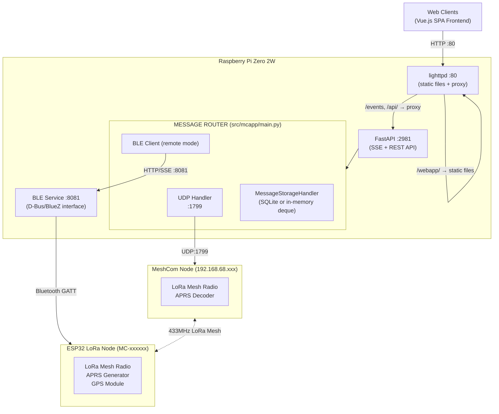
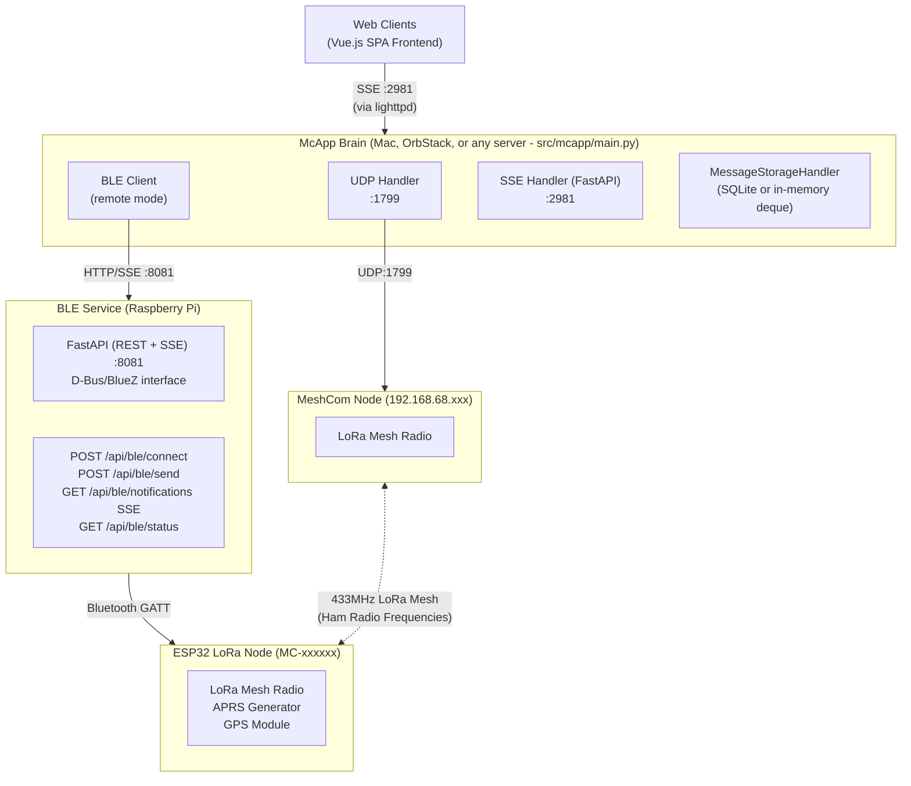

# McApp Data Flow

## Standard Deployment (Pi with Bluetooth)

All components run on the same Raspberry Pi. McApp uses remote mode to communicate with the BLE service via HTTP/SSE on localhost.

## Distributed Deployment (Remote BLE Service)

McApp runs on a server without Bluetooth hardware.
A separate BLE service on a Pi exposes BLE via HTTP/SSE.

## BLE Mode Selection

| Mode | BLE Client | Description |
|------|------------|-------------|
| `remote` | `ble_client_remote.py` | HTTP/SSE to BLE service (default for production) |
| `disabled` | `ble_client_disabled.py` | No-op stub (for testing without BLE hardware) |

**Note:** Local mode (`ble_client_local.py`) was removed in v1.01.1. For local BLE hardware access, deploy the standalone BLE service (`ble_service/`) and use `remote` mode pointing to `http://localhost:8081`.

Configured via `BLE_MODE` in config or `MCAPP_BLE_MODE` environment variable.
