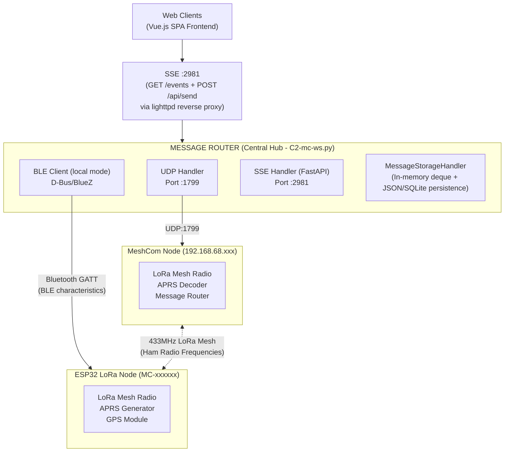

# McApp Data Flow

> **Migration Note (2026-02-15):** This document describes the legacy local BLE architecture. As of v1.01.1, local mode was removed. BLE access is now provided by the standalone BLE service (`ble_service/`) accessed via remote mode. See CLAUDE.md for current architecture.

## Standard Deployment (Pi with local Bluetooth)

## Distributed Deployment (Remote BLE Service)

McApp runs on a server without Bluetooth hardware.
A separate BLE service on a Pi exposes BLE via HTTP/SSE.

## BLE Mode Selection

| Mode | BLE Client | Description |
|------|------------|-------------|
| `local` | `ble_client_local.py` | Direct D-Bus/BlueZ on the same Pi |
| `remote` | `ble_client_remote.py` | HTTP/SSE to BLE service on another Pi |
| `disabled` | `ble_client_disabled.py` | No-op stub (for testing without BLE) |

Configured via `BLE_MODE` in config or `MCAPP_BLE_MODE` environment variable.
