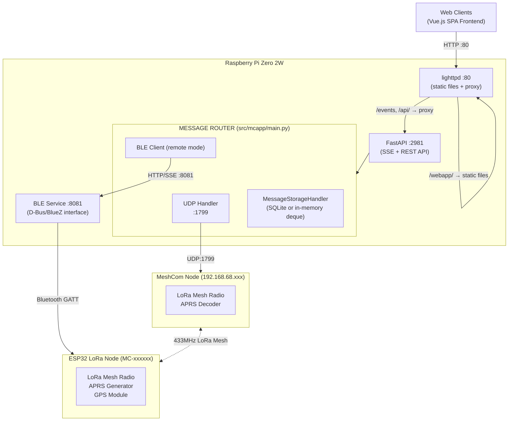
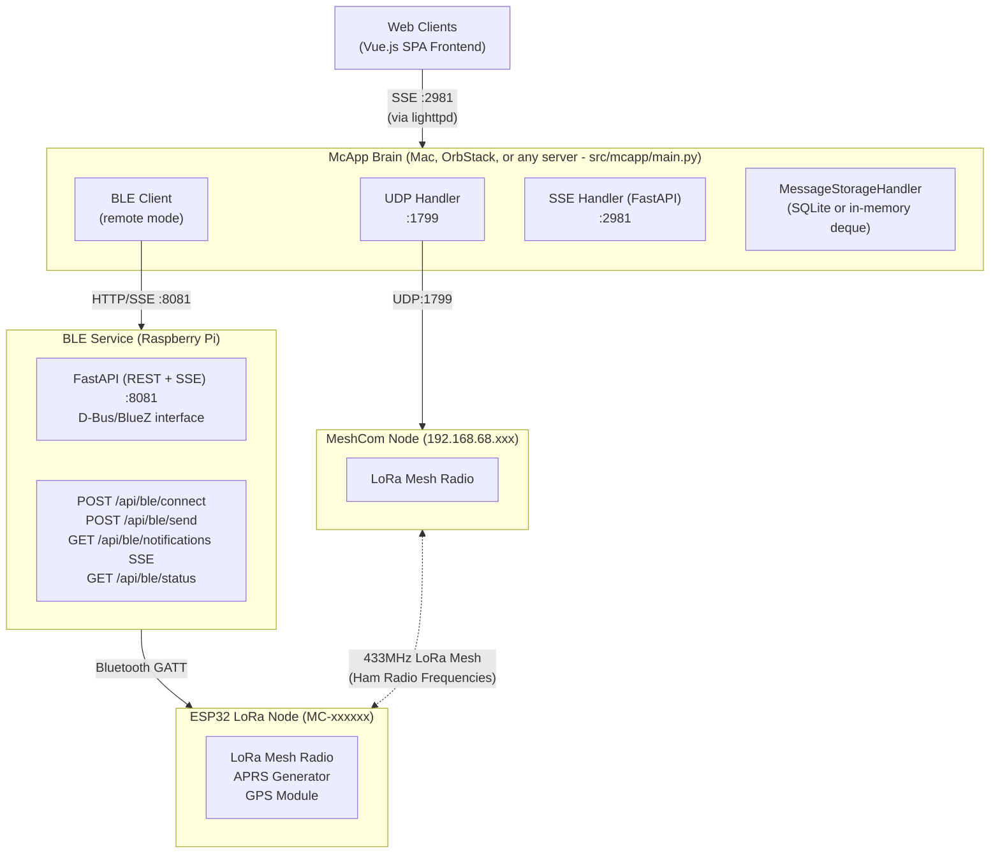
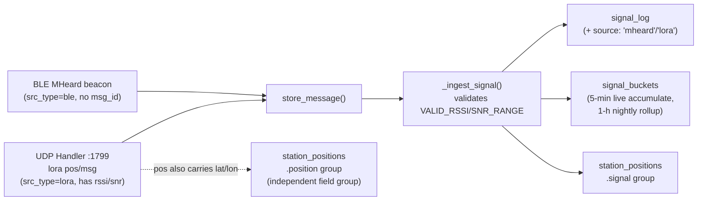

# McApp Data Flow

## Standard Deployment (Pi with Bluetooth)

All components run on the same Raspberry Pi. McApp uses remote mode to communicate with the BLE service via HTTP/SSE on localhost.


```mermaid
flowchart TD
    WC["Web Clients<br/>(Vue.js SPA Frontend)"]

    WC -- "HTTP :80" --> LH

    subgraph Pi["Raspberry Pi Zero 2W"]
        LH["lighttpd :80<br/>(static files + proxy)"]
        FA["FastAPI :2981<br/>(SSE + REST API)"]
        BLES["BLE Service :8081<br/>(D-Bus/BlueZ interface)"]

        subgraph MR["MESSAGE ROUTER (src/mcapp/main.py)"]
            UDP["UDP Handler<br/>:1799"]
            BLE["BLE Client (remote mode)"]
            MSH["MessageStorageHandler<br/>(SQLite or in-memory deque)"]
        end

        LH -- "/webapp/ → static files" --> LH
        LH -- "/events, /api/ → proxy" --> FA
        FA --> MR
        BLE -- "HTTP/SSE :8081" --> BLES
    end

    subgraph MCN["MeshCom Node (192.168.68.xxx)"]
        LR1["LoRa Mesh Radio<br/>APRS Decoder"]
    end

    subgraph ESP["ESP32 LoRa Node (MC-xxxxxx)"]
        LR2["LoRa Mesh Radio<br/>APRS Generator<br/>GPS Module"]
    end

    UDP -- "UDP:1799" --> MCN
    BLES -- "Bluetooth GATT" --> ESP
    MCN <-. "433MHz LoRa Mesh" .-> ESP
```

## Distributed Deployment (Remote BLE Service)

McApp runs on a server without Bluetooth hardware.
A separate BLE service on a Pi exposes BLE via HTTP/SSE.


```mermaid
flowchart TD
    WC2["Web Clients<br/>(Vue.js SPA Frontend)"]

    WC2 -- "SSE :2981<br/>(via lighttpd)" --> Brain

    subgraph Brain["McApp Brain (Mac, OrbStack, or any server - src/mcapp/main.py)"]
        UDP2["UDP Handler<br/>:1799"]
        BLE2["BLE Client<br/>(remote mode)"]
        SSEH2["SSE Handler (FastAPI)<br/>:2981"]
        MSH2["MessageStorageHandler<br/>(SQLite or in-memory deque)"]
    end

    subgraph BLES["BLE Service (Raspberry Pi)"]
        FA["FastAPI (REST + SSE) :8081<br/>D-Bus/BlueZ interface"]
        EP["POST /api/ble/connect<br/>POST /api/ble/send<br/>GET /api/ble/notifications SSE<br/>GET /api/ble/status"]
    end

    subgraph MCN2["MeshCom Node (192.168.68.xxx)"]
        LR3["LoRa Mesh Radio"]
    end

    subgraph ESP2["ESP32 LoRa Node (MC-xxxxxx)"]
        LR4["LoRa Mesh Radio<br/>APRS Generator<br/>GPS Module"]
    end

    UDP2 -- "UDP:1799" --> MCN2
    BLE2 -- "HTTP/SSE :8081" --> BLES
    BLES -- "Bluetooth GATT" --> ESP2
    MCN2 <-. "433MHz LoRa Mesh<br/>(Ham Radio Frequencies)" .-> ESP2
```

## Signal Data Path (RSSI/SNR → signal_log / signal_buckets / station_positions)

Both transports above feed the same signal architecture (`doc/2026-02-11_1400-position-signal-architecture-ADR.md`,
amended by UDP 2.0 Track U — `doc/UDP-2.0-impl.md`):


```mermaid
flowchart LR
    BLEN["BLE MHeard beacon<br/>(src_type=ble, no msg_id)"] --> SM["store_message()"]
    UDPN["UDP Handler :1799<br/>lora pos/msg<br/>(src_type=lora, has rssi/snr)"] --> SM

    SM --> IS["_ingest_signal()<br/>validates VALID_RSSI/SNR_RANGE"]
    IS --> SL["signal_log<br/>(+ source: 'mheard'/'lora')"]
    IS --> SB["signal_buckets<br/>(5-min live accumulate,<br/>1-h nightly rollup)"]
    IS --> SP["station_positions<br/>.signal group"]

    UDPN -. "pos also carries lat/lon" .-> POS["station_positions<br/>.position group<br/>(independent field group)"]
```

A UDP `pos` packet updates **both** the signal and position field groups in the same
`store_message()` call (they're independent columns — see the ADR). A UDP `msg` packet
only updates signal (no coordinates in a text message). `node`/`udp` src_types (the
node's own traffic) carry a `0/0` signal sentinel and are excluded from this path by an
explicit `src_type` check.

## BLE Mode Selection

| Mode       | BLE Client               | Description                                      |
| ---------- | ------------------------ | ------------------------------------------------ |
| `remote`   | `ble_client_remote.py`   | HTTP/SSE to BLE service (default for production) |
| `disabled` | `ble_client_disabled.py` | No-op stub (for testing without BLE hardware)    |

**Note:** Local mode (`ble_client_local.py`) was removed in v1.01.1. For local BLE hardware access, deploy the standalone BLE service (`ble_service/`) and use `remote` mode pointing to `http://localhost:8081`.

Configured via `BLE_MODE` in config or `MCAPP_BLE_MODE` environment variable.

## Node Admin: send and reply flow (RM1)

```
webapp  POST /api/node-admin/send {target, cmd, args}
   |                                   (Host/Origin guard; 409 if a frame is in flight or < 10 s since the last)
   v
NodeAdminService.send
   |  first send after a restart: sync row (ctr 0) first, command held until the verified sync reply + 10 s
   |  allocate ctr = MAX(ctr+1, last_hwm+1, unix_time) in ONE db_write transaction, tag over
   |  "RM1|<target>|<attached node call>|<ctr>|<cmd line>"  ->  node_admin_log row ("queued")
   v  (background task; the HTTP call has already returned {log_id, ctr, text})
MessageRouter.send_node_admin -> _handle_outbound -> BLE (0xA0 {dst}msg) or Extern-UDP :1799
   |  one RF-Monitor TX capture; a failed frame's tag is redacted
   v                                       ... LoRa ... target node: verify tag, rate gate (10 s), run, reply
target reply "RM1 <ctr> ok|err <text> <tag>"  (+ "{NNN" on the Extern-UDP copy, not on the BLE copy)
   v
udp_handler / BLE notification -> store_message -> reply_hook (BEFORE the filter) -> service.on_reply
   |  cheap prefilter, then a task: strip suffix, correlate (src, dst==row.src_call, ctr), verify tag,
   |  apply_node_admin_reply (UPDATE ... WHERE verified IS NOT 1): act ONLY when it reports a change
   v
raise last_hwm, release the sync gate, SSE `node_admin:reply` (full row + computed state) -> webapp store upserts by id
```

The reply also lands in the normal DM conversation (`store_message` continues unchanged). The SSE has no replay: the
webapp refetches `GET /api/node-admin/history` on mount, on `system:connected` and on tab-visible.
