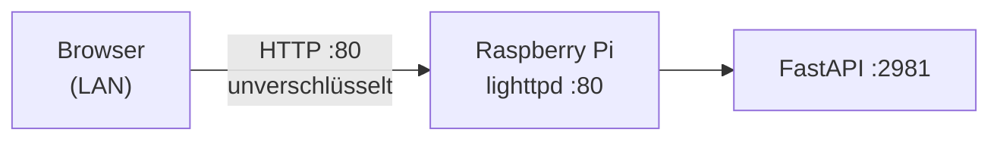
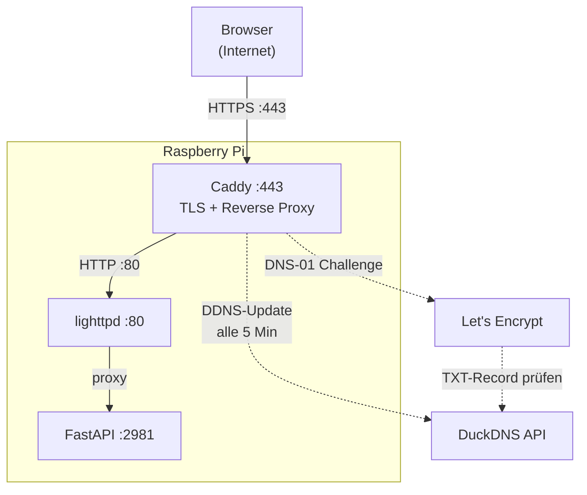
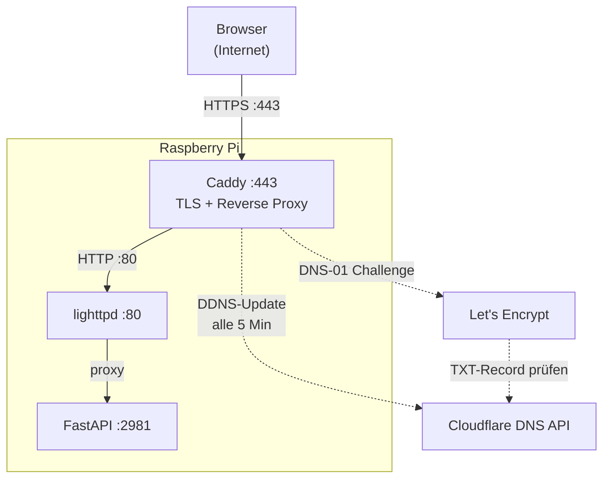
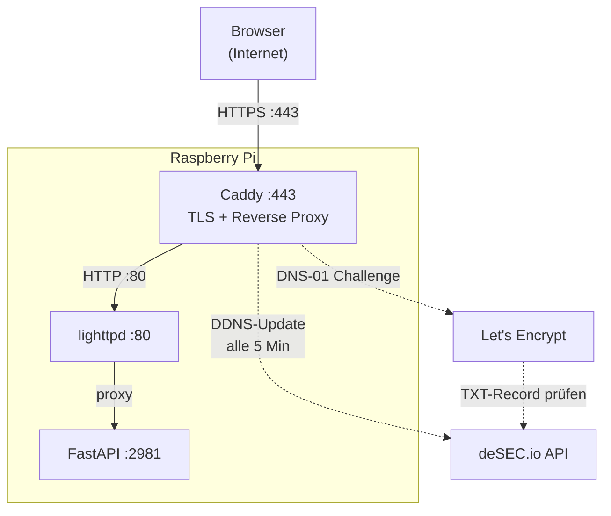
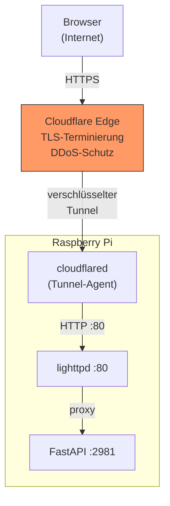
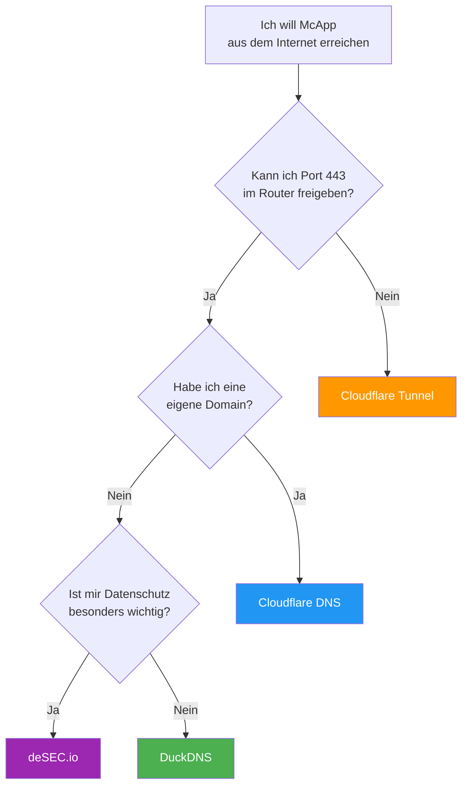

# TLS/SSL-Tunnel für McApp — Benutzerhandbuch

> **Setup-Skript:** `sudo ./scripts/ssl-tunnel-setup.sh`

---

## Inhaltsverzeichnis

1. [Problemstellung](#1-problemstellung)
2. [Lösungsszenarien im Überblick](#2-lösungsszenarien-im-überblick)
   - [Szenario A: DuckDNS (kostenlos, einfach)](#szenario-a-duckdns)
   - [Szenario B: Cloudflare DNS (eigene Domain)](#szenario-b-cloudflare-dns)
   - [Szenario C: deSEC.io (kostenlos, DSGVO-konform)](#szenario-c-desecio)
   - [Szenario D: Cloudflare Tunnel (kein Port-Forwarding)](#szenario-d-cloudflare-tunnel)
3. [Empfehlung nach Einsatzszenario](#3-empfehlung-nach-einsatzszenario)

---

## 1. Problemstellung

### Ausgangslage

McApp läuft auf einem Raspberry Pi im lokalen Netzwerk. Die Web-Oberfläche ist über `http://mcapp.local` im LAN erreichbar:



Das funktioniert im Heimnetz problemlos — aber **nur dort**.

### Warum reicht das nicht?

| Problem | Beschreibung |
|---------|-------------|
| **Kein Zugriff von unterwegs** | Die Webapp ist nur im lokalen Netzwerk erreichbar. Vom Handy unterwegs, vom QTH eines Funkfreundes oder aus dem Urlaub — kein Zugriff. |
| **Keine Verschlüsselung** | HTTP überträgt alles im Klartext. Rufzeichen, Nachrichten und Positionsdaten sind für jeden im Netzwerk sichtbar. |
| **Kein HTTPS = kein moderner Browser-Support** | Viele Browser-APIs (Geolocation, Notifications, Service Worker) funktionieren nur über HTTPS. Progressive Web Apps (PWA) erfordern zwingend TLS. |
| **Kein Schutz bei öffentlichem WLAN** | Wer die Webapp über ein offenes WLAN nutzt, riskiert, dass Dritte mitlesen. |

### Was brauchen wir?

1. **Einen öffentlichen Hostnamen** (z.B. `dk5en-mcapp.duckdns.org`), damit der Pi aus dem Internet erreichbar ist
2. **Ein TLS-Zertifikat** (Let's Encrypt), damit die Verbindung verschlüsselt ist
3. **Dynamisches DNS (DDNS)**, weil die meisten Heimanschlüsse keine feste IP-Adresse haben
4. **Einen Reverse Proxy** (Caddy), der TLS terminiert und Anfragen an lighttpd weiterleitet

---

## 2. Lösungsszenarien im Überblick

Das Setup-Skript bietet vier Varianten an. Alle verwenden **Caddy** als TLS-Reverse-Proxy (außer Cloudflare Tunnel) und automatisieren Zertifikatsverwaltung und DDNS-Updates vollständig.

---

### Szenario A: DuckDNS

> Kostenloser DNS-Dienst mit automatischem DDNS und Let's Encrypt-Zertifikat.



**Voraussetzungen:**
- Kostenloses Konto bei [duckdns.org](https://www.duckdns.org)
- Subdomain erstellen (z.B. `dk5en-mcapp`)
- Token notieren
- **Port 443 im Router weiterleiten** auf den Pi

**Vorteile:**
- Komplett kostenlos
- Einfachstes Setup (Token + Subdomain, fertig)
- Keine eigene Domain nötig
- DDNS und Zertifikate vollautomatisch

**Nachteile:**
- Hostname immer `*.duckdns.org` — kein eigener Domainname
- DuckDNS ist ein Ein-Mann-Projekt — Zukunft nicht garantiert
- API gelegentlich langsam oder nicht erreichbar

**Risiken:**
- Port 443 ist aus dem Internet erreichbar → Pi wird von Port-Scannern gefunden
- DuckDNS-Ausfall → Zertifikatserneuerung schlägt fehl (bestehendes Zertifikat läuft bis zu 90 Tage weiter)

---

### Szenario B: Cloudflare DNS

> Eigene Domain bei Cloudflare mit professionellem DNS und optionalem DDoS-Schutz.



**Voraussetzungen:**
- Eigene Domain (z.B. `meinrufzeichen.de`), DNS bei Cloudflare verwaltet
- Cloudflare-Konto mit API-Token (Berechtigung: DNS Zone Edit)
- **Port 443 im Router weiterleiten** auf den Pi

**Vorteile:**
- Eigener professioneller Hostname (z.B. `mcapp.dk5en.de`)
- Cloudflare ist hochverfügbar und schnell
- Kostenloser DDoS-Grundschutz
- Globales Anycast-Netzwerk

**Nachteile:**
- Eigene Domain erforderlich (Kosten ~5–15 €/Jahr)
- Cloudflare-Account und API-Token-Verwaltung nötig
- DNS muss bei Cloudflare liegen (Nameserver-Umzug)

**Risiken:**
- Port 443 offen (wie bei DuckDNS)
- API-Token mit DNS-Schreibrechten — bei Kompromittierung kann Angreifer DNS manipulieren
- Cloudflare ändert gelegentlich API/Nutzungsbedingungen

---

### Szenario C: deSEC.io

> Kostenloser, DSGVO-konformer DNS-Dienst aus Deutschland mit DNSSEC-Support.



**Voraussetzungen:**
- Kostenloses Konto bei [desec.io](https://desec.io)
- Subdomain erstellen (z.B. `dk5en-mcapp.dedyn.io`)
- API-Token generieren
- **Port 443 im Router weiterleiten** auf den Pi

**Vorteile:**
- Komplett kostenlos
- DSGVO-konform (Server in Deutschland)
- DNSSEC standardmäßig aktiviert
- Keine Werbung, kein Tracking
- Gute API-Dokumentation

**Nachteile:**
- Kleinerer Anbieter als DuckDNS/Cloudflare
- Hostname immer `*.dedyn.io`
- Community kleiner → weniger Erfahrungsberichte

**Risiken:**
- Port 443 offen (wie bei DuckDNS/Cloudflare)
- Kleiner Anbieter → Ressourcen begrenzt (bisher aber zuverlässig)

---

### Szenario D: Cloudflare Tunnel

> Kein Port-Forwarding nötig. Der Pi baut eine verschlüsselte Verbindung nach außen auf — Cloudflare leitet Anfragen durch den Tunnel.



**Architektur-Besonderheit:** Der Pi öffnet **keinen** eingehenden Port. Stattdessen baut der `cloudflared`-Agent eine **ausgehende** Verbindung zu Cloudflare auf. Alle HTTPS-Anfragen werden durch diesen Tunnel geleitet.

**Voraussetzungen:**
- Cloudflare-Konto
- Tunnel im [Cloudflare Dashboard](https://one.dash.cloudflare.com/) erstellen (Networks → Tunnels)
- Tunnel-Token notieren
- **Kein Port-Forwarding nötig!**

**Vorteile:**
- **Kein Port 443 offen** — Pi ist aus dem Internet nicht direkt erreichbar
- Funktioniert hinter doppeltem NAT, Carrier-Grade NAT, Mobilfunk-Hotspots
- Cloudflare übernimmt TLS-Terminierung und DDoS-Schutz
- Kein Caddy nötig → weniger RAM-Verbrauch auf dem Pi
- Keine Let's Encrypt-Zertifikate nötig (Cloudflare stellt eigene aus)

**Nachteile:**
- Cloudflare-Konto zwingend erforderlich
- Latenz etwas höher (~50–100 ms), da Anfragen über Cloudflare Edge geroutet werden
- Tunnel-Token ist sicherheitskritisch (Zugang zur Tunnel-Infrastruktur)
- Eigene Domain bei Cloudflare erforderlich (für den Tunnel-Hostnamen)

**Risiken:**
- Vollständige Abhängigkeit von Cloudflare (Preisänderungen, Nutzungsbedingungen)
- Cloudflare sieht den gesamten Datenverkehr im Klartext (TLS endet bei Cloudflare, nicht am Pi)
- Tunnel-Agent (`cloudflared`) muss regelmäßig aktualisiert werden

---

## 3. Empfehlung nach Einsatzszenario

### Entscheidungsmatrix

| Kriterium | DuckDNS | Cloudflare DNS | deSEC.io | CF Tunnel |
|-----------|:-------:|:--------------:|:--------:|:---------:|
| Kosten | kostenlos | Domain ~10 €/J | kostenlos | kostenlos* |
| Schwierigkeit | einfach | mittel | einfach | mittel |
| Port-Forwarding nötig | ja | ja | ja | **nein** |
| Eigene Domain nötig | nein | **ja** | nein | ja* |
| DSGVO-konform | nein | nein | **ja** | nein |
| Zuverlässigkeit | mittel | hoch | mittel | hoch |
| Latenz | gering | gering | gering | etwas höher |
| DDoS-Schutz | nein | ja | nein | **ja** |
| RAM-Verbrauch (Pi) | ~40 MB | ~40 MB | ~40 MB | ~20 MB |

*\* Cloudflare Tunnel ist kostenlos, erfordert aber eine bei Cloudflare verwaltete Domain.*

### Empfehlung: Wer sollte was nehmen?

#### "Ich will es einfach und kostenlos" → **DuckDNS**

Ideal für den Einstieg. Subdomain in 2 Minuten erstellt, Token kopieren, Setup-Skript starten, Port 443 im Router freigeben — fertig. Für die meisten Amateurfunker die beste Wahl.

```bash
# 1. https://www.duckdns.org → Subdomain + Token erstellen
# 2. Router: Port 443 → Pi weiterleiten
# 3. Auf dem Pi:
sudo ./scripts/ssl-tunnel-setup.sh
# → Option 1 (DuckDNS) wählen
```

#### "Ich habe eine eigene Domain" → **Cloudflare DNS**

Wer bereits eine eigene Domain besitzt und den DNS bei Cloudflare verwaltet, bekommt den professionellsten Setup mit DDoS-Schutz und globalem Anycast.

#### "Datenschutz ist mir wichtig" → **deSEC.io**

Für OMs, die Wert auf DSGVO-Konformität und europäische Datenverarbeitung legen. Technisch gleichwertig mit DuckDNS, aber mit besserer Privatsphäre und DNSSEC.

#### "Ich kann/will keinen Port freigeben" → **Cloudflare Tunnel**

Die einzige Option, die **ohne Port-Forwarding** auskommt. Perfekt für:
- Internetanschlüsse ohne öffentliche IPv4 (DS-Lite, Carrier-Grade NAT)
- Mobilfunk-Hotspots oder Starlink
- Situationen, in denen der Router nicht konfiguriert werden kann/darf
- Maximale Sicherheit (kein offener Port am Pi)

```bash
# 1. https://one.dash.cloudflare.com/ → Tunnel erstellen
# 2. Auf dem Pi:
sudo ./scripts/ssl-tunnel-setup.sh
# → Option 4 (Cloudflare Tunnel) wählen
```

---

### Zusammenfassung



---

### Nach der Installation

Das Setup-Skript zeigt am Ende die öffentliche URL an. Damit kann man prüfen:

```bash
# Status prüfen
sudo ./scripts/ssl-tunnel-setup.sh --status

# Deinstallieren (zurück zu reinem HTTP)
sudo ./scripts/ssl-tunnel-setup.sh --remove
```

Weitere Informationen zur Wartung und Fehlerbehebung: [`doc/tls-maintenance-SOP.md`](tls-maintenance-SOP.md)
