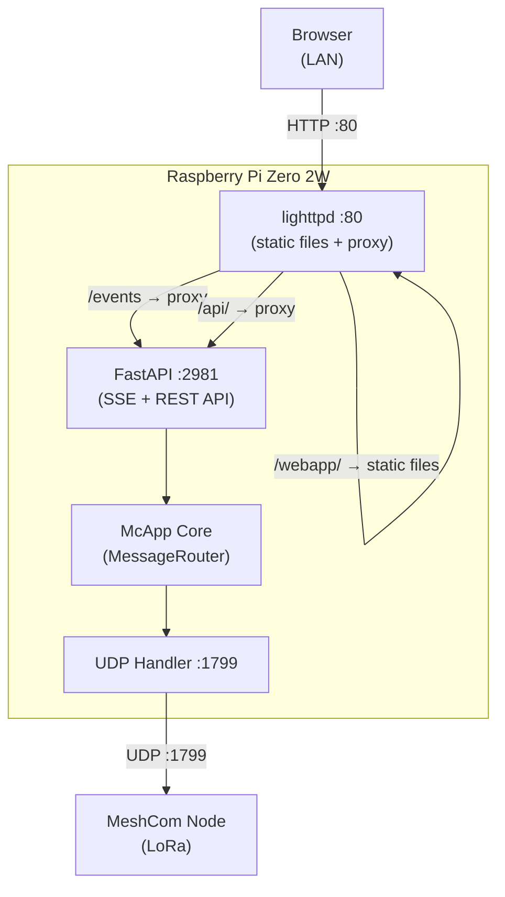
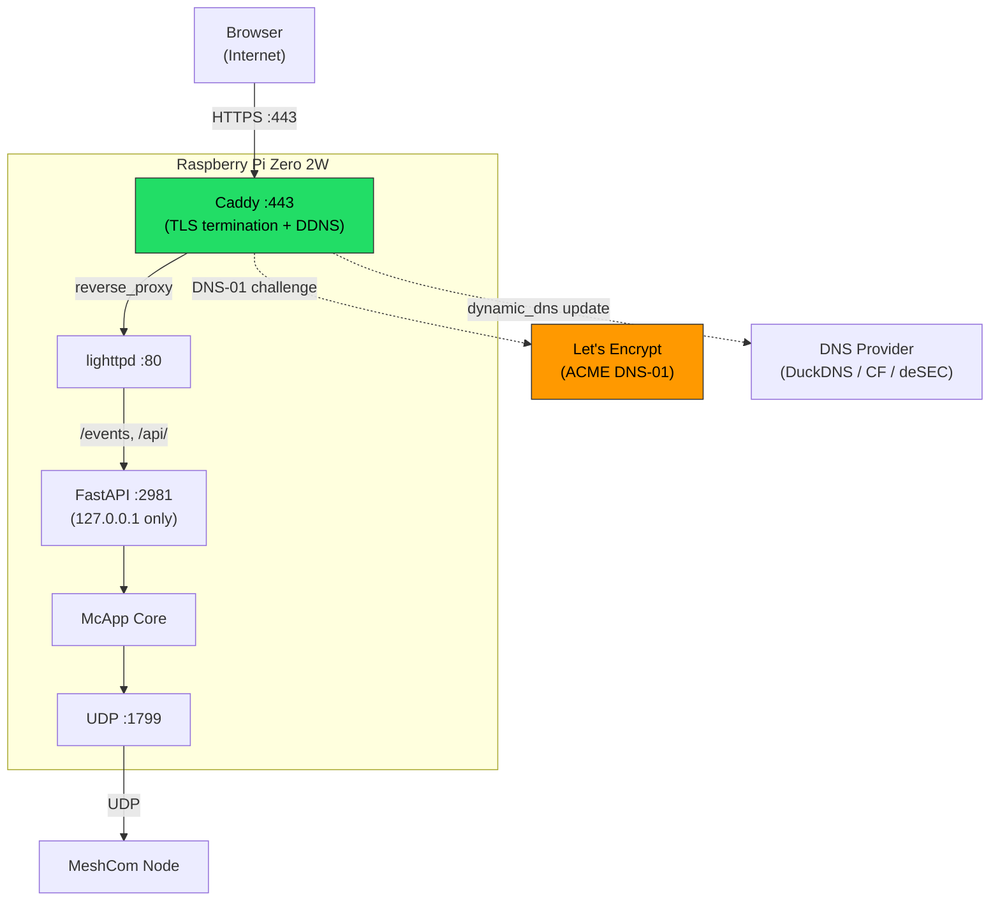
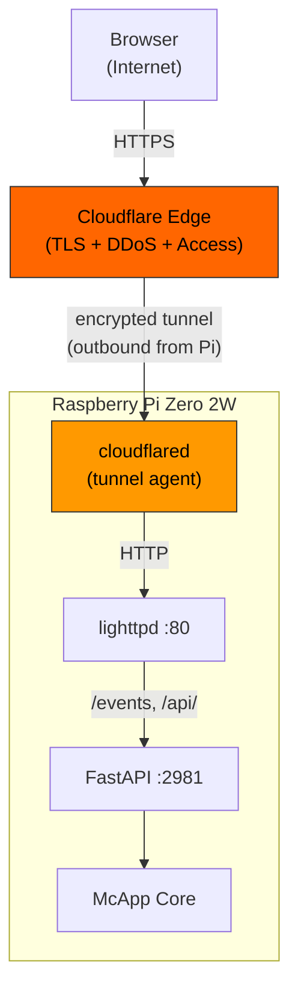
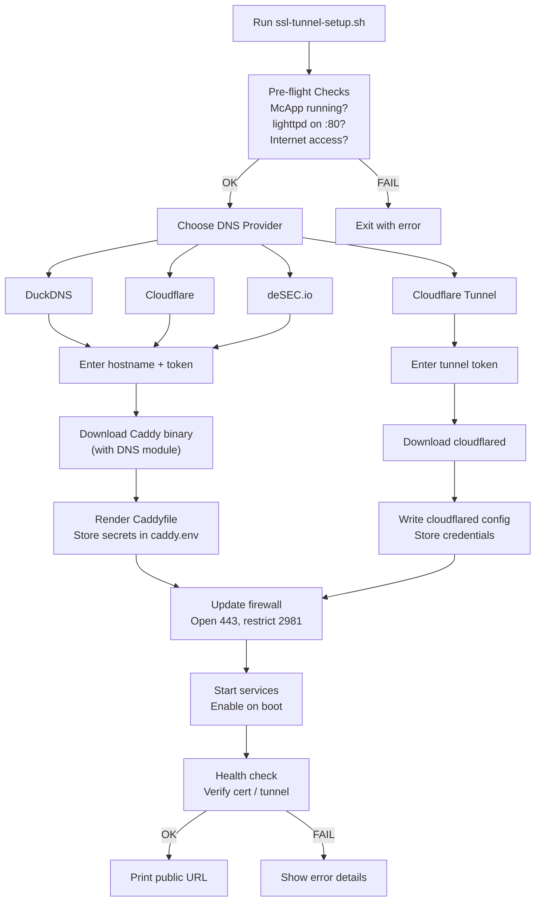
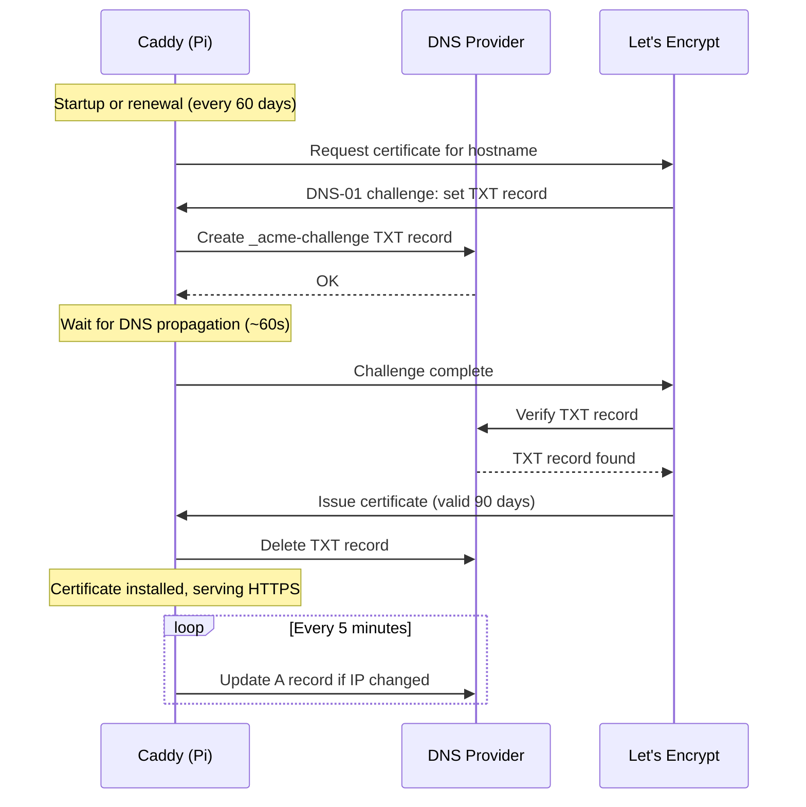

# TLS Remote Access Architecture

## Diagram 1: Base Setup (No TLS — LAN Only)

## Diagram 2: TLS Setup (Caddy + Let's Encrypt)

## Diagram 3: Cloudflare Tunnel Alternative

## Diagram 4: ssl-tunnel-setup.sh Flow

## Diagram 5: Certificate Lifecycle

