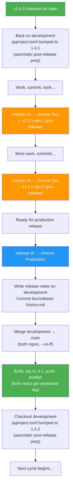

# McApp Version Logic

Reference document for version numbering, release workflow, and the deficits in the current `release.sh` that need to be fixed.

## 1. Version Format

| Channel | Format | Example | Where Used |
|---------|--------|---------|------------|
| Stable (production) | `vMAJOR.MINOR.PATCH` | `v1.4.0` | `main` branch, GitHub release |
| Dev (pre-release) | `vMAJOR.MINOR.PATCH-dev.N` | `v1.4.1-dev.3` | `development` branch, GitHub pre-release |

- `pyproject.toml` always contains the **next target version** (bare, no `v` prefix): e.g., `version = "1.4.1"`
- Git tags carry the `v` prefix: `v1.4.0`, `v1.4.1-dev.1`
- Runtime version (`__init__.py`) uses `git describe --tags` which returns the tag if on one, or `v1.4.1-dev.1-3-gabcdef` if commits exist after the last tag

## 2. Version Lifecycle



### Key Principles

1. **Always start on `development`** — the script refuses to run from any other branch.
2. **`pyproject.toml` is the single source of truth** — the production release reads the version as-is, never computes a new one.
3. **Release notes are authored on `development`** — committed there, then arrive on `main` via merge. No direct commits to `main`.
4. **Both repos are managed together** — MCProxy and webapp get identical tags and branch switches.
5. **Post-release prep is automatic** — after a production release, the script bumps to the next patch version and pushes.

## 3. Concrete Examples

### Patch Cycle: v1.4.0 → v1.4.1

| Step | Branch | Action | `pyproject.toml` | Git Tags (both repos) | GitHub Release |
|------|--------|--------|-------------------|-----------------------|----------------|
| 1 | `main` | v1.4.0 just released | `1.4.0` | `v1.4.0` in McApp + webapp | McApp v1.4.0 |
| 2 | `development` | Post-release prep: bump to next patch | **`1.4.1`** | — | — |
| 3 | `development` | Dev work, run `release.sh` | `1.4.1` | `v1.4.1-dev.1` in both repos | McApp v1.4.1-dev.1 (pre-release) |
| 4 | `development` | More work, run `release.sh` again | `1.4.1` | `v1.4.1-dev.2` in both repos | McApp v1.4.1-dev.2 (pre-release) |
| 5 | `development` | Run `release.sh`, choose Production | `1.4.1` | **`v1.4.1`** in both repos | McApp v1.4.1 |
| 6 | `development` | Post-release prep (automatic): bump to `1.4.2` | **`1.4.2`** | — | — |

### Minor Cycle: v1.4.1 → v1.5.0

| Step | Branch | Action | `pyproject.toml` | Git Tags (both repos) | GitHub Release |
|------|--------|--------|-------------------|-----------------------|----------------|
| 1 | `main` | v1.4.1 just released | `1.4.1` | `v1.4.1` in McApp + webapp | McApp v1.4.1 |
| 2 | `development` | Post-release prep: bump to next minor | **`1.5.0`** | — | — |
| 3 | `development` | Dev work, run `release.sh` | `1.5.0` | `v1.5.0-dev.1` in both repos | McApp v1.5.0-dev.1 (pre-release) |
| 4 | `development` | More work, run `release.sh` again | `1.5.0` | `v1.5.0-dev.2` in both repos | McApp v1.5.0-dev.2 (pre-release) |
| 5 | `development` | Run `release.sh`, choose Production | `1.5.0` | **`v1.5.0`** in both repos | McApp v1.5.0 |
| 6 | `development` | Post-release prep (automatic): bump to `1.5.1` | **`1.5.1`** | — | — |

The **developer chooses** patch vs minor at step 2, when setting `pyproject.toml` after a release. The automatic post-release prep always bumps patch; for a minor bump, manually edit `pyproject.toml` before the next dev cycle.

## 4. Deficits in Current `release.sh`

### 4.1 `auto_version()` always bumps minor, never allows patch

**Current behavior** (`release.sh:180-190`):
```bash
auto_version() {
  IFS='.' read -r major minor patch <<< "$current"
  minor=$((minor + 1))
  patch=0
  echo "v${major}.${minor}.${patch}"
}
```

This **computes** a new version by incrementing minor and resetting patch. There is no way to release a patch version. Result: every production release is a minor bump (v1.2.0 → v1.3.0 → v1.4.0), even for a one-line bug fix.

**Should be**: Read the version from `pyproject.toml` as-is. The version was already set during post-release prep.

**Status**: Fixed. `auto_version()` removed. Production release reads `pyproject.toml` directly.

### 4.2 Production release modifies `pyproject.toml` instead of using it as source of truth

**Current behavior** (`release.sh:216-229`): `bump_version()` writes the computed version into `pyproject.toml` on `main`, commits it, and tags.

This means:
- `pyproject.toml` on `main` gets a version that was never in `development`
- The merge from `development` → `main` brings one version, then `release.sh` overwrites it with another
- The version in `pyproject.toml` is an output of the release process, not an input

**Should be**: `pyproject.toml` is the single source of truth. Production release reads it, tags it, done. No modification needed on `main`.

**Status**: Fixed. `bump_version()` removed. No `pyproject.toml` modification on `main`.

### 4.3 No post-release version prep on development

After a production release, the script does nothing to prepare `development` for the next cycle. The developer must manually:
1. Switch to `development`
2. Bump `pyproject.toml` to the next target version
3. Commit the bump

This is error-prone and was forgotten multiple times, leading to version confusion (e.g., the v1.3.0 bump then revert to v1.2.0 visible in commit history: `d15d457`, `ede24b5`).

**Should be**: After the production release on `main`, the script automatically switches to `development`, bumps to the next patch version, and commits.

**Status**: Fixed. `post_release_prep()` automatically bumps to next patch after production release.

### 4.4 No patch vs minor choice

The developer has no way to influence whether the next release is a patch or minor bump. The script always does minor.

**Should be**: The developer sets the target version in `pyproject.toml` during post-release prep. The script just reads it. For the post-release auto-bump, default to patch (most common case) with the option to manually edit for minor/major.

**Status**: Fixed. Script reads `pyproject.toml` as-is. Auto-prep defaults to patch bump.

### 4.5 No branch safety

The script refuses to run on feature branches (good), but there's no guard against:
- Running on `main` when `development` has unreleased commits that should be merged first
- Accidentally developing on `main` and then releasing from there

**Should be**: On `main`, verify that HEAD is a merge from `development` (or at least warn if it's not). On `development`, no special check needed.

**Status**: Fixed. Script now always starts on `development`. For production releases, it validates that `main` has no commits ahead of `development` (diverged state) before merging.

### 4.6 Webapp repo has no tags — release notes can't span both repos

McApp is split across **two Git repositories**:

| Repo | Path | Content |
|------|------|---------|
| McApp | `MCProxy/` | Python backend (this repo) |
| webapp | `../webapp/` | Vue 3 frontend (separate repo) |

**Current behavior**: `release.sh` only tags the McApp repo. The webapp repo has zero version tags. This causes two problems:

1. **No cross-repo release notes**: When preparing a production release (e.g., v1.4.1), you need to summarize all changes since the last release (v1.4.0) across both repos. Without tags in the webapp repo, there's no way to run `git log v1.4.0..HEAD` there — you'd have to manually find the commit that corresponded to the v1.4.0 release by date.

2. **No webapp changelog visibility**: Frontend-only changes (new UI features, bug fixes, styling) are invisible in the release process. They get silently bundled into the tarball without being documented.

**Should be**: `release.sh` creates the **same tag** in both repos at every tagging step:
- Dev pre-release: lightweight tag `v1.4.1-dev.N` in both `MCProxy/` and `../webapp/`
- Production release: annotated tag `v1.4.1` in both repos
- This enables `git log v1.4.0..HEAD` in both repos to generate combined release notes

**Status**: Fixed. `tag_both_repos()` tags both repos. `generate_release_notes_prompt()` shows commits from both repos.

### 4.7 Version history shows chaotic jumps

The actual tag history demonstrates the problem:

| Tag | What happened |
|-----|---------------|
| `v0.99` | Early release |
| `v1.1.0` | Skipped v1.0.0 |
| `v1.2.0` | Minor bump |
| `v1.2.0-dev.1` .. `v1.2.0-dev.5` | Dev pre-releases (correct) |
| `v1.4.0` | Skipped v1.3.0 (auto_version bumped minor from 1.3.0 in pyproject.toml) |

The v1.3.0 → v1.4.0 jump happened because `pyproject.toml` was at `1.3.0` (from a botched manual bump), and `auto_version()` incremented minor to `1.4.0`.

### 4.8 `deploy-to-pi.sh` is deprecated

`scripts/deploy-to-pi.sh` is a legacy deployment script that copies files via SCP and restarts services. It predates the bootstrap system and the release workflow. It should be removed:

- The bootstrap system (`bootstrap/mcapp.sh`) handles all deployment
- Production deployments use `release.sh` → GitHub release → bootstrap pulls the tarball
- The script bypasses version tagging entirely — it just copies files to the Pi
- Keeping it around invites accidental use, which would deploy untagged, unversioned code

**Action**: Delete `scripts/deploy-to-pi.sh`.

**Status**: Done. File deleted.

## 5. Summary: What Actually Needs to Change

The deficits above sound like a lot, but the actual fix is a **net deletion of code**. The two broken functions (`auto_version()` and `bump_version()`) are the root cause of most problems — removing them and reading `pyproject.toml` directly fixes deficits 4.1, 4.2, 4.3, and 4.4 in one stroke.

### What gets deleted

| Item | Lines | Why |
|------|-------|-----|
| `auto_version()` | ~10 | Computes wrong version (always minor bump). Replace with: read `pyproject.toml` |
| `bump_version()` | ~15 | Writes computed version back to `pyproject.toml` on main. Not needed — version is already there from the merge |
| `detect_mode()` | ~18 | Replaced by interactive prompt (always start on development) |
| `commit_and_tag_production()` | ~13 | No version bump commit needed on main; tagging now handles both repos |
| `scripts/deploy-to-pi.sh` | ~51 | Deprecated. Bootstrap handles deployment |

### What stays (most of the script)

- Tarball building (webapp build + Python package)
- GitHub release creation via `gh`
- Pre-release tagging logic (dev.N increment)
- Clean working tree checks
- Failure cleanup trap

### What gets added

| Feature | Lines (est.) | Fixes |
|---------|-------------|-------|
| Interactive prompt (`prompt_release_type()`) | ~18 | Always start on development, choose release type |
| Dual-repo validation (`validate_on_development()`, `validate_repos_clean()`) | ~25 | 4.5 — both repos must be on development and clean |
| Main mergeability check (`validate_main_mergeable()`) | ~22 | 4.5 — main must not have diverged from development |
| Release notes workflow (`generate_release_notes_prompt()`, `wait_for_release_notes()`, `commit_release_notes()`) | ~45 | Release notes authored on development, committed before merge |
| Branch management (`merge_to_main()`, `checkout_development()`) | ~20 | Script handles checkout/merge/restore automatically |
| Dual-repo tagging (`tag_both_repos()`, `push_main_and_tags()`) | ~30 | 4.6 — both repos get identical tags |
| Post-release prep (`post_release_prep()`, `bump_patch_version()`) | ~20 | 4.3 — automatic version bump after production release |
| Enhanced failure recovery | ~15 | Restore both repos to development, abort merges, clean tags in both repos |

**Net effect**: The broken auto-version logic is gone. The script is longer but the complexity is in straightforward branch/tag operations, not version arithmetic.

## 6. Webapp Version Check Rules

### Current Implementation

The webapp (`useVersionCheck.ts`) fetches the 20 most recent GitHub releases and finds:
- `latestStable`: first non-prerelease tag
- `latestPrerelease`: first prerelease tag

Then computes:
```typescript
const hasUpdate = computed(() => hasStableUpdate.value || hasPrereleaseUpdate.value)
```

### The Bug

This OR logic means a **stable** user gets alerted about dev pre-releases, and a **dev** user gets alerted about stable releases from a different version line.

**Example**: User is on `v1.4.0` (stable). A `v1.5.0-dev.1` pre-release appears. `hasPrereleaseUpdate` becomes true → user sees "update available" even though they're on the stable channel.

### Correct Logic

| Installed Version | Alert When |
|-------------------|------------|
| Stable (`v1.4.0`) | Newer **stable** release exists (e.g., `v1.4.1`, `v1.5.0`) |
| Dev (`v1.4.1-dev.2`) | Newer **dev pre-release** exists (e.g., `v1.4.1-dev.3`) |

```typescript
// Correct
const hasUpdate = computed(() => {
  const v = parseVersion(local.value)
  if (!v) return false
  return v.isDev ? hasPrereleaseUpdate.value : hasStableUpdate.value
})
```

## 7. Release Script Workflow

### Overview

`release.sh` is always run from the `development` branch. It presents an interactive menu:

```
  McApp Release Builder
  =====================

==> Mode: dev/production
==> Version in pyproject.toml: 1.4.1

  What type of release?

    1) Dev pre-release  (tag development, publish pre-release)
    2) Production       (merge to main, tag, publish stable release)

  Choose [1/2]:
```

Both repos (MCProxy and webapp) must be on `development` and have clean working trees before the script will proceed.

### Production Release Steps

Starting from `development` in both repos:

```
 1. Validate: both repos on development, both clean
 2. Read version from pyproject.toml (e.g., "1.4.1")
 3. Find previous prod tag (e.g., v1.4.0)
 4. Verify tag v1.4.1 doesn't already exist in either repo
 5. Verify main has no commits ahead of development (no divergence)
 6. Print Claude prompt for release notes (commits from both repos)
 7. Wait for user to press Enter
 8. Verify doc/release-history.md exists
 9. Commit release-history.md on development (if dirty)
10. Checkout main in both repos
11. Merge development → main (--no-ff) in both repos
12. Build webapp
13. Build tarball
14. Tag v1.4.1 (annotated) in both repos
15. Push main + tags for both repos
16. Generate checksum
17. Upload GitHub release (--notes-file doc/release-history.md)
18. Checkout development in both repos
19. Bump pyproject.toml to 1.4.2 (next patch), commit, push
20. Done
```

### Dev Pre-Release Steps

Stays on `development`:

```
1. Validate: both repos on development, both clean
2. Read version from pyproject.toml (e.g., "1.4.1")
3. Find highest existing v1.4.1-dev.N tag, compute N+1
4. Build webapp
5. Tag v1.4.1-dev.{N+1} (lightweight) in both repos
6. Build tarball
7. Generate checksum
8. Upload GitHub pre-release (also pushes McApp tag)
9. Push webapp tag
10. Cleanup artifacts
```

No `pyproject.toml` modification needed for dev releases.

### Dual-Repo Management

Both repos (`MCProxy/` and `../webapp/`) receive **identical tags** at every release step. The webapp repo is a separate Git repository with its own history, but shares the same version tags as McApp.

```bash
# release.sh tags both repos
WEBAPP_DIR="$(cd "$PROJECT_DIR/../webapp" && pwd)"

# For production (annotated tags)
git -C "$PROJECT_DIR" tag -a "$version" -m "Release ${version}"
git -C "$WEBAPP_DIR"  tag -a "$version" -m "Release ${version}"

# For dev (lightweight tags)
git -C "$PROJECT_DIR" tag "$version"
git -C "$WEBAPP_DIR"  tag "$version"

# Push tags for both
git -C "$PROJECT_DIR" push origin "$version"
git -C "$WEBAPP_DIR"  push origin "$version"
```

### Release Notes Generation

Before a production release, the script prints a prompt with commits from both repos since the last production tag. The user runs this prompt with Claude to generate `doc/release-history.md`, then presses Enter to continue. The file is committed on `development` before the merge to `main`, so it arrives on `main` naturally.

```bash
# The script prints something like:
#   Summarize the changes since v1.4.0 for a GitHub release of v1.4.1.
#   Backend commits (MCProxy):
#     a6c22ad [docs] Add release history
#     b5ae31f [fix] Parse negative temperatures
#   Frontend commits (webapp):
#     f3a1b2c [feat] Add dark mode toggle
#     d4e5f6a [fix] Fix mobile layout
#   Write the summary to doc/release-history.md
```

### Failure Recovery

The `on_failure()` trap handler:
- Removes local artifacts (tarball, checksum, staging dir)
- Deletes GitHub release if created
- Deletes tags from **both repos** (local and remote)
- Restores **both repos** to `development` if switched to `main`
- Aborts in-progress merges

### What the Script Does NOT Do

- Compute or auto-bump the version (reads `pyproject.toml` as-is)
- Modify `pyproject.toml` on `main` (the merge from `development` brought the right version)
- Allow release without clean working trees in both repos
- Allow release from any branch other than `development`
- Tag only one repo — both repos are always tagged together
