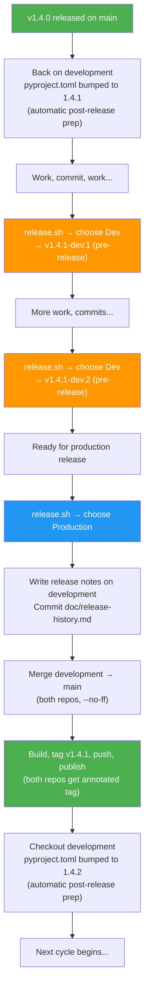

# McApp Version Logic

Reference document for version numbering and release workflow.

## 1. Version Format

| Channel | Format | Example | Where Used |
|---------|--------|---------|------------|
| Stable (production) | `vMAJOR.MINOR.PATCH` | `v1.4.0` | `main` branch, GitHub release |
| Dev (pre-release) | `vMAJOR.MINOR.PATCH-dev.N` | `v1.4.1-dev.3` | `development` branch, GitHub pre-release |

- `pyproject.toml` always contains the **next target version** (bare, no `v` prefix): e.g., `version = "1.4.1"`
- Git tags carry the `v` prefix: `v1.4.0`, `v1.4.1-dev.1`
- Runtime version (`__init__.py`) uses `git describe --tags` which returns the tag if on one, or `v1.4.1-dev.1-3-gabcdef` if commits exist after the last tag

## 2. Version Lifecycle



### Key Principles

1. **Always start on `development`** — the script refuses to run from any other branch.
2. **`pyproject.toml` is the single source of truth** — the production release reads the version as-is, never computes a new one.
3. **Release notes are authored on `development`** — committed there, then arrive on `main` via merge. No direct commits to `main`.
4. **Both repos are managed together** — MCProxy and webapp get identical tags and branch switches.
5. **Post-release prep is automatic** — after a production release, the script bumps to the next patch version and pushes.

## 3. Concrete Examples

### Patch Cycle: v1.4.0 → v1.4.1

| Step | Branch | Action | `pyproject.toml` | Git Tags (both repos) | GitHub Release |
|------|--------|--------|-------------------|-----------------------|----------------|
| 1 | `main` | v1.4.0 just released | `1.4.0` | `v1.4.0` in McApp + webapp | McApp v1.4.0 |
| 2 | `development` | Post-release prep: bump to next patch | **`1.4.1`** | — | — |
| 3 | `development` | Dev work, run `release.sh` | `1.4.1` | `v1.4.1-dev.1` in both repos | McApp v1.4.1-dev.1 (pre-release) |
| 4 | `development` | More work, run `release.sh` again | `1.4.1` | `v1.4.1-dev.2` in both repos | McApp v1.4.1-dev.2 (pre-release) |
| 5 | `development` | Run `release.sh`, choose Production | `1.4.1` | **`v1.4.1`** in both repos | McApp v1.4.1 |
| 6 | `development` | Post-release prep (automatic): bump to `1.4.2` | **`1.4.2`** | — | — |

### Minor Cycle: v1.4.1 → v1.5.0

| Step | Branch | Action | `pyproject.toml` | Git Tags (both repos) | GitHub Release |
|------|--------|--------|-------------------|-----------------------|----------------|
| 1 | `main` | v1.4.1 just released | `1.4.1` | `v1.4.1` in McApp + webapp | McApp v1.4.1 |
| 2 | `development` | Post-release prep: bump to next minor | **`1.5.0`** | — | — |
| 3 | `development` | Dev work, run `release.sh` | `1.5.0` | `v1.5.0-dev.1` in both repos | McApp v1.5.0-dev.1 (pre-release) |
| 4 | `development` | More work, run `release.sh` again | `1.5.0` | `v1.5.0-dev.2` in both repos | McApp v1.5.0-dev.2 (pre-release) |
| 5 | `development` | Run `release.sh`, choose Production | `1.5.0` | **`v1.5.0`** in both repos | McApp v1.5.0 |
| 6 | `development` | Post-release prep (automatic): bump to `1.5.1` | **`1.5.1`** | — | — |

The **developer chooses** patch vs minor at step 2, when setting `pyproject.toml` after a release. The automatic post-release prep always bumps patch; for a minor bump, manually edit `pyproject.toml` before the next dev cycle.

## 4. Webapp Version Check Bug

### Current Implementation

The webapp (`useVersionCheck.ts`) fetches the 20 most recent GitHub releases and finds:
- `latestStable`: first non-prerelease tag
- `latestPrerelease`: first prerelease tag

Then computes:
```typescript
const hasUpdate = computed(() => hasStableUpdate.value || hasPrereleaseUpdate.value)
```

### The Bug

This OR logic means a **stable** user gets alerted about dev pre-releases, and a **dev** user gets alerted about stable releases from a different version line.

**Example**: User is on `v1.4.0` (stable). A `v1.5.0-dev.1` pre-release appears. `hasPrereleaseUpdate` becomes true → user sees "update available" even though they're on the stable channel.

### Correct Logic

| Installed Version | Alert When |
|-------------------|------------|
| Stable (`v1.4.0`) | Newer **stable** release exists (e.g., `v1.4.1`, `v1.5.0`) |
| Dev (`v1.4.1-dev.2`) | Newer **dev pre-release** exists (e.g., `v1.4.1-dev.3`) |

```typescript
// Correct
const hasUpdate = computed(() => {
  const v = parseVersion(local.value)
  if (!v) return false
  return v.isDev ? hasPrereleaseUpdate.value : hasStableUpdate.value
})
```

## 5. Release Script Workflow

### Overview

`release.sh` is always run from the `development` branch. It presents an interactive menu:

```
  McApp Release Builder
  =====================

==> Mode: dev/production
==> Version in pyproject.toml: 1.4.1

  What type of release?

    1) Dev pre-release  (tag development, publish pre-release)
    2) Production       (merge to main, tag, publish stable release)

  Choose [1/2]:
```

Both repos (MCProxy and webapp) must be on `development` and have clean working trees before the script will proceed.

### Production Release Steps

Starting from `development` in both repos:

```
 1. Validate: both repos on development, both clean
 2. Read version from pyproject.toml (e.g., "1.4.1")
 3. Find previous prod tag (e.g., v1.4.0)
 4. Verify tag v1.4.1 doesn't already exist in either repo
 5. Verify main has no commits ahead of development (no divergence)
 6. Print Claude prompt for release notes (commits from both repos)
 7. Wait for user to press Enter
 8. Verify doc/release-history.md exists
 9. Commit release-history.md on development (if dirty)
10. Checkout main in both repos
11. Merge development → main (--no-ff) in both repos
12. Build webapp
13. Build tarball
14. Tag v1.4.1 (annotated) in both repos
15. Push main + tags for both repos
16. Generate checksum
17. Upload GitHub release (--notes-file doc/release-history.md)
18. Checkout development in both repos
19. Bump pyproject.toml to 1.4.2 (next patch), commit, push
20. Done
```

### Dev Pre-Release Steps

Stays on `development`:

```
1. Validate: both repos on development, both clean
2. Read version from pyproject.toml (e.g., "1.4.1")
3. Find highest existing v1.4.1-dev.N tag, compute N+1
4. Build webapp
5. Tag v1.4.1-dev.{N+1} (lightweight) in both repos
6. Build tarball
7. Generate checksum
8. Upload GitHub pre-release (also pushes McApp tag)
9. Push webapp tag
10. Cleanup artifacts
```

No `pyproject.toml` modification needed for dev releases.

### Dual-Repo Management

Both repos (`MCProxy/` and `../webapp/`) receive **identical tags** at every release step. The webapp repo is a separate Git repository with its own history, but shares the same version tags as McApp.

```bash
# release.sh tags both repos
WEBAPP_DIR="$(cd "$PROJECT_DIR/../webapp" && pwd)"

# For production (annotated tags)
git -C "$PROJECT_DIR" tag -a "$version" -m "Release ${version}"
git -C "$WEBAPP_DIR"  tag -a "$version" -m "Release ${version}"

# For dev (lightweight tags)
git -C "$PROJECT_DIR" tag "$version"
git -C "$WEBAPP_DIR"  tag "$version"

# Push tags for both
git -C "$PROJECT_DIR" push origin "$version"
git -C "$WEBAPP_DIR"  push origin "$version"
```

### Release Notes Generation

Before a production release, the script prints a prompt with commits from both repos since the last production tag. The user runs this prompt with Claude to generate `doc/release-history.md`, then presses Enter to continue. The file is committed on `development` before the merge to `main`, so it arrives on `main` naturally.

```bash
# The script prints something like:
#   Summarize the changes since v1.4.0 for a GitHub release of v1.4.1.
#   Backend commits (MCProxy):
#     a6c22ad [docs] Add release history
#     b5ae31f [fix] Parse negative temperatures
#   Frontend commits (webapp):
#     f3a1b2c [feat] Add dark mode toggle
#     d4e5f6a [fix] Fix mobile layout
#   Write the summary to doc/release-history.md
```

### Failure Recovery

The `on_failure()` trap handler:
- Removes local artifacts (tarball, checksum, staging dir)
- Deletes GitHub release if created
- Deletes tags from **both repos** (local and remote)
- Restores **both repos** to `development` if switched to `main`
- Aborts in-progress merges

### What the Script Does NOT Do

- Compute or auto-bump the version (reads `pyproject.toml` as-is)
- Modify `pyproject.toml` on `main` (the merge from `development` brought the right version)
- Allow release without clean working trees in both repos
- Allow release from any branch other than `development`
- Tag only one repo — both repos are always tagged together
